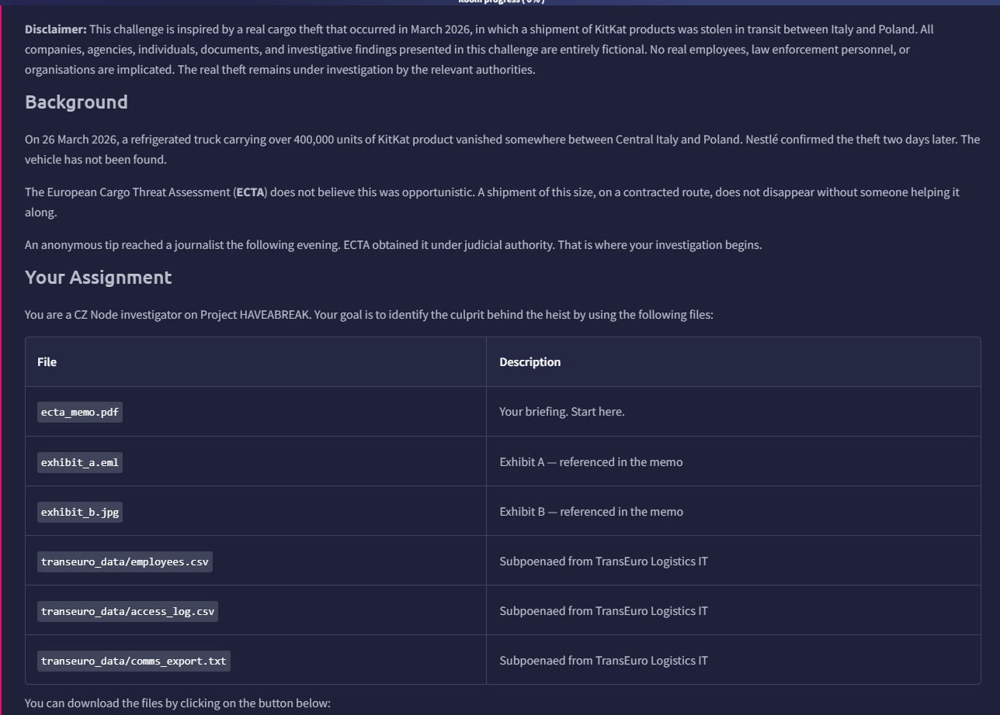
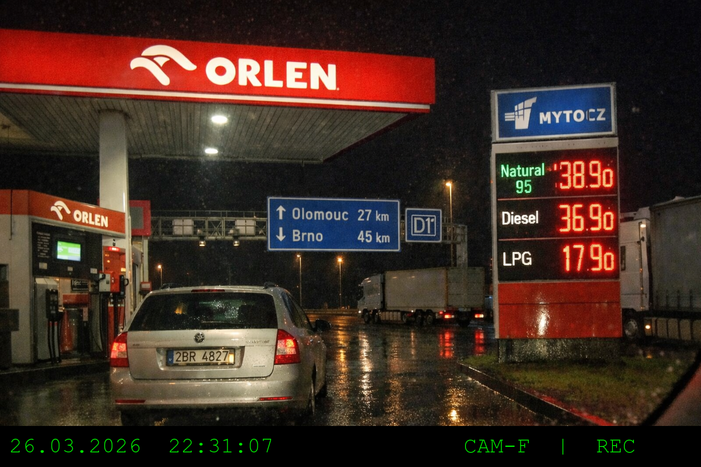

# Have a Break



Below is the architecture of the provided zip

```bash
.
├── ecta-case-1775237862109.zip
├── ecta_memo.html.pdf
├── exhibit_a.eml
├── exhibit_b.png
├── __MACOSX
│   └── transeuro_data
└── transeuro_data
    ├── access_log.csv
    ├── comms_export.txt
    └── employees.csv
```

## Introduction

We can take a quick look at the PDF first

On 26 March 2026, a major shipment of KitKat confectionery vanished while in transit from a Nestlé production facility in Central Italy to a distribution center in Poland. The theft occurred after a refrigerated HGV failed to complete its scheduled check-ins along the transit route through Austria and the Czech Republic. 

By March 28, 2026, Nestlé publicly confirmed that the vehicle and its entire cargo remained unaccounted for.

Our goal is to reveal what happened and who was the culprit.

## Email Metadata

To kickstart, we can first view the email `exhibit_a.eml`, to know more about the sender and the case.


We can see that it is an email written by an anonymous person. The email itself reveal no information about the person.

To reveal the metadata, we can use the `strings` utility. We can see the IP of the sender in the `Received` field, which we know the person is behind a VPN

```bash
Received: from [193.32.249.132] ([193.32.249.132])
        by smtp.gmail.com with ESMTPSA id
        4fb4d7f45d1cf-66e02d37620sm407278a12.2.2026.03.27.23.14.55
        for <redakce@novinybrno.cz>
        (version=TLS1_3 cipher=TLS_AES_128_GCM_SHA256 bits=128/128);
        Thu, 27 Mar 2026 23:14:55 +0100 (CET)
```

We can do a look up of the IP address, to avoid spoilers or writeups, I use Google Dork to filter some of the result, the searching string I used is:

```bash
193.32.249.132 -THM -CTF
```

We can find that the IP belongs to a VPN called `MULLVAD`, with the result provided by [Spur](https://spur.us/context/193.32.249.132)


## Image OSINT

We can then start looking at the PNG file, it was captured from the vehicle



There are several details worth noting:

- Orlen Gas Station
- Between Olomouc and Brno, and closer to Olomouc
- D1 (A motorway in Czech)

We can try to filter and narrow down the results in [Orlen website](https://www.orlen.pl/en/for-you/fuel-stations?kw=&from=Olomouc&to=Brno&s=&wp=&dst=0). However, the suggested stations are differ from the picture


Notice that we should focus on the highlighted road, D1 Highway, as there is a D1 sign shown in the photo. We should also focus on searches on the right side, as shown in the `comms_export.txt`

```bash
[2026-03-17 11:02] os0047@transeuro-log.cz
Before I take the IT-PL run next week — what is the recommended
overnight stop on the Czech stretch? Last time I used the one
near Olomouc but I was not sure if that is still on the
approved list.

[2026-03-17 11:34] br0204@transeuro-log.cz
Still approved. ORLEN service area on D1, just before the
Olomouc junction. Good overnight parking, 24h fuel. It is
what most drivers use on that corridor.
```

 Eventually, I found [one](https://maps.app.goo.gl/HQ9SJ7wTQdgY76TF8) which is very similar to the photo, and close to D1


Here is how it looks like, However the signs are nowhere to be seen


I am still doubtful if this is the right answer `Kroměřížská 1281, 768 24 Hulín, Czechia`, and it is correct.

## The Culprit

Then we can try reading `access_log.csv` to identify the culprit. We can see that there are 5 files, and the action part should be able to give us some insight

```bash
$ head access_log.csv
date,time,employee_id,file,action
2026-03-24,07:11:03,BR-0291,ROUTE_IT_PL_Q1_2026.pdf,AUTH_FAILED
2026-03-24,08:44:12,BR-0204,ROUTE_CZ_SK_Q1_2026.pdf,VIEW
2026-03-24,08:58:03,BR-0334,ROUTE_DE_PL_Q1_2026.pdf,VIEW
2026-03-24,09:14:33,BR-0291,ROUTE_AT_HU_Q1_2026.pdf,VIEW
2026-03-24,09:51:07,BR-0291,ROUTE_IT_PL_Q1_2026.pdf,VIEW
2026-03-24,09:55:22,PR-0122,ROUTE_IT_PL_Q1_2026.pdf,VIEW
2026-03-24,10:04:17,BR-0334,ROUTE_IT_PL_Q1_2026.pdf,VIEW
2026-03-24,10:22:18,BR-0291,DRIVER_SCHEDULE_WK13.xlsx,VIEW
2026-03-24,10:32:44,PR-0114,CAPACITY_MARCH_2026.xlsx,VIEW
```

We can then try to extract only the action field and see the occurrence of each unique type.

```bash
$cat access_log.csv|cut -d ',' -f 5|sort|uniq -c
      4 ACCESS_DENIED
      1 action
      1 AUTH_FAILED
      6 EDIT
      1 EXPORT
     38 VIEW
```

We can see there is only 1 Export record, meaning it is abnormal in this system.

So we can grep that result.

```bash
cat access_log.csv|grep -i export
2026-03-25,22:14:09,BR-0291,ROUTE_IT_PL_Q1_2026.pdf,EXPORT
```

Now, we know at `22:14:09`, `BR-0291` exports the file.

## Email Sender

Then, who is the person sending the email?

To find this, we need to go back to the email.

> 
> 
> 
> ‘I saw unusual activity in our internal system the night before departure.’
> 

We can refer to `access_log.csv`:

```bash
2026-03-25,22:14:09,BR-0291,ROUTE_IT_PL_Q1_2026.pdf,EXPORT
2026-03-25,23:41:17,BR-0312,DRIVER_SCHEDULE_WK13.xlsx,EDIT
```

We can see that `BR-0312` edited a file after the export action. Which means, he was the only employee who witnessed the Export action, which matches the above statement.

## Real Identity of the Culprit

Finally, what is the full name of the culprit? There is a related record in `employees.csv`

```bash
BR-0291,Route Planner,Brno,Králice nad Oslavou,br0291@transeuro-log.cz
```

However, that does not help us much, as this is an internal email, where the data should never be disclosed to the public.

Gladly, there is an interesting message in `comms_export.txt`

```bash
[2026-03-24 09:11] br0255@transeuro-log.cz
Reminder to all staff — personal email addresses must not be
used for accessing or sharing company files. This morning a
request was received from an external address
(kraliknovak09@gmail.com) to access files in the route
planning shared folder. The request was blocked. Please use
your company account for all work-related activity.
```

We can try to look up the email `kraliknovak09@gmail.com`. I use a reverse email lookup website called [epieos](https://epieos.com/)


Download the data, and we can see the record includes several links. 

```bash
{
  "metadata": {
    "query": "Kraliknovak09@gmail.com",
    "timestamp": "2026-04-09T15:52:43.985Z"
  },
  "data": {
    "visitor": {
      "google": {
        "id": "103790956576446810107",
        "services": {
          "google_maps": "https://www.google.com/maps/contrib/103790956576446810107",
          "google_calendar": "https://calendar.google.com/calendar/u/0/embed?src=Kraliknovak09@gmail.com",
          "google_plus_archive": "https://web.archive.org/web/*/plus.google.com/103790956576446810107*"
        }
      }
    }
  }
}
```

I opened the Google Maps link and found the name to be **`Radovan Blšťák`**


