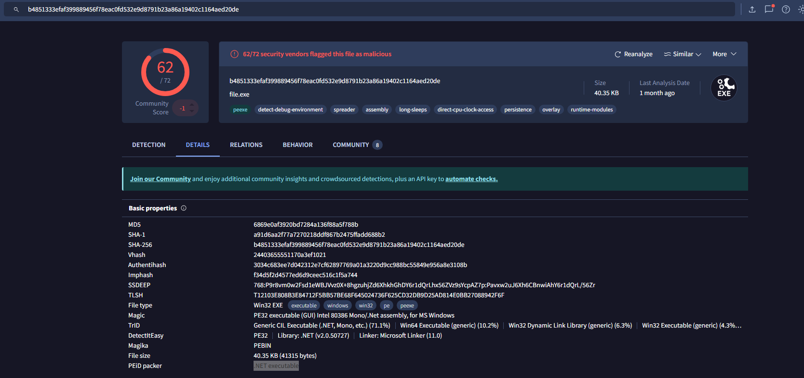

# TShark Challenge II: Directory

## DNS

First, we can try using the `-Y` flag to add a display filter to display DNS-related results. I found `jx2-bavuong[.]com` to be fishy.

```bash
$ tshark -r directory-curiosity.pcap -Y dns
   11   1.764583 192.168.100.116 ? 192.168.100.2 DNS 75 Standard query 0x82a6 A jx2-bavuong.com
   12   2.098611 192.168.100.2 ? 192.168.100.116 DNS 91 Standard query response 0x82a6 A jx2-bavuong.com A 141.164.41.174
   57   6.000463 192.168.100.116 ? 192.168.100.2 DNS 72 Standard query 0x7e1f A api.bing.com
   58   6.001397 192.168.100.116 ? 192.168.100.2 DNS 72 Standard query 0xd62e A www.bing.com
   59   6.001505 192.168.100.116 ? 192.168.100.2 DNS 72 Standard query 0x1877 A www.bing.com
   60   6.005877 192.168.100.2 ? 192.168.100.116 DNS 148 Standard query response 0x7e1f A api.bing.com CNAME api-bing-com.e-0001.e-msedge.net CNAME e-0001.e-msedge.net A 13.107.5.80
   61   6.006865 192.168.100.2 ? 192.168.100.116 DNS 220 Standard query response 0xd62e A www.bing.com CNAME a-0001.a-afdentry.net.trafficmanager.net CNAME www-bing-com.dual-a-0001.a-msedge.net CNAME dual-a-0001.a-msedge.net A 204.79.197.200 A 13.107.21.200
   62   6.007180 192.168.100.2 ? 192.168.100.116 DNS 220 Standard query response 0x1877 A www.bing.com CNAME a-0001.a-afdentry.net.trafficmanager.net CNAME www-bing-com.dual-a-0001.a-msedge.net CNAME dual-a-0001.a-msedge.net A 204.79.197.200 A 13.107.21.200
  256  38.713894 192.168.100.116 ? 192.168.100.2 DNS 82 Standard query 0x81dd A iecvlist.microsoft.com
  257  38.716022 192.168.100.116 ? 192.168.100.2 DNS 84 Standard query 0xb539 A r20swj13mr.microsoft.com
  258  38.719989 192.168.100.2 ? 192.168.100.116 DNS 164 Standard query response 0x81dd A iecvlist.microsoft.com CNAME ie9comview.vo.msecnd.net CNAME cs9.wpc.v0cdn.net A 152.199.19.161
  259  38.722033 192.168.100.2 ? 192.168.100.116 DNS 166 Standard query response 0xb539 A r20swj13mr.microsoft.com CNAME ie9comview.vo.msecnd.net CNAME cs9.wpc.v0cdn.net A 152.199.19.161
  323  40.299409 192.168.100.116 ? 192.168.100.2 DNS 77 Standard query 0x02e5 A ocsp.digicert.com
  324  40.299849 192.168.100.2 ? 192.168.100.116 DNS 125 Standard query response 0x02e5 A ocsp.digicert.com CNAME cs9.wac.phicdn.net A 93.184.220.29
```

If we do some searching, we can find that it is a malicious domain.

https://any.run/report/b4851333efaf399889456f78eac0fd532e9d8791b23a86a19402c1164aed20de/207626b9-f128-41a2-9a6c-14a7298ede97 

## HTTP

Similarly, we can use the `-Y` flag to show HTTP-related results. We can then use `-T fields` to specify and display specific fields instead of the whole packet, and `-e` to display the wanted field.

Because the domain will appear in `http.request.full_uri`, we can display that field and count its occurrences. We will get `14` as the answer.

```bash
$ tshark -r directory-curiosity.pcap -2 -Y "http" -T fields -e http.request.full_uri|grep jx2|wc -l 
14
```

We can also display the destination address using `-e ip.dst`, we will obtain `141[.]164[.]41[.]174`

```bash
$ tshark -r directory-curiosity.pcap -2 -Y "http" -T fields -e http.request.full_uri -e ip.dst |grep jx2
http://jx2-bavuong.com/	141.164.41.174
http://jx2-bavuong.com/icons/blank.gif	141.164.41.174
http://jx2-bavuong.com/icons/text.gif	141.164.41.174
http://jx2-bavuong.com/icons/binary.gif	141.164.41.174
http://jx2-bavuong.com/favicon.ico	141.164.41.174
http://jx2-bavuong.com/vlauto.exe	141.164.41.174
http://jx2-bavuong.com/newbot/proxy	141.164.41.174
http://jx2-bavuong.com/newbot/blog	141.164.41.174
http://jx2-bavuong.com/newbot/target	141.164.41.174
http://jx2-bavuong.com/newbot/target.method	141.164.41.174
http://jx2-bavuong.com/newbot/target.ip	141.164.41.174
http://jx2-bavuong.com/newbot/target.port	141.164.41.174
http://jx2-bavuong.com/newbot/botlogger.php	141.164.41.174
http://jx2-bavuong.com/vlauto.exe	141.164.41.174

```

The server info will be displayed once the connection is successful. With that, we can use the known IP address as the source address to filter, and show only the `http.server` field. We can get the server is `Apache/2.2.11 (Win32) DAV/2 mod_ssl/2.2.11 OpenSSL/0.9.8i PHP/5.2.9`

```bash
$ tshark -r directory-curiosity.pcap -Y "http && ip.src == 141.164.41.174" -T fields -e http.server|sort|uniq
Apache/2.2.11 (Win32) DAV/2 mod_ssl/2.2.11 OpenSSL/0.9.8i PHP/5.2.9
```

## Files

We can follow the stream using `-z follow` . Because we want to know about the first stream(stream 0) of the TCP protocol in ascii, we use `-z follow,tcp,ascii,0` . Remember to use `-q` flag to silent mode as the result is overwhelming. Below are the full result.

```bash
$ tshark -r directory-curiosity.pcap -z follow,tcp,ascii,0 -q

===================================================================
Follow: tcp,ascii
Filter: tcp.stream eq 0
Node 0: 192.168.100.116:49170
Node 1: 141.164.41.174:80
251
GET / HTTP/1.1
Accept: text/html, application/xhtml+xml, */*
Accept-Language: en-US
User-Agent: Mozilla/5.0 (Windows NT 6.1; Trident/7.0; rv:11.0) like Gecko
Accept-Encoding: gzip, deflate
Host: jx2-bavuong.com
DNT: 1
Connection: Keep-Alive

	1078
HTTP/1.1 200 OK
Date: Sun, 13 Dec 2020 00:51:46 GMT
Server: Apache/2.2.11 (Win32) DAV/2 mod_ssl/2.2.11 OpenSSL/0.9.8i PHP/5.2.9
Content-Length: 829
Keep-Alive: timeout=5, max=100
Connection: Keep-Alive
Content-Type: text/html;charset=UTF-8

<!DOCTYPE HTML PUBLIC "-//W3C//DTD HTML 3.2 Final//EN">
<html>
 <head>
  <title>Index of /</title>
 </head>
 <body>
<h1>Index of /</h1>
<pre> <a href="?C=N;O=D">Name</a>                    <a href="?C=M;O=A">Last modified</a>      <a href="?C=S;O=A">Size</a>  <a href="?C=D;O=A">Description</a><hr> <a href="123.php">123.php</a>                 12-Jul-2020 08:43    1   
 <a href="vlauto.exe">vlauto.exe</a>              06-May-2020 23:32   40K  
 <a href="vlauto.php">vlauto.php</a>              10-Jul-2020 23:25   93   
<hr></pre>
<address>Apache/2.2.11 (Win32) DAV/2 mod_ssl/2.2.11 OpenSSL/0.9.8i PHP/5.2.9 Server at jx2-bavuong.com Port 80</address>
</body></html>

313
GET /icons/blank.gif HTTP/1.1
Accept: image/png, image/svg+xml, image/*;q=0.8, */*;q=0.5
Referer: http://jx2-bavuong.com/
Accept-Language: en-US
User-Agent: Mozilla/5.0 (Windows NT 6.1; Trident/7.0; rv:11.0) like Gecko
Accept-Encoding: gzip, deflate
Host: jx2-bavuong.com
DNT: 1
Connection: Keep-Alive

	490
HTTP/1.1 200 OK
Date: Sun, 13 Dec 2020 00:51:46 GMT
Server: Apache/2.2.11 (Win32) DAV/2 mod_ssl/2.2.11 OpenSSL/0.9.8i PHP/5.2.9
Last-Modified: Sat, 20 Nov 2004 13:16:24 GMT
ETag: "20000000053c6-94-3e9506e1a3a00"
Accept-Ranges: bytes
Content-Length: 148
Keep-Alive: timeout=5, max=99
Connection: Keep-Alive
Content-Type: image/gif

GIF89a...................!.NThis art is in the public domain. Kevin Hughes, kevinh@eit.com, September 1995.!.......,............................I..;
===================================================================

```

The main focus is in here. There are `3` files in total, and the first file is `123[.]php` (might need to navigate to the right as that line is too long)

```bash
<pre> <a href="?C=N;O=D">Name</a>                    <a href="?C=M;O=A">Last modified</a>      <a href="?C=S;O=A">Size</a>  <a href="?C=D;O=A">Description</a><hr> <a href="123.php">123.php</a>                 12-Jul-2020 08:43    1   
 <a href="vlauto.exe">vlauto.exe</a>              06-May-2020 23:32   40K  
 <a href="vlauto.php">vlauto.php</a> 
```

We can then export all the files/objects using `--export-object`. Specify HTTP protocol and save all of them to the directory export using `http,export` parameters. We can see the first exe file is `vlauto[.]exe`

```bash
$ tshark -r directory-curiosity.pcap --export-object http,export
$ cd export
$ ls
 %2f                                                                                                                          blank.gif         target.ip
 MFEwTzBNMEswSTAJBgUrDgMCGgUABBSAUQYBMq2awn1Rh6Doh%2FsBYgFV7gQUA95QNVbRTLtm8KPiGxvDl7I90VUCEAJ0LqoXyo4hxxe7H%2Fz9DKA%3D       blog              target.method
'MFEwTzBNMEswSTAJBgUrDgMCGgUABBSAUQYBMq2awn1Rh6Doh%2FsBYgFV7gQUA95QNVbRTLtm8KPiGxvDl7I90VUCEAJ0LqoXyo4hxxe7H%2Fz9DKA%3D(1)'   botlogger.php     target.port
'MFEwTzBNMEswSTAJBgUrDgMCGgUABBSAUQYBMq2awn1Rh6Doh%2FsBYgFV7gQUA95QNVbRTLtm8KPiGxvDl7I90VUCEAJ0LqoXyo4hxxe7H%2Fz9DKA%3D(2)'  'favicon(1).ico'   text.gif
'MFEwTzBNMEswSTAJBgUrDgMCGgUABBSAUQYBMq2awn1Rh6Doh%2FsBYgFV7gQUA95QNVbRTLtm8KPiGxvDl7I90VUCEAJ0LqoXyo4hxxe7H%2Fz9DKA%3D(3)'   favicon.ico      'vlauto(1).exe'
'MFEwTzBNMEswSTAJBgUrDgMCGgUABBSAUQYBMq2awn1Rh6Doh%2FsBYgFV7gQUA95QNVbRTLtm8KPiGxvDl7I90VUCEAJ0LqoXyo4hxxe7H%2Fz9DKA%3D(4)'   proxy             vlauto.exe
 binary.gif                                                                                                                   target

```

## Malware Analysis

To benefit the analysis, it is always good to know the sha256 hash of the file. We can use `sha256sum` to check it. In this case, it is `b4851333efaf399889456f78eac0fd532e9d8791b23a86a19402c1164aed20de`.

```bash
$ sha256sum vlauto.exe                                          
b4851333efaf399889456f78eac0fd532e9d8791b23a86a19402c1164aed20de  vlauto.exe
```

We can then navigate to VirusTotal(https://www.virustotal.com/gui/home/upload). A site that is designed for malware analysis. Paste the obtained hash, and we can see that the exe file is indeed malware. We can navigate to the details, and we see that the PEiD(https://www.oreilly.com/library/view/mastering-reverse-engineering/9781788838849/f1e4d67d-eb4f-47e2-9d9d-ae10d8293ef6.xhtml) packer value is `.NET executable`



Go to the Behavior tab, we can also see Lastline Sandbox fag is a `MALWARE TROJAN`


## Finished


