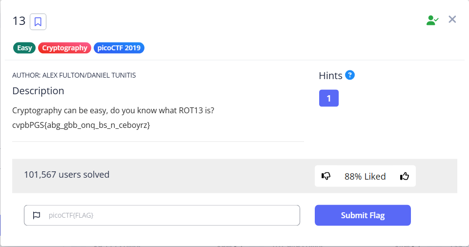

# 13



The flag is encoded using ROT13, resulted in `cvpbPGS{abg_gbb_onq_bs_n_ceboyrz}`

To recover the flag, we can use the `tr` to shift the characters, or any online tool will do.

```bash
└─$ echo 'cvpbPGS{abg_gbb_onq_bs_n_ceboyrz}'|tr a-zA-Z n-za-mN-ZA-M
picoCTF{not_too_bad_of_a_problem}
```

Flag: `picoCTF{not_too_bad_of_a_problem}`
