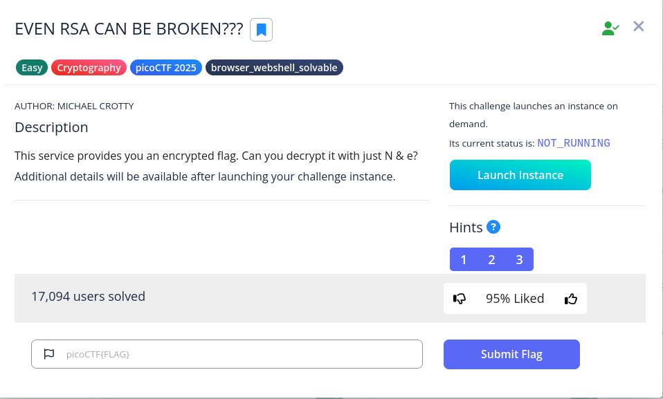

# EVEN RSA CAN BE BROKEN???



The encryption is given as follows

```jsx
from sys import exit
from Crypto.Util.number import bytes_to_long, inverse
from setup import get_primes

e = 65537

def gen_key(k):
    """
    Generates RSA key with k bits
    """
    p,q = get_primes(k//2)
    N = p*q
    d = inverse(e, (p-1)*(q-1))

    return ((N,e), d)

def encrypt(pubkey, m):
    N,e = pubkey
    return pow(bytes_to_long(m.encode('utf-8')), e, N)

def main(flag):
    pubkey, _privkey = gen_key(1024)
    encrypted = encrypt(pubkey, flag) 
    return (pubkey[0], encrypted)

if __name__ == "__main__":
    flag = open('flag.txt', 'r').read()
    flag = flag.strip()
    N, cypher  = main(flag)
    print("N:", N)
    print("e:", e)
    print("cyphertext:", cypher)
    exit()
```

RSA is an asymmetric encryption scheme. It uses the public key e to encrypt and the private key d to decrypt. 

To decrypt the ciphertext:

1. Find p and q. Their product is N. To do that, we can find them quickly using http://factordb.com/
2. Compute `(p-1)*(q-1)`, which is called Euler's totient function(denoted as phi). It is basically the coprime of the element in the range of 1 to that element. Since both p and q are prime, all the values from 1 to n-1 are coprime; therefore, just subtract 1 from each element.
3. Then use inverse to find the d by computing the modular inverse of e mod phi
4. Decrypt the ciphertext using c^d mod N

Refer to [decrypt.py](http://decrypt.py) for the implementation.

Flag: `picoCTF{tw0_1$_pr!m341c6ed35}`
