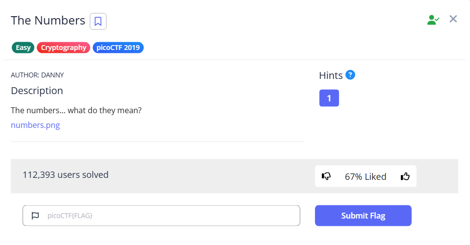

# The Numbers



We receive a photo like this


The number actually represents the index (1-origin indexing) of the letter. To solve this, we can write a python script

```python
list = [16,9,3,15,3,20,6,'{',20,8,5,14,21,13,2,5,18,19,13,1,19,15,14,'}']
for element in list:
    if type(element)==int:
        print(chr(97+element-1), end='')
    else:
       print(element, end='')
```

Run the script to get the flag. Remember to capitalize the CTF

```bash
└─$ python test.py                                                                                                                                                                                                                         
picoctf{thenumbersmason}
```

Flag: `picoCTF{thenumbersmason}`
