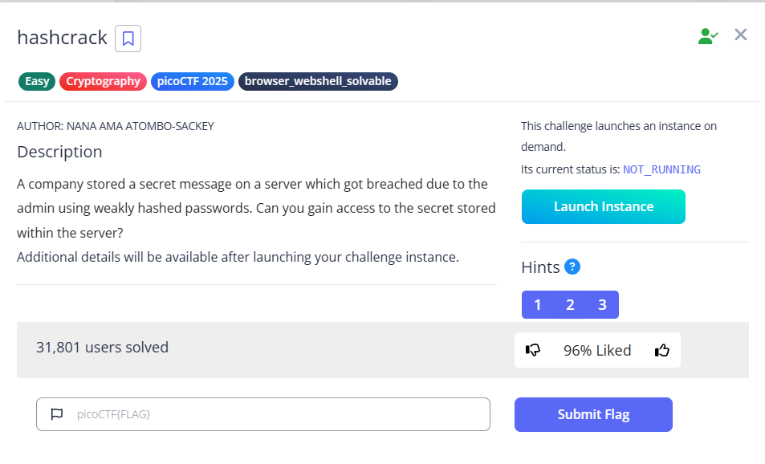

# hashcrack



Upon connection, we can see these lines, prompting the password to the corresponding hash:

```bash
Welcome!! Looking For the Secret?

We have identified a hash: 482c811da5d5b4bc6d497ffa98491e38
Enter the password for identified hash: 
```

We can use some tools to help us. Here I used hashes.com https://hashes.com/en/decrypt/hash


`password123`


`letmein`


`qwerty098`

Full playthrough

```bash
└─$ nc verbal-sleep.picoctf.net xxxxx
Welcome!! Looking For the Secret?

We have identified a hash: 482c811da5d5b4bc6d497ffa98491e38
Enter the password for identified hash: password123
Correct! You've cracked the MD5 hash with no secret found!

Flag is yet to be revealed!! Crack this hash: b7a875fc1ea228b9061041b7cec4bd3c52ab3ce3
Enter the password for the identified hash: letmein
Correct! You've cracked the SHA-1 hash with no secret found!

Almost there!! Crack this hash: 916e8c4f79b25028c9e467f1eb8eee6d6bbdff965f9928310ad30a8d88697745
Enter the password for the identified hash: qwerty098
Correct! You've cracked the SHA-256 hash with a secret found. 
The flag is: picoCTF{UseStr0nG_h@shEs_&PaSswDs!_eb2f8459}

```

Flag: `picoCTF{UseStr0nG_h@shEs_&PaSswDs!_eb2f8459}`
