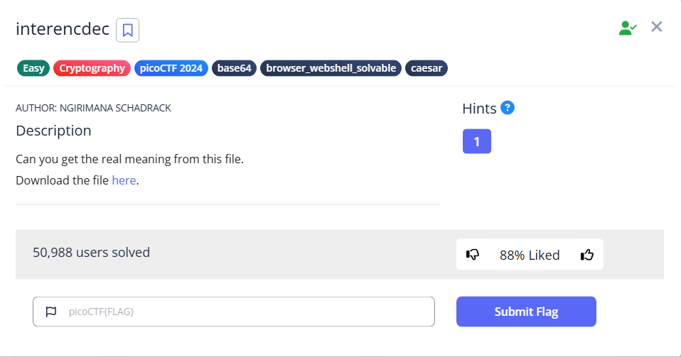

# interencdec



Reading the file will reveal that it is a Base 64 String

```bash
└─$ cat enc_flag 
YidkM0JxZGtwQlRYdHFhR3g2YUhsZmF6TnFlVGwzWVROclh6ZzVNR3N5TXpjNWZRPT0nCg==
```

Base 64 decode it once will realize that the string is encoded at least twice.

```bash
$ cat enc_flag|base64 -d
b'd3BqdkpBTXtqaGx6aHlfazNqeTl3YTNrXzg5MGsyMzc5fQ=='
```

Therefore, we can write a script to decode it twice, and we will get a flag-like string

```bash
└─$ python test.py                                                                                                                                                                                                                         
wpjvJAM{jhlzhy_k3jy9wa3k_890k2379}
```

Then we can guess it is rotated. So we can play with CyberChef and found out it is ROT19


Flag: `picoCTF{caesar_d3cr9pt3d_890d2379}`
