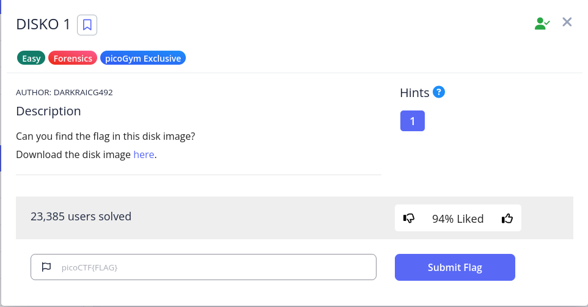

# DISKO 1



It is a simple disk challenge, so it is solvable through strings

```bash
└─$ file disko-1.dd 
disko-1.dd: DOS/MBR boot sector, code offset 0x58+2, OEM-ID "mkfs.fat", Media descriptor 0xf8, sectors/track 32, heads 8, sectors 102400 (volumes > 32 MB), FAT (32 bit), sectors/FAT 788, serial number 0x241a4420, unlabeled

└─$ fls disko-1.dd 
d/d 4:  bin
v/v 1612675:    $MBR
v/v 1612676:    $FAT1
v/v 1612677:    $FAT2
V/V 1612678:    $OrphanFiles

└─$ strings disko-1.dd |grep pico
:/icons/appicon
# $Id: piconv,v 2.8 2016/08/04 03:15:58 dankogai Exp $
piconv -- iconv(1), reinvented in perl
  piconv [-f from_encoding] [-t to_encoding]
  piconv -l
  piconv -r encoding_alias
  piconv -h
B<piconv> is perl version of B<iconv>, a character encoding converter
a technology demonstrator for Perl 5.8.0, but you can use piconv in the
piconv converts the character encoding of either STDIN or files
Therefore, when both -f and -t are omitted, B<piconv> just acts
picoCTF{1t5_ju5t_4_5tr1n9_e3408eef}

```

Flag: `picoCTF{1t5_ju5t_4_5tr1n9_e3408eef}`
