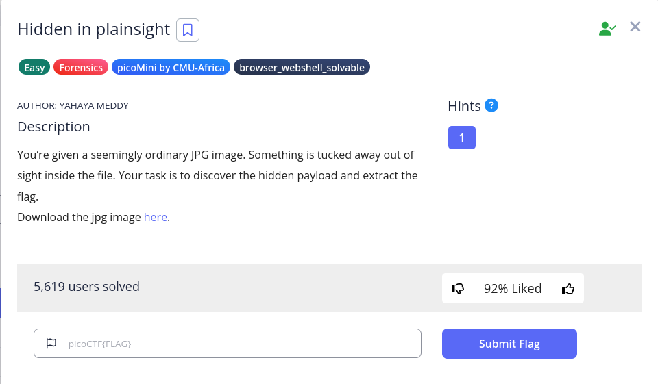

# Hidden in plainsight



We are given an image called img.jpg


We can find a comment using strings, or exiftool 

```jsx
─$ file img.jpg 
img.jpg: JPEG image data, JFIF standard 1.01, aspect ratio, density 1x1, segment length 16, comment: "c3RlZ2hpZGU6Y0VGNmVuZHZjbVE9", baseline, precision 8, 640x640, components 3

└─$ exiftool img.jpg |grep -i comment
Comment                         : c3RlZ2hpZGU6Y0VGNmVuZHZjbVE9
```

Trying to base64 decode the comment, we can find the steghide password:

```jsx
└─$ echo 'c3RlZ2hpZGU6Y0VGNmVuZHZjbVE9'|base64 -d
steghide:cEF6endvcmQ=

└─$ echo 'cEF6endvcmQ='|base64 -d
pAzzword
```

To use steghide, we using the keyword `extract`, then `-sf` to specify the file and `-p` to specify the password:

```jsx
└─$ steghide extract -sf img.jpg -p pAzzword
wrote extracted data to "flag.txt".
```

And then we can get the flag

```jsx
└─$ cat flag.txt 
picoCTF{h1dd3n_1n_1m4g3_871ba555}
```

Flag: `picoCTF{h1dd3n_1n_1m4g3_871ba555}`
