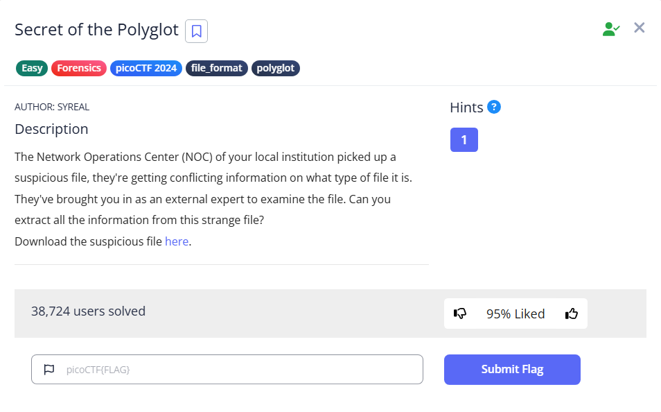

# Secret of the Polyglot



We received a PDF file. If you open it, you will find the second part of the flag. But where is the first part?


The second half actually hinted that it is a PNG file.

To verify, we use `file` on the PDF, we will see that it is actually an PNG image.

```bash
└─$ file flag2of2-final.pdf 
flag2of2-final.pdf: PNG image data, 50 x 50, 8-bit/color RGBA, non-interlaced
```

Use `cp` to copy the PDF into a PNG file, and we will see the first half of the flat

`cp flag2of2-final.pdf flag2of2-final.png`


Flag: `picoCTF{f1u3n7_1n_pn9_&_pdf_724b1287}`
