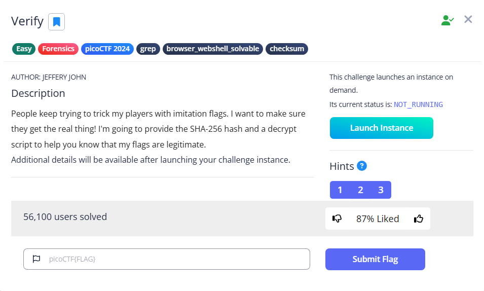

# Verify



Once we reach the instance, we can try to use ls to know what files are inside

```bash
ctf-player@pico-chall$ ls
checksum.txt  decrypt.sh  files
```

We can then use the sha256hash to find the real flag inside the directory `files`, using sha256sum. The above command will calculate the sha256 hash of each file, then grep the hash that matches the sha256sum lies within checksum.txt

```bash
ctf-player@pico-chall$ sha256sum files/*|grep $(cat checksum.txt)
467a10447deb3d4e17634cacc2a68ba6c2bb62a6637dad9145ea673bf0be5e02  files/c6c8b911
```

We can then run the decrypt.sh script to read the flag

```bash
ctf-player@pico-chall$ ./decrypt.sh files/c6c8b911
picoCTF{trust_but_verify_c6c8b911}
```

Flag: `picoCTF{trust_but_verify_c6c8b911}`
