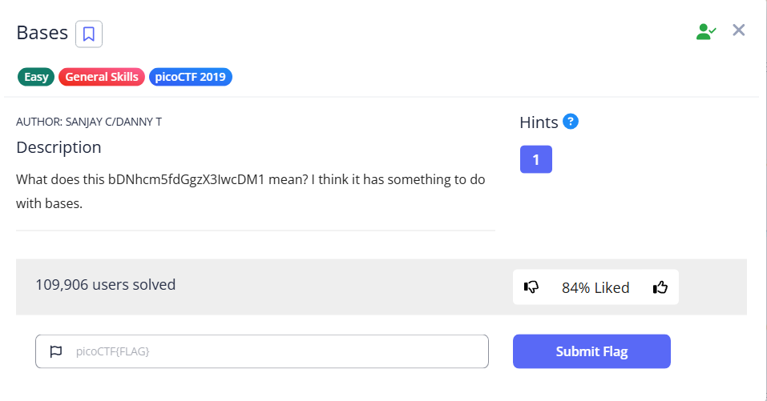

# Bases



We are given a base64 string `bDNhcm5fdGgzX3IwcDM1`, we can decode it directly

```bash
└─$ echo 'bDNhcm5fdGgzX3IwcDM1'|base64 -d
l3arn_th3_r0p35
```

Then pack it into the flag format

Flag: `picoCTF{l3arn_th3_r0p35}`
