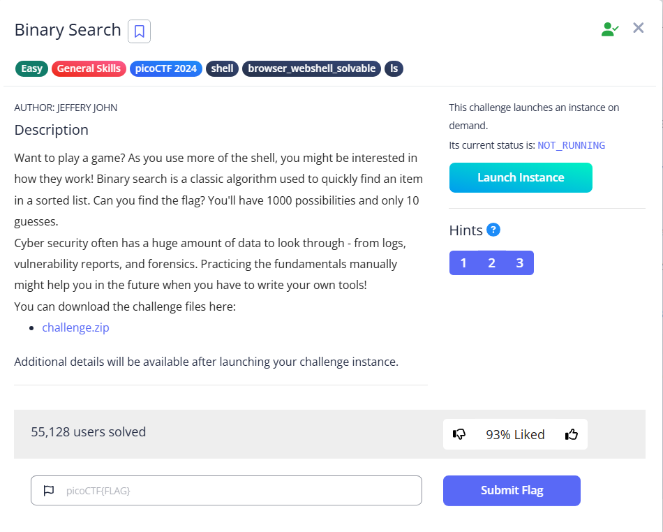

# Binary Search



We are given a zip file. Inside the zip file lies a bash script. It generate a random number each time ranging from 1 to 1000(`target=$(( (RANDOM % 1000) + 1 ))`), and we have a total of 10 guesses(`MAX_GUESSES=10`)

It might seem impossible. However, each wrong attempt will indicate whether the next guess should be higher or lower than the current guess

```bash
if (( guess < target )); then
	echo "Higher! Try again."
elif (( guess > target )); then
  echo "Lower! Try again."
```

With this, we can implement the [binary search strategy](https://en.wikipedia.org/wiki/Binary_search), which involves eliminating half of the values at a time.

To understand, let’s examine some educated guesses to this script. In the first guess, I pick `500`, which the script suggests we lower. With this, we can eliminate half of the values(`500-1000`), as the target should be smaller

```bash
Welcome to the Binary Search Game!
I'm thinking of a number between 1 and 1000.
Enter your guess: 500
Lower! Try again.
```

Then we continue to lower the values, and shrinking the range, we can see that the values are then larger than `63`

```bash
Enter your guess: 250
Lower! Try again.
Enter your guess: 125
Lower! Try again.
Enter your guess: 63
Higher! Try again.
```

The adjust our guesses so that we can finally get the correct value by narrowing down the possible range

```bash
Enter your guess: 94
Lower! Try again.
Enter your guess: 78
Lower! Try again.
Enter your guess: 70
Lower! Try again.
Enter your guess: 67
Lower! Try again.
Enter your guess: 65                                                                                                                                                                                                                      
Lower! Try again.                                                                                                                                                                                                                         
Enter your guess: 64                                                                                                                                                                                                                      
Congratulations! You guessed the correct number: 64                                                                                                                                                                                       
Here's your flag: picoCTF{g00d_gu355_1597707f} 
```

Flag: `picoCTF{g00d_gu355_1597707f}`
