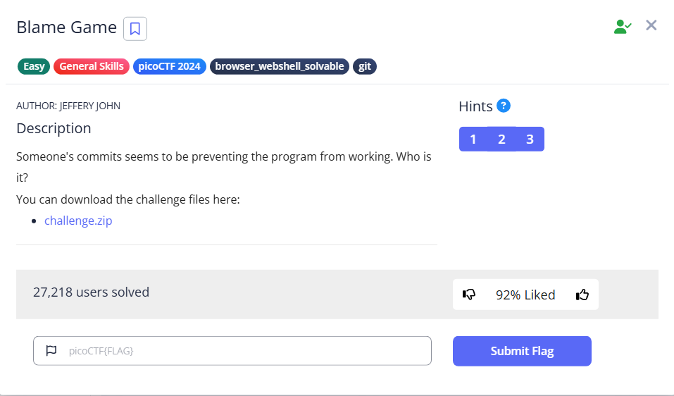

# Blame Game



If we read the `message.py`, we will see that the parenthesis is not closed

```bash
└─$ cat message.py                                                                                                                                                                                                                         
print("Hello, World!"
```

Using `git reflog`, we can see there are so many commits, and the commit messages are the same.

```bash
└─$ git reflog
929e391 (HEAD -> master) HEAD@{0}: commit: important business work
5611f02 HEAD@{1}: commit: important business work
455a99a HEAD@{2}: commit: important business work
bd7c2f9 HEAD@{3}: commit: important business work
f1ee988 HEAD@{4}: commit: important business work
f89bbe1 HEAD@{5}: commit: important business work
0ae2112 HEAD@{6}: commit: important business work
dcdeddb HEAD@{7}: commit: important business work
32557fc HEAD@{8}: commit: important business work
5b01229 HEAD@{9}: commit: important business work
9f32cd1 HEAD@{10}: commit: important business work
5fe66c5 HEAD@{11}: commit: important business work
a4331e4 HEAD@{12}: commit: important business work
c332245 HEAD@{13}: commit: important business work
45840ab HEAD@{14}: commit: important business work
987bc7e HEAD@{15}: commit: important business work
5a3742a HEAD@{16}: commit: important business work
cfc3a35 HEAD@{17}: commit: important business work
9944463 HEAD@{18}: commit: important business work
e271500 HEAD@{19}: commit: important business work
2fba088 HEAD@{20}: commit: important business work
7a28ce3 HEAD@{21}: commit: important business work
877703e HEAD@{22}: commit: important business work
443ed12 HEAD@{23}: commit: important business work
f78a281 HEAD@{24}: commit: important business work
2a32be5 HEAD@{25}: commit: important business work
99f1210 HEAD@{26}: commit: important business work
b596f15 HEAD@{27}: commit: important business work
b589a17 HEAD@{28}: commit: important business work
af06162 HEAD@{29}: commit: important business work
c53c3e0 HEAD@{30}: commit: important business work
4d64199 HEAD@{31}: commit: important business work
1a561ac HEAD@{32}: commit: important business work
d93c27a HEAD@{33}: commit: important business work
f8be155 HEAD@{34}: commit: important business work
758ecc1 HEAD@{35}: commit: important business work
6859e8a HEAD@{36}: commit: important business work
794a68e HEAD@{37}: commit: important business work
50fd56e HEAD@{38}: commit: important business work
6c6ce59 HEAD@{39}: commit: important business work
2c7d500 HEAD@{40}: commit: important business work
fec3216 HEAD@{41}: commit: important business work
6edf618 HEAD@{42}: commit: important business work
dcbfd0e HEAD@{43}: commit: important business work
3c1a15d HEAD@{44}: commit: important business work
54643fe HEAD@{45}: commit: important business work
8568387 HEAD@{46}: commit: important business work
8cbda7b HEAD@{47}: commit: important business work
22b0e6e HEAD@{48}: commit: important business work
c3d5617 HEAD@{49}: commit: important business work
14fe848 HEAD@{50}: commit: important business work
13cf9d3 HEAD@{51}: commit: important business work
742c6d8 HEAD@{52}: commit: important business work
```

Using `git log` will find a commit different from another at the very bottom; we can see that the flag is hidden under the author’s name

```bash
└─$ git log
.
.
.
commit 23e9d4ce78b3cea725992a0ce6f5eea0bf0bcdd4
Author: picoCTF{@sk_th3_1nt3rn_81e716ff} <ops@picoctf.com>
Date:   Tue Mar 12 00:07:15 2024 +0000

    optimize file size of prod code
```

To simplify our command, we can add grep with flag format `picoCTF{`

```bash
└─$ git log|grep picoCTF{                                                                                                                                                                                                                  
Author: picoCTF{@sk_th3_1nt3rn_81e716ff} <ops@picoctf.com>
```

<aside>
💡

There is a better usage of `git log` that I found after I finished the challenge, you can follow that file to see all changes on that files, which is very handy in this challenge. Here is the [source](https://stackoverflow.com/questions/3701404/how-to-list-all-commits-that-changed-a-specific-file)

```bash
└─$ git log --follow -- message.py
commit 23e9d4ce78b3cea725992a0ce6f5eea0bf0bcdd4
Author: picoCTF{@sk_th3_1nt3rn_81e716ff} <ops@picoctf.com>
Date:   Tue Mar 12 00:07:15 2024 +0000

    optimize file size of prod code

commit 3ce5c692e2f9682a866c59ac1aeae38d35d19771
Author: picoCTF <ops@picoctf.com>
Date:   Tue Mar 12 00:07:15 2024 +0000

    create top secret project
```

</aside>

Flag: `picoCTF{@sk_th3_1nt3rn_81e716ff}`
