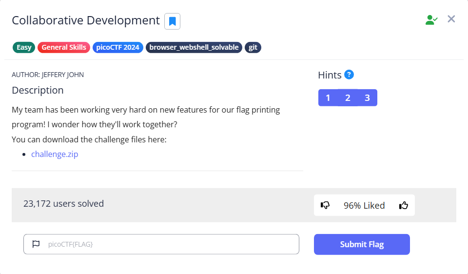

# Collaborative Development



```bash
└─$ cat flag.py 
print("Printing the flag...")

```

If we use `git reflog`, we can see that there is a feature branch

```bash
└─$ git reflog
eb4de2a (HEAD -> main) HEAD@{0}: checkout: moving from feature/part-3 to main
1308521 (feature/part-3) HEAD@{1}: commit: add part 3
eb4de2a (HEAD -> main) HEAD@{2}: checkout: moving from main to feature/part-3
eb4de2a (HEAD -> main) HEAD@{3}: checkout: moving from feature/part-2 to main
9792a89 (feature/part-2) HEAD@{4}: commit: add part 2
eb4de2a (HEAD -> main) HEAD@{5}: checkout: moving from main to feature/part-2
eb4de2a (HEAD -> main) HEAD@{6}: checkout: moving from feature/part-1 to main
ad37f59 (feature/part-1) HEAD@{7}: commit: add part 1
eb4de2a (HEAD -> main) HEAD@{8}: checkout: moving from main to feature/part-1
eb4de2a (HEAD -> main) HEAD@{9}: commit (initial): init flag printer

```

There are so many ways to do it. But in the case, we can `git diff` all the commits in the branch `feature`, and we can view all parts of the flag 

```bash
└─$ git diff feature/part-1 feature/part-2 feature/part-3                                                                                                                                                                                  
diff --cc flag.py
index 7ab4e25,78ac69c..6e17fb3
--- a/flag.py
+++ b/flag.py
@@@ -1,3 -1,3 +1,2 @@@
  print("Printing the flag...")
--
- print("m@k3s_th3_dr3@m_", end='')
 -print("w0rk_e4b79efb}")
++print("picoCTF{t3@mw0rk_", end='')
```

Flag: `picoCTF{t3@mw0rk_m@k3s_th3_dr3@m_w0rk_e4b79efb}`
