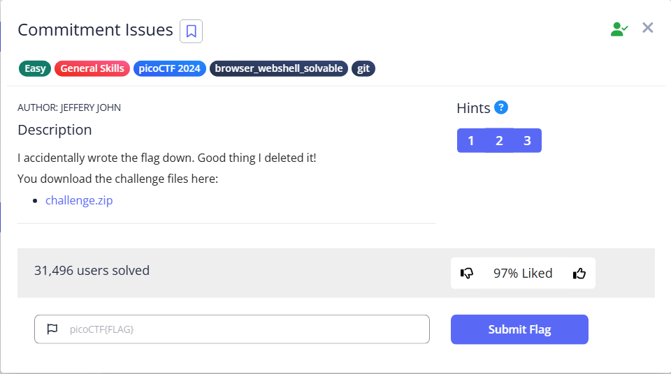

# Commitment Issues



We can see a txt file inside the given zip file, which does not show the flag at first glance.

```bash
└─$ cat message.txt                                                                                                                                                                                                                        
TOP SECRET  
```

However, the word ‘commitment’ in the title suggests that it might be related to git, so we can give it a shot and use `git reflog`, and we see something interesting

```bash
└─$ git reflog
a6dca68 (HEAD -> master) HEAD@{0}: commit: remove sensitive info
e720dc2 HEAD@{1}: commit (initial): create flag
```

We can then use `git diff` to compare the differences between the two versions

```bash
└─$ git diff a6dca68 e720dc2
diff --git a/message.txt b/message.txt                                                                                                                                                                                                     
index d552d1e..d263841 100644                                                                                                                                                                                                              
--- a/message.txt                                                                                                                                                                                                                          
+++ b/message.txt                                                                                                                                                                                                                          
@@ -1 +1 @@                                                                                                                                                                                                                                
-TOP SECRET                                                                                                                                                                                                                                
+picoCTF{s@n1t1z3_7246792d}   
```

Alternatively, `git show` is a simpler method to compare

```bash
└─$ git show                                                                                                                                                                                                                               
commit a6dca68e4310585eac3b5c9caf0f75967dfe972c (HEAD -> master)
Author: picoCTF <ops@picoctf.com>
Date:   Sat Mar 9 21:10:06 2024 +0000

    remove sensitive info

diff --git a/message.txt b/message.txt
index d263841..d552d1e 100644
--- a/message.txt
+++ b/message.txt
@@ -1 +1 @@
-picoCTF{s@n1t1z3_7246792d}
+TOP SECRET

```

You can also switch to the previous version

```bash
└─$ git checkout e720
Note: switching to 'e720'.

You are in 'detached HEAD' state. You can look around, make experimental
changes and commit them, and you can discard any commits you make in this
state without impacting any branches by switching back to a branch.

If you want to create a new branch to retain commits you create, you may
do so (now or later) by using -c with the switch command. Example:

  git switch -c <new-branch-name>

Or undo this operation with:

  git switch -

Turn off this advice by setting config variable advice.detachedHead to false

HEAD is now at e720dc2 create flag

```

We can then read the flag

```bash
└─$ cat message.txt                                                                                                                                                                                                                        
picoCTF{s@n1t1z3_7246792d}
```

Flag: `picoCTF{s@n1t1z3_7246792d}`
