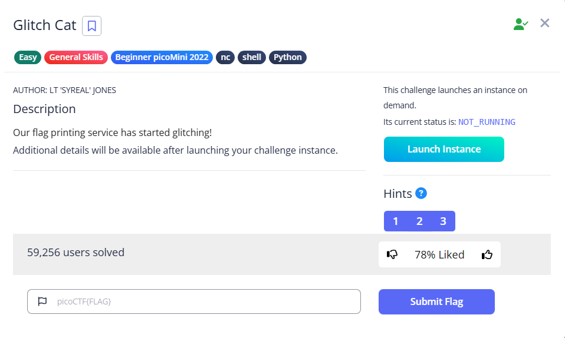

# Glitch Cat



After we connect to the instance, we can see that some characters are represented using the ASCII codes

```bash
└─$ nc saturn.picoctf.net xxxxx
'picoCTF{gl17ch_m3_n07_' + chr(0x39) + chr(0x63) + chr(0x34) + chr(0x32) + chr(0x61) + chr(0x34) + chr(0x35) + chr(0x64) + '}'
```

To reverse it, we can use python to print them out

```bash
└─$ python3
>>> flag='picoCTF{gl17ch_m3_n07_' + chr(0x39) + chr(0x63) + chr(0x34) + chr(0x32) + chr(0x61) + chr(0x34) + chr(0x35) + chr(0x64) + '}'
>>> print(flag)
picoCTF{gl17ch_m3_n07_9c42a45d}

```

Flag: `picoCTF{gl17ch_m3_n07_9c42a45d}`
