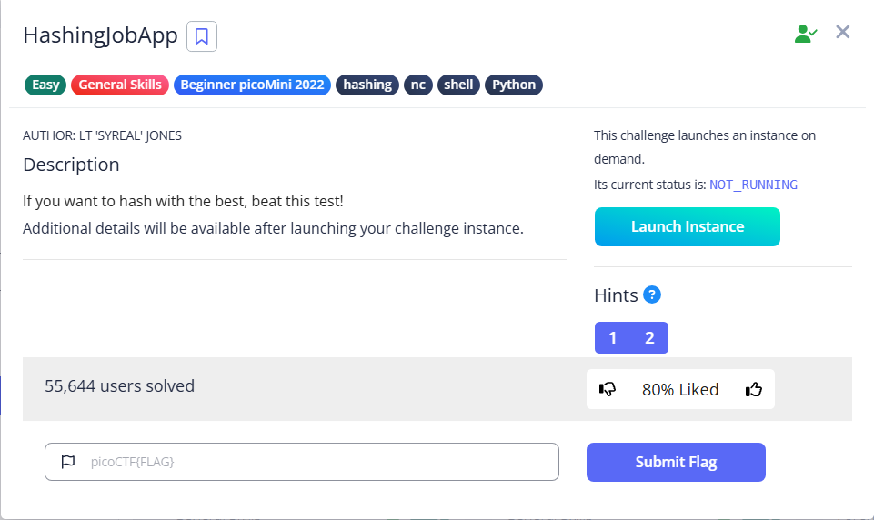

# HashingJobApp



After connecting, we need to enter the corresponding MD5 hashes for three random words.

To do that, we can use the `md5sum` to compute the MD5 hashes

Notice that the two hashes are different, and the second one is the correct answer, as echo will include a new line character by default, and the `-n` flag omit it.

```bash
└─$ echo 'Albert Einstein'|md5sum
c33d736cb84aa55ce2585bb1b2f7c12e  -

└─$ echo -n 'Albert Einstein'|md5sum
7560afa1f46d5e5fefe4ad93e42a293d  -
```

After correcting answering all three hashes, we get the flag

```bash
└─$ nc saturn.picoctf.net xxxxx
Please md5 hash the text between quotes, excluding the quotes: 'Albert Einstein'
Answer: 
7560afa1f46d5e5fefe4ad93e42a293d
7560afa1f46d5e5fefe4ad93e42a293d
Correct.
Please md5 hash the text between quotes, excluding the quotes: 'a nine iron'
Answer: 
55dd71d9f0d869b2dd53ed4408dcacb4
55dd71d9f0d869b2dd53ed4408dcacb4
Correct.
Please md5 hash the text between quotes, excluding the quotes: 'Clint Eastwood'
Answer: 
b84954cb41831fa842dd69f6e1836b6e
b84954cb41831fa842dd69f6e1836b6e
Correct.
picoCTF{4ppl1c4710n_r3c31v3d_3eb82b73}
```

Flag: `picoCTF{4ppl1c4710n_r3c31v3d_3eb82b73}`
