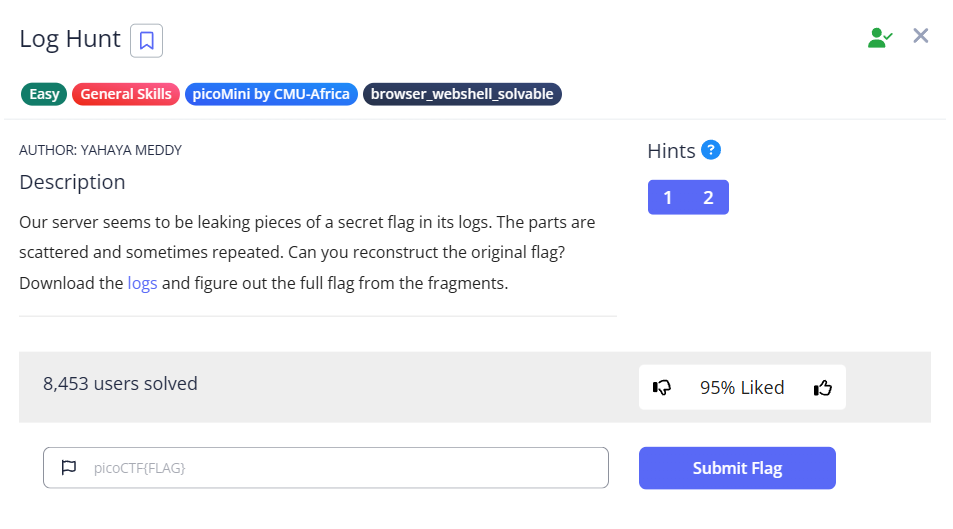

# Log Hunt



Here is some basic information about the log file. We can see the flag header

```bash
└─$ file server.log 
server.log: ASCII text

└─$ cat server.log|head
[1990-08-09 10:00:10] INFO FLAGPART: picoCTF{us3_
[1990-08-09 10:00:16] WARN Disk space low
[1990-08-09 10:00:19] DEBUG Cache cleared
[1990-08-09 10:00:23] WARN Disk space low
[1990-08-09 10:00:25] INFO Service restarted
[1990-08-09 10:00:33] WARN Disk space low
[1990-08-09 10:00:38] ERROR Connection lost
[1990-08-09 10:00:46] ERROR Failed login attempt
[1990-08-09 10:00:48] INFO User logged in
[1990-08-09 10:00:50] INFO User logged in

└─$ cat server.log|wc -l
2348

```

I realize that most of the message are the same. Except the flag part. We can try to only grep the FLAGPART

```bash
└─$ cat server.log|grep -i flag
[1990-08-09 10:00:10] INFO FLAGPART: picoCTF{us3_
[1990-08-09 10:02:55] INFO FLAGPART: y0urlinux_
[1990-08-09 10:05:54] INFO FLAGPART: sk1lls_
[1990-08-09 10:05:55] INFO FLAGPART: sk1lls_
[1990-08-09 10:10:54] INFO FLAGPART: cedfa5fb}
[1990-08-09 10:10:58] INFO FLAGPART: cedfa5fb}
[1990-08-09 10:11:06] INFO FLAGPART: cedfa5fb}
[1990-08-09 11:04:27] INFO FLAGPART: picoCTF{us3_
[1990-08-09 11:04:29] INFO FLAGPART: picoCTF{us3_
[1990-08-09 11:04:37] INFO FLAGPART: picoCTF{us3_
[1990-08-09 11:09:16] INFO FLAGPART: y0urlinux_
[1990-08-09 11:09:19] INFO FLAGPART: y0urlinux_
[1990-08-09 11:12:40] INFO FLAGPART: sk1lls_
[1990-08-09 11:12:45] INFO FLAGPART: sk1lls_
[1990-08-09 11:16:58] INFO FLAGPART: cedfa5fb}
[1990-08-09 11:16:59] INFO FLAGPART: cedfa5fb}
[1990-08-09 11:17:00] INFO FLAGPART: cedfa5fb}
[1990-08-09 12:19:23] INFO FLAGPART: picoCTF{us3_
[1990-08-09 12:19:29] INFO FLAGPART: picoCTF{us3_
[1990-08-09 12:19:32] INFO FLAGPART: picoCTF{us3_
[1990-08-09 12:23:43] INFO FLAGPART: y0urlinux_
[1990-08-09 12:23:45] INFO FLAGPART: y0urlinux_
[1990-08-09 12:23:53] INFO FLAGPART: y0urlinux_
[1990-08-09 12:25:32] INFO FLAGPART: sk1lls_
[1990-08-09 12:28:45] INFO FLAGPART: cedfa5fb}
[1990-08-09 12:28:49] INFO FLAGPART: cedfa5fb}
[1990-08-09 12:28:52] INFO FLAGPART: cedfa5fb}
```

We have already gotten the flag. However, I want to try using sed to aid me in obtaining the flag. To do this, we refer to this manual: https://www.gnu.org/software/sed/manual/sed.html#The-_0022s_0022-Command

To use the substitution function, we can use the syntax `sed ‘s/<Original Text>/<replace text>/’` , where s stands for substitution.

To benefit the sorting and uniq on the string, we want to remove the date and time beforehand. We can also use wildcards to make the search easier, which is explained well in here: https://stackoverflow.com/questions/9189120/using-sed-with-wildcard

We want to remove everything before the ], so we can use `^` to indicate from the start, and `.*` to represent either one or many characters, and finally, we remove them by replace them with nothing. 

Chaining with sort and uniq, we can remove the duplicated lines and make the results clearer.

```bash
└─$ cat server.log|sed 's/^.*]//'|sort|uniq -c                                                                                                                                                                                             
    250  DEBUG Cache cleared
    266  DEBUG System check complete
    239  ERROR Connection lost
    282  ERROR Failed login attempt
      9  INFO FLAGPART: cedfa5fb}
      7  INFO FLAGPART: picoCTF{us3_
      5  INFO FLAGPART: sk1lls_
      6  INFO FLAGPART: y0urlinux_
    237  INFO Scheduled task run
    286  INFO Service restarted
    284  INFO User logged in
    213  WARN Disk space low
    264  WARN High memory usage detected

```

Flag: `picoCTF{us3_y0urlinux_sk1lls_cedfa5fb}`
