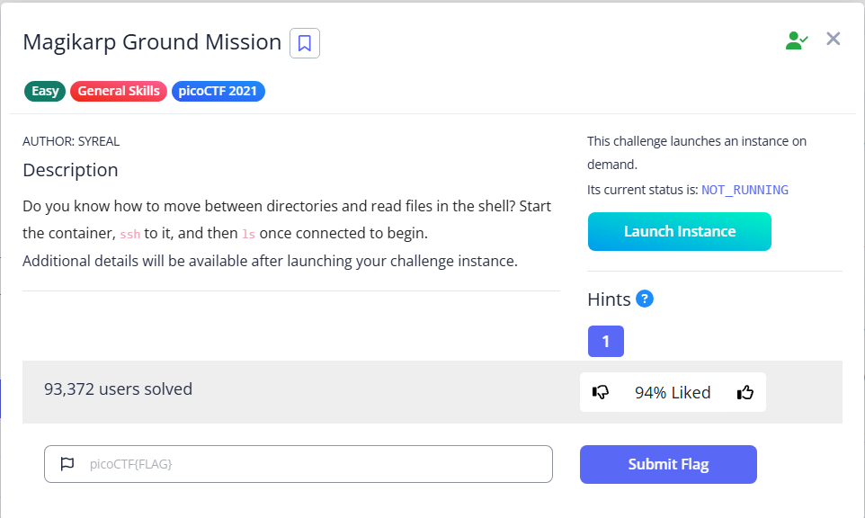

# Magikarp Ground Mission



After we connect using SSH, we can get the first part of the flag

```bash
└─$ ssh ctf-player@wily-courier.picoctf.net -p xxxxx
..
..
.
ctf-player@wily-courier.picoctf.net's password: 
.
.
.

The programs included with the Ubuntu system are free software;
the exact distribution terms for each program are described in the
individual files in /usr/share/doc/*/copyright.

Ubuntu comes with ABSOLUTELY NO WARRANTY, to the extent permitted by
applicable law.

ctf-player@pico-chall$ ls
1of3.flag.txt  instructions-to-2of3.txt
ctf-player@pico-chall$ cat 1of3.flag.txt 
picoCTF{xxsh_
```

We not get the first part of the flag: `picoCTF{xxsh_`. To get the next part, we need to read the instruction file

```bash
ctf-player@pico-chall$ cat instructions-to-2of3.txt 
Next, go to the root of all things, more succinctly `/`
```

So we can use `/` to navigate to the root 

```bash
ctf-player@pico-chall$ cd /                                                                                                                                                                                                                
ctf-player@pico-chall$ ls                                                                                                                                                                                                                  
2of3.flag.txt  bin  boot  challenge  dev  etc  home  instructions-to-3of3.txt  lib  lib64  media  mnt  opt  proc  root  run  sbin  srv  sys  tmp  usr  var                                                                                 
ctf-player@pico-chall$ cat 2of3.flag.txt                                                                                                                                                                                                   
0ut_0f_//4t3r_                                                                                                                                                                                                                             
```

We get the second part `0ut_0f_//4t3r_`. To get the third part, repeat the process, and this time, we go to the home directory using `~`

```bash
ctf-player@pico-chall$ cat instructions-to-3of3.txt                                                                                                                                                                                        
Lastly, ctf-player, go home... more succinctly `~`                                                                                                                                                                                         
ctf-player@pico-chall$ cd ~                                                                                                                                                                                                                
ctf-player@pico-chall$ ls                                                                                                                                                                                                                  
3of3.flag.txt  drop-in                                                                                                                                                                                                                     
ctf-player@pico-chall$ cat 3of3.flag.txt                                                                                                                                                                                                   
0b24fc4f}
```

Here is the final part: `0b24fc4f}`

Flag: `picoCTF{xxsh_0ut_0f_//4t3r_0b24fc4f}`
