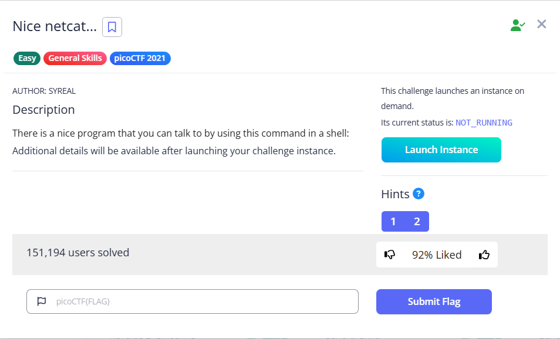

# Nice netcat…



Upon the connection, we can see many numbers. We can deduce it is decimal ASCII values.

```bash
└─$ nc wily-courier.picoctf.net xxxxx
112 
105 
99 
111 
67 
84 
70 
123 
103 
48 
48 
100 
95 
107 
49 
116 
116 
121 
33 
95 
110 
49 
99 
51 
95 
107 
49 
116 
116 
121 
33 
95 
102 
55 
97 
54 
101 
125 
10 
```

Convert them back to characters, and we can get the flag


