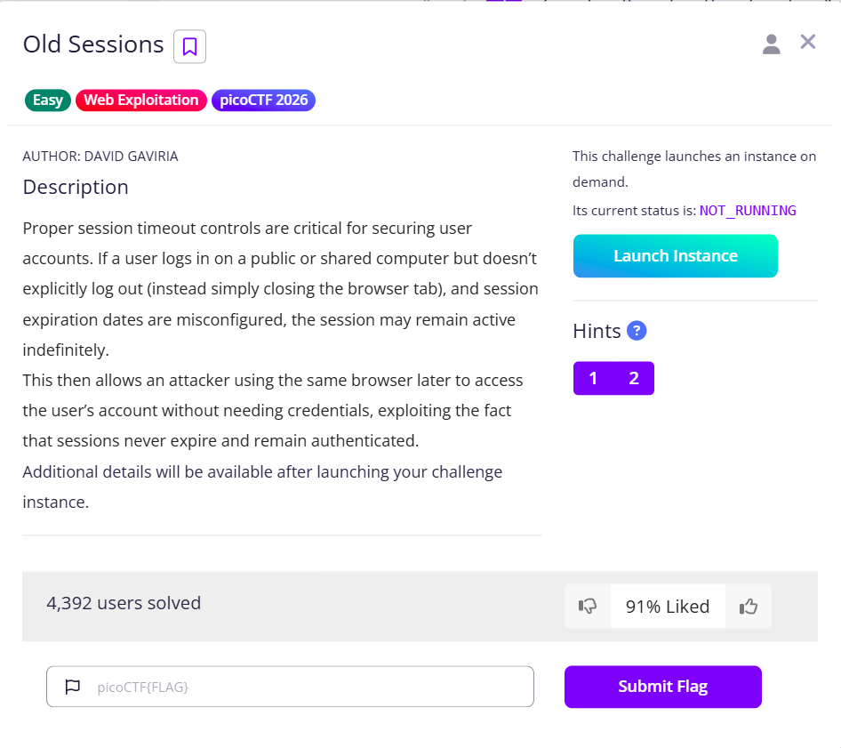

# Old Sessions

The instance contains a login page, viewing the source does not bring us any credentials, so we can try to register first

I use `test:test` as the credentials for the new account, a short one will do

After that, we can log in using the test account, and see that there is a comment drawing our attention to the `/sessions` endpoint

Navigate to there and we will see the session cookie of all users, because the `_permanent` is set to be True, this session will never be expired

We can change our session to the admin session easily by going to F12, and change the value to the admin session `Igt6toLOAWXmNe-SKUysn4LZqirJlQ84xbQjHZ8b2Gc`

Upon refresh, we can obtain the flag

Flag: `picoCTF{s3t_s3ss10n_3xp1rat10n5_11cae9aa}`
