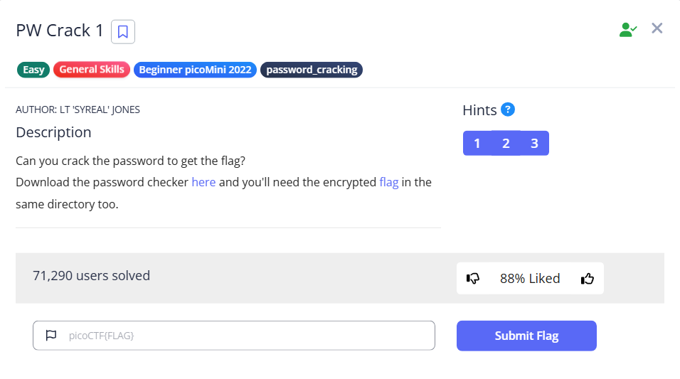

# PW Crack1



We are given two files: the first one is the encrypted flag, and the second one is the password checker

```bash
└─$ ls                                                                                                                                                                                                                                     
level1.flag.txt.enc  level1.py

```

The encrypted flag doesn’t look any sense at this moment

```bash
 cat level1.flag.txt.enc                                                                                                                                                                                                                
A
 Rr1w▒Q nVT_nPRVW▒
```

But if you look at level1.py, it is actually a simple XOR calculation. The flag is XORed by `1e1a`

```bash
└─$ cat level1.py 
### THIS FUNCTION WILL NOT HELP YOU FIND THE FLAG --LT ########################
def str_xor(secret, key):
    #extend key to secret length
    new_key = key
    i = 0
    while len(new_key) < len(secret):
        new_key = new_key + key[i]
        i = (i + 1) % len(key)        
    return "".join([chr(ord(secret_c) ^ ord(new_key_c)) for (secret_c,new_key_c) in zip(secret,new_key)])
###############################################################################

flag_enc = open('level1.flag.txt.enc', 'rb').read()

def level_1_pw_check():
    user_pw = input("Please enter correct password for flag: ")
    if( user_pw == "1e1a"):
        print("Welcome back... your flag, user:")
        decryption = str_xor(flag_enc.decode(), user_pw)
        print(decryption)
        return
    print("That password is incorrect")

level_1_pw_check()
```

To use the original script to solve, you can input the password `1e1a`, or if you prefer, you can remove the password check and directly call the `str_xor` function with `1e1a`

```bash
└─$ python level1.py 
Please enter correct password for flag: 1e1a
Welcome back... your flag, user:
picoCTF{545h_r1ng1ng_fa343060}
```

Alternatively, you can also use the `xor` function in `pwntools` to do the job.

```bash
from pwn import xor

password='1e1a'
with open('level1.flag.txt.enc','r') as f:
    encrypted=f.read()
    flag=xor(encrypted,password)
    print(flag.decode('utf-8'))
```

Either way, we can get the flag

```bash
└─$ python solve.py 
.
.
.
picoCTF{545h_r1ng1ng_fa343060}
```

Flag: `picoCTF{545h_r1ng1ng_fa343060}`
