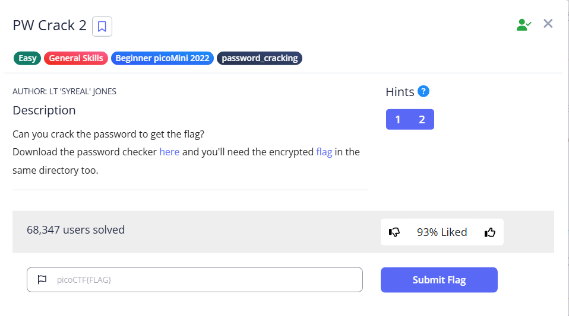

# PW Crack 2



We know that the flag is encrypted, so we should read the python file first

```bash
└─$ cat level2.py
### THIS FUNCTION WILL NOT HELP YOU FIND THE FLAG --LT ########################
def str_xor(secret, key):
    #extend key to secret length                                                                                                                                                                                                           
    new_key = key                                                                                                                                                                                                                          
    i = 0                                                                                                                                                                                                                                  
    while len(new_key) < len(secret):                                                                                                                                                                                                      
        new_key = new_key + key[i]                                                                                                                                                                                                         
        i = (i + 1) % len(key)                                                                                                                                                                                                             
    return "".join([chr(ord(secret_c) ^ ord(new_key_c)) for (secret_c,new_key_c) in zip(secret,new_key)])                                                                                                                                  
###############################################################################                                                                                                                                                            
                                                                                                                                                                                                                                           
flag_enc = open('level2.flag.txt.enc', 'rb').read()                                                                                                                                                                                        
                                                                                                                                                                                                                                           
                                                                                                                                                                                                                                           
                                                                                                                                                                                                                                           
def level_2_pw_check():                                                                                                                                                                                                                    
    user_pw = input("Please enter correct password for flag: ")
    if( user_pw == chr(0x33) + chr(0x39) + chr(0x63) + chr(0x65) ):
        print("Welcome back... your flag, user:")
        decryption = str_xor(flag_enc.decode(), user_pw)
        print(decryption)
        return
    print("That password is incorrect")

level_2_pw_check()

```

Similar as before, but this time, the password is represented in ASCII Code (in Hex) instead of characters, therefore we first need to convert them back, which we get `39ce` 

```bash
└─$ python
>>> test= chr(0x33) + chr(0x39) + chr(0x63) + chr(0x65)
>>> print(test)
39ce
```

We can then run the python script with the password

```bash
└─$ python level2.py                                                                                                                                                                                                                       
Please enter correct password for flag: 39ce
Welcome back... your flag, user:
picoCTF{tr45h_51ng1ng_502ec42e}

```

Alternatively, we can write our own script to solve it

```bash
from pwn import xor

password='1e1a'
with open('level1.flag.txt.enc','r') as f:
    encrypted=f.read()
    flag=xor(encrypted,password)
    print(flag.decode('utf-8'))
```

We can also get the flag by running it

```bash
└─$ python solve.py                                                                                                                                                                                                                        
.
.
.
picoCTF{tr45h_51ng1ng_502ec42e}

```

Flag: `picoCTF{tr45h_51ng1ng_502ec42e}`
