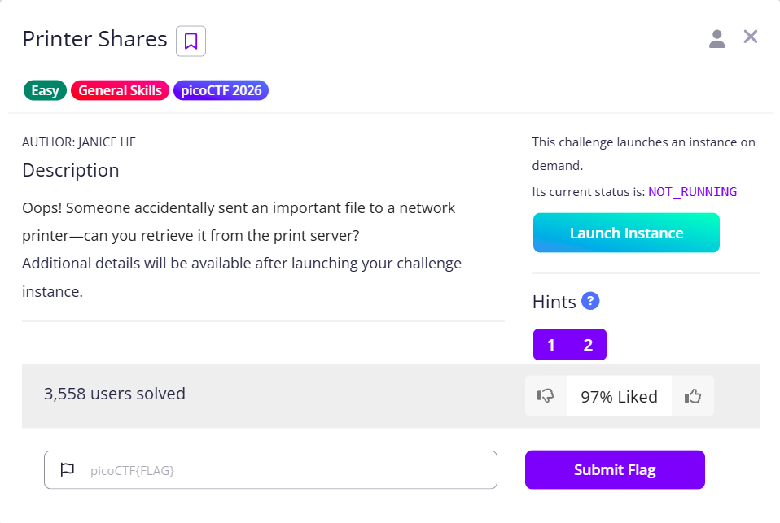

# Printer Shares



After launching the Instance, we can see the printer’s port and run an `nc` command to check whether the printer is online. The command includes the `-z` to invoke the zero I/O mode, so that we can focus on scanning

```bash
nc -vz mysterious-sea.picoctf.net <port>
DNS fwd/rev mismatch: mysterious-sea.picoctf.net != ec2-3-130-79-223.us-east-2.compute.amazonaws.com
mysterious-sea.picoctf.net [3.130.79.223] <port> (?) open
```

Once we know that it is open, we need to figure out how we can communicate with the printer. Direct `nc` connections will result in failure

```bash
└─$ nc -vvv mysterious-sea.picoctf.net <port>
DNS fwd/rev mismatch: mysterious-sea.picoctf.net != ec2-3-130-79-223.us-east-2.compute.amazonaws.com
mysterious-sea.picoctf.net [3.130.79.223] <port> (?) : Connection refused
 sent 0, rcvd 0
```

We can refer to the [Wikipedia page]([https://en.wikipedia.org/wiki/List_of_printing_protocols](https://en.wikipedia.org/wiki/List_of_printing_protocols)), and we will find that Telnet and SMB are commonly used

> 
> 
> 
> **Generic protocols**
> 
> **Telnet** is based on simply transferring data safely to/from TCP ports that are now being used for printing purposes. This approach is sometimes called raw TCP/IP, Stream, or direct sockets printing.
> **Server Message Block (SMB)** is an application-layer network protocol for file and printer sharing originally developed by IBM in the mid-80s. It is the default method used by Windows based computers to share files and printers.[4]
> 

Run a connection using Telnet, and we will find that we can establish a connection, however I do not know how to interact with it, resulting in no responses.

```bash
└─$ telnet mysterious-sea.picoctf.net <port>
Trying 3.130.79.223...
Connected to mysterious-sea.picoctf.net.
Escape character is '^]'.
files
ls
```

This leaves us to SMB. There is a useful utility called `smbclient`, to use it we can specify the following:

- `-L`: List the available shares
- `//<host>`: Specify the target
- `-p`: Specify the port
- `-U "<username>"`: specify the username, we will leave this as blank
- `-N`: No password

Combine them together, we can see that we can retrieve the names of the shares, which we are interested in `shares`

```bash
└─$ smbclient -L //mysterious-sea.picoctf.net -p <port> -U "" -N 

        Sharename       Type      Comment
        ---------       ----      -------
        shares          Disk      Public Share With Guests
        IPC$            IPC       IPC Service (Samba 4.19.5-Ubuntu)
Reconnecting with SMB1 for workgroup listing.
do_connect: Connection to mysterious-sea.picoctf.net failed (Error NT_STATUS_CONNECTION_REFUSED)
Unable to connect with SMB1 -- no workgroup available
```

Notice there is a slight error with SMB1 after the share listing; it is because SMB1 is considered insecure and deprecated, which, by default, disables it. You can know more about the version [here](https://www.packetsafari.com/blog/2020/06/09/smbv1-vs-smbv2-vs-smbv3)

> SMBv1, the original version of the protocol, suffers from a range of limitations and security vulnerabilities. Its inherently insecure design has led to high-profile attacks, like the WannaCry ransomware. Microsoft has since **deprecated** SMBv1 in favor of more secure and efficient versions.
> 

After the Listing, it will try to use SMB1 to continue the connection, which we can’t in this case.

To continue, we can remove the `-L` flag, and instead add the `shares` to the host, here are the results, you can see we can interact with the share and obtain `flag.txt`. The commands after the connection are nearly the same as FTP.

```bash
└─$ smbclient //mysterious-sea.picoctf.net/shares -p <port> -U "" -N  
Try "help" to get a list of possible commands.
smb: \> ls
  .                                   D        0  Sat Mar  7 04:25:43 2026
  ..                                  D        0  Sat Mar  7 04:25:43 2026
  dummy.txt                           N     1142  Thu Feb  5 05:22:17 2026
  flag.txt                            N       37  Sat Mar  7 04:25:43 2026
ge
                65536 blocks of size 1024. 60004 blocks available
smb: \> get flag.txt
getting file \flag.txt of size 37 as flag.txt (0.0 KiloBytes/sec) (average 0.0 KiloBytes/sec)

```

Finally, go back to host and cat the `flag.txt`

```bash
└─$ cat flag.txt 
picoCTF{5mb_pr1nter_5h4re5_8a0df8e0}
```

Flag: `picoCTF{5mb_pr1nter_5h4re5_8a0df8e0}`
