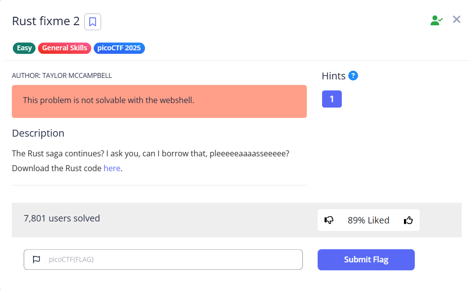

# Rust Fixme 2



This time we got a different error

```bash
└─$ cargo build
   Compiling crossbeam-utils v0.8.20
   Compiling rayon-core v1.12.1
   Compiling either v1.13.0
   Compiling crossbeam-epoch v0.9.18
   Compiling crossbeam-deque v0.8.5
   Compiling rayon v1.10.0
   Compiling xor_cryptor v1.2.3
   Compiling rust_proj v0.1.0 (Rust fixme2/fixme2)
error[E0596]: cannot borrow `*borrowed_string` as mutable, as it is behind a `&` reference
 --> src/main.rs:9:5
  |
9 |     borrowed_string.push_str("PARTY FOUL! Here is your flag: ");
  |     ^^^^^^^^^^^^^^^ `borrowed_string` is a `&` reference, so the data it refers to cannot be borrowed as mutable
  |
help: consider changing this to be a mutable reference
  |
3 | fn decrypt(encrypted_buffer:Vec<u8>, borrowed_string: &mut String){ // How do we pass values to a function that we want to change?
  |                                                        +++

error[E0596]: cannot borrow `*borrowed_string` as mutable, as it is behind a `&` reference
  --> src/main.rs:20:5
   |
20 |     borrowed_string.push_str(&String::from_utf8_lossy(&decrypted_buffer));
   |     ^^^^^^^^^^^^^^^ `borrowed_string` is a `&` reference, so the data it refers to cannot be borrowed as mutable
   |
help: consider changing this to be a mutable reference
   |
 3 | fn decrypt(encrypted_buffer:Vec<u8>, borrowed_string: &mut String){ // How do we pass values to a function that we want to change?                                                                                                   
   |                                                        +++                                                                                                                                                                           
                                                                                                                                                                                                                                          
For more information about this error, try `rustc --explain E0596`.
error: could not compile `rust_proj` (bin "rust_proj") due to 2 previous errors

```

Here is the script I used. 

```rust
use xor_cryptor::XORCryptor;

fn decrypt(encrypted_buffer:Vec<u8>, borrowed_string: &mut String){ // How do we pass values to a function that we want to change?

    // Key for decryption
    let key = String::from("CSUCKS");

    // Editing our borrowed value
    borrowed_string.push_str("PARTY FOUL! Here is your flag: ");

    // Create decrpytion object
    let res = XORCryptor::new(&key);
    if res.is_err() {
        return; // How do we return in rust?
    }
    let xrc = res.unwrap();

    // Decrypt flag and print it out
    let decrypted_buffer = xrc.decrypt_vec(encrypted_buffer);
    borrowed_string.push_str(&String::from_utf8_lossy(&decrypted_buffer));
    println!("{}", borrowed_string);
}

fn main() {
    // Encrypted flag values
    let hex_values = ["41", "30", "20", "63", "4a", "45", "54", "76", "01", "1c", "7e", "59", "63", "e1", "61", "25", "0d", "c4", "60", "f2", "12", "a0", "18", "03", "51", "03", "36", "05", "0e", "f9", "42", "5b"];

    // Convert the hexadecimal strings to bytes and collect them into a vector
    let encrypted_buffer: Vec<u8> = hex_values.iter()
        .map(|&hex| u8::from_str_radix(hex, 16).unwrap())
        .collect();

    let mut party_foul = String::from("Using memory unsafe languages is a: "); // Is this variable changeable?
    decrypt(encrypted_buffer, &mut party_foul); // Is this the correct way to pass a value to a function so that it can be changed?
}

```

The things that I modified are the function declaration, the variable party_foul, and its reference, by adding 'mut' (mutable). The reason is that the decryption function will push the decrypted string to borrow_string, and strings are by default mutable; therefore, it will lead to a compilation error. To fix this, add `mut` so that now the variable and the reference are mutable, and we can append the decrypted string.

To know more about reference, refer to https://doc.rust-lang.org/book/ch04-02-references-and-borrowing.html, and https://doc.rust-lang.org/book/ch03-01-variables-and-mutability.html for mutability.

Anyways, running the script will give us the flag.

```bash
cargo run                                                                                                                                                                                                                             
    Finished `dev` profile [unoptimized + debuginfo] target(s) in 0.01s
     Running `target/debug/rust_proj`
Using memory unsafe languages is a: PARTY FOUL! Here is your flag: picoCTF{4r3_y0u_h4v1n5_fun_y31?}
```

Flag: `picoCTF{4r3_y0u_h4v1n5_fun_y31?}`
