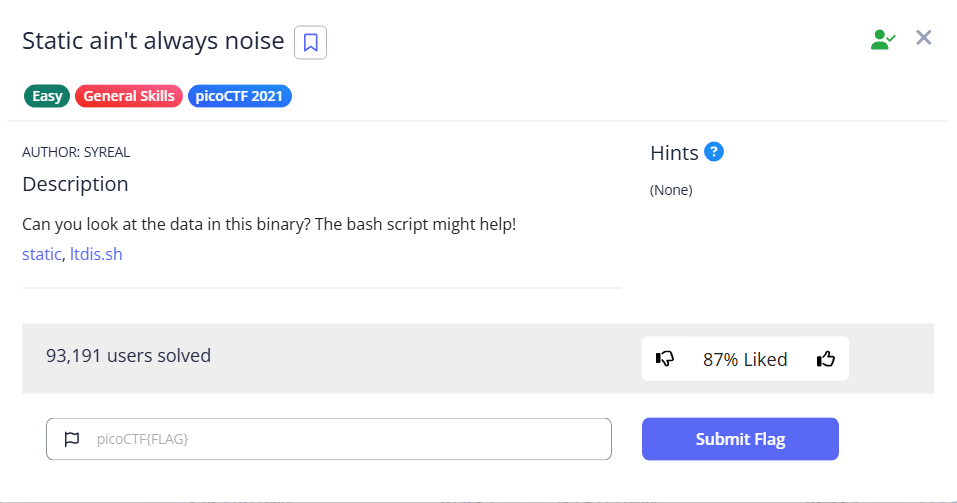

# Static ain't always noise



We are given two files, one is a Bash script, and the other is an ELF. Using strings will give us the flag

```bash
└─$ ls
ltdis.sh  static

└─$ strings static 
/lib64/ld-linux-x86-64.so.2
libc.so.6
puts
__cxa_finalize
__libc_start_main
GLIBC_2.2.5
_ITM_deregisterTMCloneTable
__gmon_start__
_ITM_registerTMCloneTable
u+UH
[]A\A]A^A_
Oh hai! Wait what? A flag? Yes, it's around here somewhere!
:*3$"
picoCTF{d15a5m_t34s3r_20335e41}

```

We can also use the given bash file. It accept a filename and it will try to decompile the file

```bash
└─$ ./ltdis.sh                                                                                                                                                                                                                             
Attempting disassembly of  ...
objdump: 'a.out': No such file
objdump: section '.text' mentioned in a -j option, but not found in any input file
Disassembly failed!
Usage: ltdis.sh <program-file>
Bye!

└─$ ./ltdis.sh static 
Attempting disassembly of static ...
Disassembly successful! Available at: static.ltdis.x86_64.txt
Ripping strings from binary with file offsets...
Any strings found in static have been written to static.ltdis.strings.txt with file offset
```

Reading the file will give us the flag

```bash
└─$ cat static.ltdis.strings.txt                                                                                                                                                                                                           
    318 /lib64/ld-linux-x86-64.so.2
    471 libc.so.6
    47b puts
    480 __cxa_finalize
    48f __libc_start_main
    4a1 GLIBC_2.2.5
    4ad _ITM_deregisterTMCloneTable
    4c9 __gmon_start__
    4d8 _ITM_registerTMCloneTable
   110b u+UH
   11ca []A\A]A^A_
   2008 Oh hai! Wait what? A flag? Yes, it's around here somewhere!
   20d7 :*3$"
   3020 picoCTF{d15a5m_t34s3r_20335e41}
```

Flag: `picoCTF{d15a5m_t34s3r_20335e41}`
