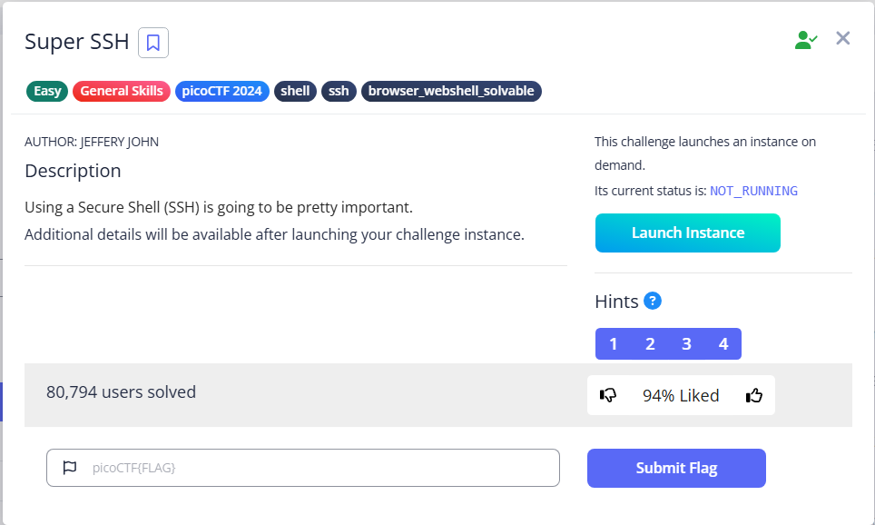

# Super SSH



To know how a tool work, it is best to view the manual

According to [man7.org](https://man7.org/linux/man-pages/man1/ssh.1.html)

> ssh connects and logs into the specified destination, which may be
specified as either `[user@]hostname` or a URI of the form
`ssh://[user@]hostname[:port]`.
> 

for me, I like to specify the port using `-p`, so the command will become `ssh ctf-player@titan.picoctf.net -p <port>`. Connect to the instance and we can get the flag

```bash
└─$ ssh ctf-player@titan.picoctf.net -p xxxxx
.
.
.
ctf-player@titan.picoctf.net's password: 
Welcome ctf-player, here's your flag: picoCTF{s3cur3_c0nn3ct10n_8969f7d3}
Connection to titan.picoctf.net closed.
```

Flag: `picoCTF{s3cur3_c0nn3ct10n_8969f7d3}`
