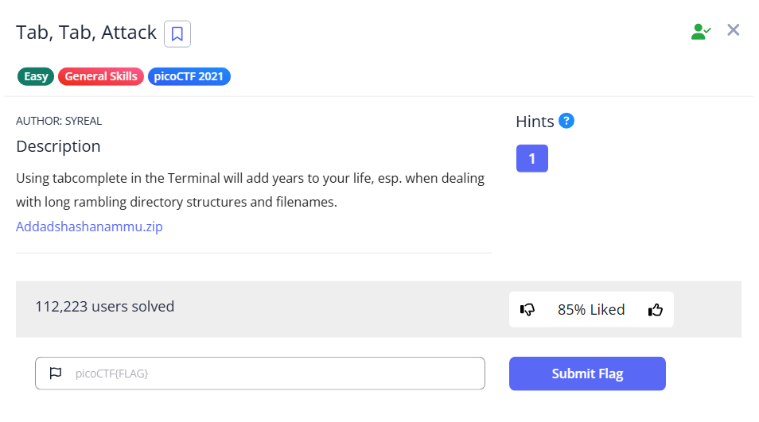

# Tab, Tab, Attack



The directories have long names, what should we do?

```bash
└─$ tree
.
├── Addadshashanammu
│   └── Almurbalarammi
│       └── Ashalmimilkala
│           └── Assurnabitashpi
│               └── Maelkashishi
│                   └── Onnissiralis
│                       └── Ularradallaku
│                           ├── fang-of-haynekhtnamet
│                           └── fang-of-haynekhtnamet.c
└── Addadshashanammu.zip

8 directories, 3 files
```

As the challenge title suggest, Bash does support auto-completion. To do that, we can use TAB, and we can get to the file very easily

```bash
└─$ cat Addadshashanammu/Almurbalarammi/Ashalmimilkala/Assurnabitashpi/Maelkashishi/Onnissiralis/Ularradallaku/fang-of-haynekhtnamet
@@@@�▒▒▒����   ���-�=�=X`�-�=�=�888 XXXDDS�td888 P�td8 8 8 DDQ�tdR�td�-�=�=HH/lib64/ld-linux-x86-64.so.2GNU�GNUO����Z��P � ���GNU��e�m= 
                                                                                                                                        Y h "libc.so.6puts__cxa_finalize__libc_start_mainGLIBC_2.2.5_ITM_deregisterTMCloneTable__gmon_start�H�=��R/��H�=y/H�r/H9�tH�./H��t �����H�=I/H�5B/H)�H��H��?H��H�H��tH�/H����fD�����=/u+UH�=�.H��t%u/D��1�I��^H��H���PTL�fH�
                                                                                               H�=�.�����d�����.]������w�����UH��H�=�������]�f.�f���AWL�=;,AVI��AUI��ATA��UH�-,,SL)�H��_���H��t1��L��L��D��A��H��H9�u�H�[]A\A]A^A_�ff.������H�H��*ZAP!* picoCTF{l3v3l_up!_t4k3_4_r35t!_fc588427}D��������▒����(���`����8��������8zRx
                                                                                        ����/D$4h��� F▒J
                                                                                                        �?▒:*3$"\`���tX����9���
RC
D�@���eF�I▒�E �E(�D0�H8�G@n8A0A(B B▒B�h���@
��▒����o�p�
�
 ▒�?▒�� ������o���o���o����o�=@GCC: (Ubuntu 9.4.0-1ubuntu1~20.04.2) 9.4.0▒8X|���
 
 �
 @P`� 8 � �=�=�=▒�?@▒@�
                       ��!7▒@F�=m@y�=�������!����=��=��=�8 �▒�?�
                                                                �$ z @@R@�Yx@� @� �pe�▒▒@~`/�▒@�I@� �"crtstuff.cderegister_tm_clones__do_global_dtors_auxcompleted.8061__do_global_dtors_aux_fini_array_entryframe_dummy__frame_dummy_init_array_entryfang-of-haynekhtnamet.c__FRAME_END____init_array_end_DYNAMIC__init_array_start__GNU_EH_FRAME_HDR_GLOBAL_OFFSET_TABLE___libc_csu_fini_ITM_deregisterTMCloneTableputs@@GLIBC_2.2.5_edata__libc_start_main@@GLIBC_2.2.5__data_start__gmon_start____dso_handle_IO_stdin_used__libc_csu_init__bss_startmain__TMC_END___ITM_registerTMCloneTable__cxa_finalize@@GLIBC_2.2.5.symtab.strtab.shstrtab.interp.note.gnu.property.note.gnu.build-id.note.ABI-tag.gnu.hash.dynsym.dynstr.gnu.version.gnu.version_r.rela.dyn.rela.plt.init.plt.got.plt.sec.text.fini.rodata.eh_frame_hdr.eh_frame.init_array.fini_array.dynamic.data.bss.comment▒▒#886XX$I|| W���o��a
�  �8 8 D�� ������=�-��?�@0                                                                                                                                                 ��▒ipp�q���o��~���o�  ▒�B��▒▒�   �@@�PP�``����
                         @00+@0▒▒       X6k8▒

```

We can also use find to find the flag, which is not the ideal solve in this challenge

```bash
└─$ find . -type f -exec strings {} \;|grep picoCTF                                                                                                                                                                                        
printf("*ZAP!* picoCTF{l3v3l_up!_t4k3_4_r35t!_fc588427}\n");
*ZAP!* picoCTF{l3v3l_up!_t4k3_4_r35t!_fc588427}
printf("*ZAP!* picoCTF{l3v3l_up!_t4k3_4_r35t!_fc588427}\n");

```

Flag: `picoCTF{l3v3l_up!_t4k3_4_r35t!_fc588427}`
