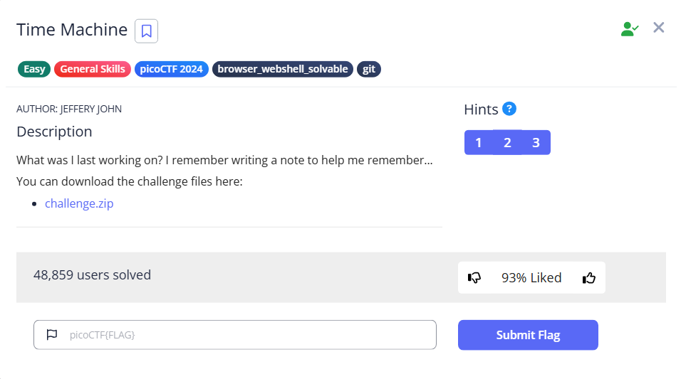

# Time Machine



Inside was a message.txt, which encouraged us to check the commit history

```bash
└─$ cat message.txt                                                                                                                                                                                                                        
This is what I was working on, but I'd need to look at my commit history to know why...
```

We can try to use git to check the commit history, to study the usage, we can use `--help`

```bash
└─$ git --help  
.
.
.
examine the history and state (see also: git help revisions)                                                                                                                                                                               
   bisect     Use binary search to find the commit that introduced a bug                                                                                                                                                                   
   diff       Show changes between commits, commit and working tree, etc                                                                                                                                                                   
   grep       Print lines matching a pattern                                                                                                                                                                                               
   log        Show commit logs                                                                                                                                                                                                             
   show       Show various types of objects                                                                                                                                                                                                
   status     Show the working tree status          
```

We can try them one-by-one, and eventually we will find `show` and `log` can help us

`git log` will show the details of the commit 

```bash
└─$ git log                                                                                                                                                                                                                                
commit e65fedb3a72a16c577f4b17023b63997134b307d (HEAD -> master)
Author: picoCTF <ops@picoctf.com>
Date:   Tue Mar 12 00:07:29 2024 +0000

    picoCTF{t1m3m@ch1n3_88c35e3b}
```

While `git show` will show a much detailed history, we can even see the differences between versions

```bash
└─$ git show                                                                                                                                                                                                                               
commit e65fedb3a72a16c577f4b17023b63997134b307d (HEAD -> master)
Author: picoCTF <ops@picoctf.com>
Date:   Tue Mar 12 00:07:29 2024 +0000

    picoCTF{t1m3m@ch1n3_88c35e3b}

diff --git a/message.txt b/message.txt
new file mode 100644
index 0000000..4324621
--- /dev/null
+++ b/message.txt
@@ -0,0 +1 @@
+This is what I was working on, but I'd need to look at my commit history to know why...
\ No newline at end of file

```

We can also use `git reflog`, which is much shorter and condensed, which is very easy to read.

```bash
└─$ git reflog
e65fedb (HEAD -> master) HEAD@{0}: commit (initial): picoCTF{t1m3m@ch1n3_88c35e3b}
```

<aside>
💡

The message is actually stored inside `drop-in/.git/COMMIT_EDITMSG`, which we can see this file is extracted when unzipping the zip file

```bash
└─$ cat drop-in/.git/COMMIT_EDITMSG                                                                                                                                                                                                       
picoCTF{t1m3m@ch1n3_88c35e3b}
```

</aside>

Either way, we can get the flag for this challenge

Flag: `picoCTF{t1m3m@ch1n3_88c35e3b}`
