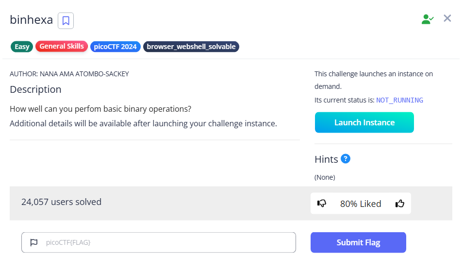

# binhexa



Upon connecting, I was asked to calculate the operations on the binary numbers, including:

- `>>`: Right shift
    - For right shift, just remove the LSB on Binary Number 2, resulting in `1110110`
- `&`: AND Operator
    - Can only appear to be 1 when both of them are 1 at the same time, resulting in `10100000`
        
        ```bash
        Binary Number 1: 10100001
        Binary Number 2: 11101100
                 Result: 10100000
        ```
        
- `+`: Addition
    - Please use an [online calculator](https://www.calculator.net/binary-calculator.html), we get `110001101`
- `<<`: Left Shift
    - Add `0` as the LSB on Binary Number 1, resulting in `101000010`
- `|`: OR operator
    - Either one of the bit is 1 will result in 1
    
    ```bash
    Binary Number 1: 10100001
    Binary Number 2: 11101100
             Result: 11101101
    ```
    
- `*`: Multiplication
    - Please use an [online calculator](https://www.calculator.net/binary-calculator.html), we get `1001010001101100`

Here is the full playthrough

```bash
└─$ nc titan.picoctf.net xxxxx                                                                                                                                                                                                             

Welcome to the Binary Challenge!"
Your task is to perform the unique operations in the given order and find the final result in hexadecimal that yields the flag.

Binary Number 1: 10100001
Binary Number 2: 11101100

Question 1/6:
Operation 1: '>>'
Perform a right shift of Binary Number 2 by 1 bits .
Enter the binary result: 01110110
Correct!

Question 2/6:
Operation 2: '&'
Perform the operation on Binary Number 1&2.
Enter the binary result: 10100000
Correct!

Question 3/6:
Operation 3: '+'
Perform the operation on Binary Number 1&2.
Enter the binary result: 110001101
Correct!

Question 4/6:
Operation 4: '<<'
Perform a left shift of Binary Number 1 by 1 bits.
Enter the binary result: 101000010
Correct!

Question 5/6:
Operation 5: '|'
Perform the operation on Binary Number 1&2.
Enter the binary result: 11101101
Correct!

Question 6/6:
Operation 6: '*'
Perform the operation on Binary Number 1&2.
Enter the binary result: 1001010001101100
Correct!

Enter the results of the last operation in hexadecimal: 946C 

Correct answer!
The flag is: picoCTF{b1tw^3se_0p3eR@tI0n_su33essFuL_aeaf4b09}

```

Flag: `picoCTF{b1tw^3se_0p3eR@tI0n_su33essFuL_aeaf4b09}`
