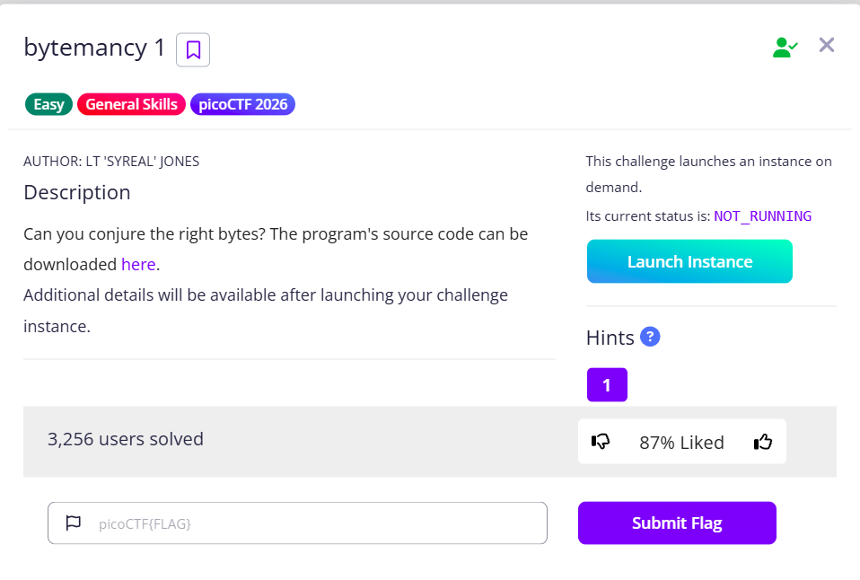

# bytemancy 1



In this challenge, we need to send `\x65` 1751 times to get the flag

```python
while(True):
  try:
    print('⊹──────[ BYTEMANCY-1 ]──────⊹')
    print("☍⟐☉⟊☽☈⟁⧋⟡☍⟐☉⟊☽☈⟁⧋⟡☍⟐☉⟊☽☈⟁⧋⟡☍⟐")
    print()
    print('Send me ASCII DECIMAL 101 1751 times, side-by-side, no space.')
    print()
    print("☍⟐☉⟊☽☈⟁⧋⟡☍⟐☉⟊☽☈⟁⧋⟡☍⟐☉⟊☽☈⟁⧋⟡☍⟐")
    print('⊹─────────────⟡─────────────⊹')
    user_input = input('==> ')
    if user_input == "\x65"*1751:
      print(open("./flag.txt", "r").read())
      break
    else:
      print("That wasn't it. I got: " + str(user_input))
      print()
      print()
      print()
  except Exception as e:
    print(e)
    break
                      
```

In order words, it is just sending many `e`

```python
>>> print("\x65")
e
```

Instead of typing them manually, we can send them using pwntools in Python, just like the following

```python
from pwn import *

nc = remote('foggy-cliff.picoctf.net', xxxxx)

nc.sendlineafter(b'==>',b'e'*1751)

nc.interactive()
```

Run the code and you can obtain the flag

```python
└─$ python solve.py                                                                                                                                                                
[+] Opening connection to foggy-cliff.picoctf.net on port xxxxx: Done
[*] Switching to interactive mode
 picoCTF{h0w_m4ny_e's???_be9356c0}
```

Flag: `picoCTF{h0w_m4ny_e's???_be9356c0}`
