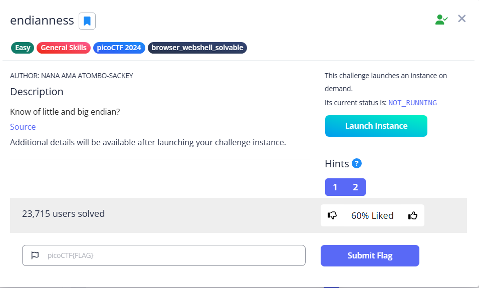

# endianness



In this challenge, we need to give the correct representation of a word. In my case, it is `letos`

```bash
nc titan.picoctf.net xxxxx
Welcome to the Endian CTF!
You need to find both the little endian and big endian representations of a word.
If you get both correct, you will receive the flag.
Word: letos
Enter the Little Endian representation:
```

For little-endian, the least significant byte is placed first. That is, the last character is placed first, then the second-to-last, and so on, which is essentially a reverse. 

Therefore, using CyberChef, we can easily find it using ‘reverse’ and ‘to hex’ recipes.


After entering the right little-endian representation, we are prompted to enter the big-endian representation.

```bash
Enter the Little Endian representation: 736f74656c
Correct Little Endian representation!
Enter the Big Endian representation:
```

Do not get fooled, the word itself is originally represented in a big endian format, so all we need to do is to convert it to hex.


Entering it will give us the flag

```bash
Enter the Big Endian representation: 6c65746f73
Correct Big Endian representation!
Congratulations! You found both endian representations correctly!
Your Flag is: picoCTF{3ndi4n_sw4p_su33ess_25c5f083}
```

Flag: `picoCTF{3ndi4n_sw4p_su33ess_25c5f083}`
